<div align="center">

# Informe de Trabajo Final


### Universidad Peruana de Ciencias Aplicadas (UPC) 🎓

**Carrera:** Ingeniería de Software  

**Ciclo:** 2026-10  

**Curso:** 1AS10730 Aplicaciones Web  

**NRC:** 10203  

**Docente:** Alex Humberto Sánchez Ponce    

**StartUp:** NexTech 🌿  

**Producto:** BioTrack

<div align='left'>	

~~~C#
string[] EquipoNexTech() {
    return new string[] {
        "🧑‍💻 Pacheco Lavado, Rafael Agustin - U202014215",
        "🧑‍💻 Mendoza Moreano, Mariel Lucero  - U20231a418",
        "🧑‍💻 Díaz Yurivilca, Sofía  - U20241A195",
        "🧑‍💻 Rengifo Lozano, David  - U20221022",
        "🧑‍💻 Villón Amez, Enrique  - U20161a304"
    };
}
~~~

</div>

Abril del 2026 🗓️

</div>

---

## 📝 Registro de Versiones del Informe

<table>
  <tr>
    <th>Version</th>
    <th>Fecha</th>
    <th>Autor</th>
    <th>Descripción de modificación </th>
  </tr>
  <tr>
    <td>AV1</td>
    <td>2026-04-22</td>
    <td>
      <ul> 
        <li>Pacheco Lavado, Rafael Agustin</li> 
        <li>Mendoza Moreano, Mariel Lucero</li> 
        <li>Díaz Yurivilca, Sofía </li>
        <li>Rengifo Lozano, David</li>
        <li>Villón Amez, Enrique</li>
      </ul>
    </td>
    <td> Se han incluído los siguientes capítulos:
        <ul>
          <li>Capítulo I: Introducción</li>
          <li>Capítulo II: Requirements Elicitation & Analysis</li>
          <li>Capítulo III: Requirements Specification</li>
          <li>Capítulo IV: Product Design</li>
          <li>Avance del Capítulo V: Product Implementation, Validation & Deployment hasta el punto 5.2.1.8</li>
          <li>Avance de Conclusiones, Bibliografía y Anexos</li>
        </ul>
    </td>
  </tr>
</table>

---

## 🤝 Project Report Collaboration Insights

**URL del Repositorio:** [https://github.com/1ASI0729-2610-10203-NexTech/Project-Report](https://github.com/1ASI0729-2610-10203-NexTech/Project-Report)


A continuación se presentarán los commits realizados por los miembros del equipo:

### ⏩ Avance del **AV1**


---

## 📑 Contenido

- [📝 Registro de Versiones del Informe](#-registro-de-versiones-del-informe)
- [🤝 Project Report Collaboration Insights](#-project-report-collaboration-insights)
- [🎯 Student Outcome](#-student-outcome)
- [🏁 Capítulo I: Introducción](#-capítulo-i-introducción)
  - [1.1. Startup Profile](#11-startup-profile)
    - [1.1.1. Descripción de la Startup](#111-descripción-de-la-startup)
    - [1.1.2. Perfiles de integrantes del equipo](#112-perfiles-de-integrantes-del-equipo)
  - [1.2. Solution Profile](#12-solution-profile)
    - [1.2.1 Antecedentes y problemática](#121-antecedentes-y-problemática)
    - [1.2.2 Lean UX Process](#122-lean-ux-process)
      - [1.2.2.1. Lean UX Problem Statements](#1221-lean-ux-problem-statements)
      - [1.2.2.2. Lean UX Assumptions](#1222-lean-ux-assumptions)
      - [1.2.2.3. Lean UX Hypothesis Statements](#1223-lean-ux-hypothesis-statements)
      - [1.2.2.4. Lean UX Canvas](#1224-lean-ux-canvas)
  - [1.3. Segmentos objetivo](#13-segmentos-objetivo)
- [🔍 Capítulo II: Requirements Elicitation & Analysis](#-capítulo-ii-requirements-elicitation--analysis)
  - [2.1. Competidores](#21-competidores)
    - [2.1.1. Análisis competitivo](#211-análisis-competitivo)
    - [2.1.2. Estrategias y tácticas frente a competidores](#212-estrategias-y-tácticas-frente-a-competidores)
  - [2.2. Entrevistas](#22-entrevistas)
    - [2.2.1. Diseño de entrevistas](#221-diseño-de-entrevistas)
    - [2.2.2. Registro de entrevistas](#222-registro-de-entrevistas)
    - [2.2.3. Análisis de entrevistas](#223-análisis-de-entrevistas)
  - [2.3. Needfinding](#23-needfinding)
    - [2.3.1. User Personas](#231-user-personas)
    - [2.3.2. User Task Matrix](#232-user-task-matrix)
    - [2.3.3. User Journey Mapping](#233-user-journey-mapping)
    - [2.3.4. Empathy Mapping](#234-empathy-mapping)
  - [2.4. Big Picture EventStorming](#24-big-picture-eventstorming)
  - [2.5. Ubiquitous Language](#25-ubiquitous-language)
- [📋 Capítulo III: Requirements Specification](#-capítulo-iii-requirements-specification)
  - [3.1. User Stories](#31-user-stories)
  - [3.2. Impact Mapping](#32-impact-mapping)
  - [3.3. Product Backlog](#33-product-backlog)
- [🎨 Capítulo IV: Product Design](#-capítulo-iv-product-design)
  - [4.1. Style Guidelines](#41-style-guidelines)
  - [4.2. Information Architecture](#42-information-architecture)
  - [4.3. Landing Page UI Design](#43-landing-page-ui-design)
  - [4.4. Web Applications UX/UI Design](#44-web-applications-uxui-design)
  - [4.5. Web Applications Prototyping](#45-web-applications-prototyping)
  - [4.6. Domain-Driven Software Architecture](#46-domain-driven-software-architecture)
  - [4.7. Software Object-Oriented Design](#47-software-object-oriented-design)
  - [4.8. Database Design](#48-database-design)
- [🛠️ Capítulo V: Product Implementation, Validation & Deployment](#-capítulo-v-product-implementation-validation--deployment)
  - [5.1. Software Configuration Management](#51-software-configuration-management)
  - [5.2. Landing Page, Services & Applications Implementation](#52-landing-page-services--applications-implementation)
    - [5.2.1. Sprint 1](#521-sprint-1)
      - [5.2.1.1. Sprint Planning 1](#5211-sprint-planning-1)
      - [5.2.1.2. Aspect Leaders and Collaborators](#5212-aspect-leaders-and-collaborators)
      - [5.2.1.3. Sprint Backlog 1](#5213-sprint-backlog-1)
      - [5.2.1.4. Development Evidence for Sprint Review](#5214-development-evidence-for-sprint-review)
      - [5.2.1.5. Execution Evidence for Sprint Review](#5215-execution-evidence-for-sprint-review)
      - [5.2.1.6. Services Documentation Evidence for Sprint Review](#5216-services-documentation-evidence-for-sprint-review)
      - [5.2.1.7. Software Deployment Evidence for Sprint Review](#5217-software-deployment-evidence-for-sprint-review)
      - [5.2.1.8. Team Collaboration Insights during Sprint](#5218-team-collaboration-insights-during-sprint)
  - [5.3. Validation Interviews](#53-validation-interviews)
  - [5.4. Video About-the-Product](#54-video-about-the-product)
- [💡 Conclusiones](#-conclusiones)
- [📚 Bibliografía](#-bibliografía)
- [📎 Anexos](#-anexos)

---

## 🎯 Student Outcome

ABET – EAC - Student Outcome 5 Criterio: La capacidad de funcionar efectivamente en un equipo cuyos miembros juntos proporcionan liderazgo, crean un entorno de colaboración e inclusivo, establecen objetivos, planifican tareas y cumplen objetivos.
<div>
<table>
  <thead>
    <tr>
      <th>Criterio específico</th>
      <th>Nombre</th>
      <th>Acciones realizadas</th>
      <th>Conclusiones</th>
    </tr>
  </thead>
  <tbody>
    <!-- Criterio 1 -->
    <tr>
      <td rowspan="5">Trabaja en equipo para proporcionar liderazgo en forma conjunta</td>
      <td>Pacheco Lavado, Rafael Agustin</td>
      <td>
        <strong>ℹ️ AV1:</strong><br>
        Texto<br>
      </td>
      <td rowspan="5">Me comunico oralmente de manera clara y estructurada, aportando al análisis técnico y estratégico del proyecto.</td>
    </tr>
    <tr>
      <td>Mendoza Moreano, Mariel Lucero </td>
      <td>
        <strong>ℹ️ AV1:</strong><br>
        Texto
        <br>
      </td>
    </tr>
    <tr>
      <td>Díaz Yurivilca, Sofía </td>
      <td>
        <strong>ℹ️ AV1:</strong><br>
        Texto<br>
      </td>
    </tr>
    <tr>
      <td>Rengifo Lozano, David </td>
      <td>
        <strong>ℹ️ AV1:</strong><br>
        Texto<br>
      </td>
    </tr>
    <tr>
      <td>Villón Amez, Enrique</td>
      <td>
        <strong>ℹ️ AV1:</strong><br>
        Texto<br>
      </td>
    </tr>
    <!-- Criterio 2 -->
    <tr>
      <td rowspan="6">Crea un entorno colaborativo e inclusivo, establece metas, planifica tareas y cumple objetivos</td>
      <td>Pacheco Lavado, Rafael Agustin</td>
      <td>
        <strong>ℹ️ AV1:</strong><br>
        Texto<br>
      </td>
      <td rowspan="6">Redacto con claridad, adaptando mi comunicación escrita a públicos técnicos y no técnicos.</td>
    </tr>
    <tr>
      <td>Mendoza Moreano, Mariel Lucero </td>
      <td>
        <strong>ℹ️ AV1:</strong><br>
        Texto<br>
      </td>
    </tr>
    <tr>
      <td>Díaz Yurivilca, Sofía</td>
      <td>
        <strong>ℹ️ AV1:</strong><br>
        Texto<br>
      </td>
    </tr>
    <tr>
      <td>Rengifo Lozano, David</td>
      <td>
        <strong>ℹ️ AV1:</strong><br>
        Texto<br>
      </td>
    </tr>
    <tr>
      <td>Villón Amez, Enrique</td>
      <td>
        <strong>ℹ️ AV1:</strong><br>
        Texto<br>
      </td>
    </tr>
  </tbody>
</table>
</div>

---

## 🏁 Capítulo I: Introducción

### 1.1. Startup Profile

#### 1.1.1. Descripción de la Startup

BioTrack es un startup del sector HealthTech que ofrece un servicio integral de gestión nutricional a través de una plataforma web, dirigido a pacientes y organizaciones. A diferencia de modelos intermediarios, cuenta con un equipo interno de nutricionistas que brinda atención continua, permitiendo un seguimiento centralizado y confiable. 

La plataforma permite gestionar planes alimenticios personalizados, registrar el progreso de los pacientes y visualizar su evolución mediante gráficos y reportes. Además, las organizaciones acceden a dashboards con información del estado de salud de sus colaboradores, facilitando la implementación de programas de bienestar. 

El servicio opera bajo un modelo de suscripción escalable, adaptado a clientes individuales (B2C) y corporativos (B2B). Como proyección tecnológica, contempla la integración de IoT para optimizar la recolección de datos y mejorar la precisión del monitoreo. 

 

**Visión:** Ser la plataforma líder en gestión nutricional digital a nivel regional, reconocida por mejorar el bienestar de las personas y organizaciones mediante soluciones tecnológicas accesibles, eficientes y basadas en datos. 

**Misión:** Facilitar la interacción y el seguimiento nutricional entre especialistas y pacientes mediante herramientas digitales integradas, seguras y automatizadas, promoviendo la salud preventiva a través del uso de información confiable para la toma de decisiones. 

#### 1.1.2. Perfiles de integrantes del equipo

| Foto | Integrante | Carrera | Descripción |
| :---: | :--- | :--- | :--- |
|  | **Pacheco Lavado, Rafael Agustin**<br>(U202014215) | Ingeniería de Software | Texto |
|  | **Mendoza Moreano, Mariel Lucero**<br>(U20231a418) | Carrera | Texto |
|  | **Díaz Yurivilca, Sofía**<br>(U20241A195) | Ingeniería de Software | Soy estudiante del quinto ciclo. Me considero responsable, proactivo y con motivación por aprender. En el curso de Aplicaciones Web, busco desarrollar una solución orientada al sector HealthTech a través del proyecto BioTrack, una plataforma web de gestión nutricional dirigida a pacientes y organizaciones. |
|  | **Rengifo Lozano, David**<br>(U20221022) | Carrera | Texto |
|  | **Villón Amez, Enrique**<br>(U20161a304) | Carrera | Texto |

*(Tabla 1. Perfiles integrantes de equipo - Elaboración propia. Nota: En esta tabla se aprecian los perfiles de los integrantes del equipo.)*

### 1.2. Solution Profile
#### 1.2.1 Antecedentes y problemática

En la actualidad, la gestión de la salud y el bienestar se ha vuelto una prioridad tanto para individuos como para organizaciones; sin embargo, el seguimiento nutricional profesional enfrenta barreras significativas debido a la desconexión entre la consulta y la vida cotidiana del paciente. Históricamente, el monitoreo del progreso se ha basado en registros manuales y reportes subjetivos que suelen carecer de precisión, lo que dificulta la toma de decisiones clínicas informadas por parte de los nutricionistas. Esta ineficiencia se traduce en una pérdida de motivación para el paciente y una falta de datos accionables para las empresas que buscan promover una cultura de salud preventiva. Frente a esta problemática, BioTrack surge como una solución tecnológica que permite centralizar y automatizar la recolección de datos nutricionales mediante una plataforma web.

#### ⁉️5“W”s + 2"H"'s

##### 🟡 WHAT (¿Qué? / ¿Cuál?)

- **¿Cual es el problema?** 

El problema radica en los métodos ineficientes de recolección de datos nutricionales, que impiden un seguimiento preciso del progreso del paciente. La falta de cumplimiento es la primera causa de fracaso clínico; de hecho, la Organización Mundial de la Salud (OMS) advierte que la adherencia a largo plazo en pacientes con enfermedades crónicas comprende poco más del 50% (Ortega Cerda et al., 2018).

- **¿Qué consecuencias tiene?**

Esta falta de control produce un estancamiento en los resultados de salud y una alta tasa de abandono de las dietas. Para las organizaciones, esto se traduce en una pérdida de la inversión en programas de bienestar al no lograr un impacto real, ya que el patrón alimentario inadecuado disminuye directamente la capacidad productiva de los trabajadores (Bejarano Roncancio & Díaz Beltrán, 2012).

##### 🟡 WHEN (¿Cuándo?)

- **¿Cuando sucede el problema?**   

El problema ocurre en el "punto ciego" entre cada consulta nutricional (generalmente de 15 a 30 días), cuando no existe un monitoreo continuo. El registro personal de la ingesta dietética es valioso, pero la evidencia demuestra que el auto-monitoreo decae rápidamente con el tiempo si no se utilizan estrategias interactivas (Patel et al., 2019).

- **¿Cuando utiliza el cliente el producto?**

El paciente utiliza la plataforma diariamente para registrar sus comidas de forma ágil. Por su parte, el nutricionista y el administrador corporativo lo utilizan durante sus jornadas laborales para revisar alertas de adherencia y reportes estadísticos, respectivamente.

##### 🟡 WHERE (¿Dónde?)

- **¿Dónde se presenta el problema?** 

En consultorios nutricionales, clínicas de bienestar y departamentos de Recursos Humanos corporativos que dependen de registros físicos o software local que no permite la movilidad ni el análisis de datos en tiempo real.

- **¿Dónde se usa el producto?** 

La aplicación web es un entorno Cloud, utilizable desde cualquier dispositivo con acceso a internet, permitiendo que los pacientes registren sus datos desde su hogar y los profesionales gestionen la información desde sus oficinas.

##### 🟡 WHO (¿Quién?)

- **¿Quién tiene este problema?**   

Pacientes que se desmotivan por falta de seguimiento continuo, nutricionistas que pierden tiempo valioso en tareas administrativas manuales, y organizaciones que invierten en salud corporativa sin obtener métricas claras de su impacto.

- **¿Quién se beneficia del producto?** 

El ecosistema de BioTrack beneficia a tres actores principales: El Paciente (usuario final), el Nutricionista (profesional clínico) y el Administrador Corporativo (RRHH).

##### 🟡 WHY (¿Por qué?)

- **¿Por qué ocurre el problema?** 

Porque la industria de la nutrición tradicional no ha integrado herramientas digitales de uso diario. Se depende de la memoria del paciente o de hojas de cálculo aisladas, métodos manuales que experimentan un rápido declive en su uso por parte del paciente (Patel et al., 2019).

- **¿Por qué es importante automatizar?**

Porque reduce el margen de error humano y permite un seguimiento preventivo. La digitalización facilita el auto-monitoreo constante a través de aplicaciones, lo cual es una estrategia comprobada para mantener el compromiso del usuario y pasar de un modelo reactivo a uno proactivo (Patel et al., 2019).

##### 🟡 HOW (¿Cómo?)

- **¿Cómo soluciona el producto el problema?**

BioTrack proporciona un entorno web de múltiples Bounded Contexts. A los pacientes les ofrece un registro diario (Daily Log) intuitivo; a los nutricionistas, un panel centralizado con alertas de riesgo; y a las empresas, un Dashboard con métricas de salud poblacional totalmente anónimas para respetar la privacidad médica.

##### 🟡 HOW MUCH (¿Cuánto?)

- **¿Cuánto le cuesta este problema a la sociedad/empresas?**  

La mala alimentación incrementa de forma acelerada el desarrollo de enfermedades crónicas, lo que no solo aumenta los costos directos de atención en salud, sino que impacta negativamente a las empresas al disminuir la capacidad productiva de los trabajadores (Bejarano Roncancio & Díaz Beltrán, 2012).

- **¿Cuánto costaría implementar la solución propuesta?**

  - Desarrollo Web (Frontend y Backend): S/ 20,000 - S/ 35,000

  - Integración de Pasarela de Pagos B2B/B2C: S/ 3,000 - S/ 5,000

  - Diseño de Arquitectura UX/UI: S/ 4,000 - S/ 8,000

  - Infraestructura Cloud y Base de Datos (Anual): S/ 1,500 - S/ 3,000

  - Total estimado MVP: S/ 28,500 - S/ 51,000

#### 1.2.2 Lean UX Process

##### 1.2.2.1. Lean UX Problem Statements

El seguimiento nutricional es un proceso clave para mejorar la salud y el bienestar tanto de los pacientes como de los colaboradores dentro de una organización. Sin embargo, actualmente este proceso se realiza de manera fragmentada, mediante registros manuales o herramientas aisladas que no permiten una visión integral del estado nutricional. 

Hemos identificado un factor crítico que afecta la efectividad de este seguimiento: la falta de acceso a información centralizada, continua y confiable sobre el progreso nutricional. Por un lado, los pacientes no cuentan con una herramienta que les permita registrar y visualizar su evolución de forma constante, lo que genera desmotivación y abandono de los planes alimenticios. Por otro lado, las organizaciones no disponen de datos agregados y actualizados que les permitan monitorear el bienestar de sus colaboradores y tomar decisiones informadas. 

¿Cómo mejorar la gestión nutricional logrando que los pacientes registren su información de manera constante y puedan visualizar su progreso, mientras que las organizaciones acceden a datos claros y actualizados, permitiendo un seguimiento eficiente y la implementación de estrategias de bienestar basadas en información confiable? 

##### 1.2.2.2. Lean UX Assumptions

Business Outcomes 

Creemos que nuestros usuarios necesitan: 
Una plataforma web que les permita gestionar y visualizar información nutricional de manera centralizada, para realizar un seguimiento continuo de su progreso y mejorar la toma de decisiones relacionadas con su salud y bienestar. 

Estas necesidades se pueden satisfacer con: 
Una aplicación web interactiva que permita registrar planes alimenticios, llevar control del progreso del paciente y visualizar datos mediante gráficos y reportes, además de ofrecer dashboards con información agregada para organizaciones. 

Nuestros clientes iniciales son: 
Personas interesadas en mejorar sus hábitos alimenticios (pacientes) y organizaciones que buscan monitorear el bienestar de sus colaboradores mediante herramientas digitales. 

El valor más importante que un cliente quiere de nuestros servicios es: 
Contar con información clara, accesible y actualizada sobre su estado nutricional o el de sus colaboradores, presentada de forma sencilla y comprensible. 

El cliente también va a obtener estos beneficios adicionales: 
Mejor organización de su información, seguimiento continuo de su progreso, visualización de resultados mediante gráficos, reducción del uso de registros manuales y apoyo en la toma de decisiones relacionadas con la salud. 

Vamos a adquirir la mayoría de nuestros clientes a través de: 
Redes sociales, campañas digitales, demostraciones del sistema y propuestas dirigidas a organizaciones interesadas en programas de bienestar. 

Haremos dinero a través de: 
Suscripciones mensuales o anuales para el acceso a la plataforma, tanto para usuarios individuales como para organizaciones. 

Nuestra competencia principal en el mercado será: 
Aplicaciones de seguimiento de salud, registros manuales y herramientas básicas como hojas de cálculo que no permiten un monitoreo centralizado ni visualización avanzada. 

Vamos a tener ventaja frente a nuestra competencia debido a: 
Una plataforma simple, accesible desde cualquier dispositivo, con visualización clara de datos y enfoque en la centralización de la información nutricional en un solo sistema. 

El mayor riesgo del servicio es que: 
Los usuarios no adopten la plataforma por costumbre de usar métodos tradicionales o por falta de interés en registrar información de manera constante. 

Eliminaremos los riesgos: 
Diseñando una interfaz sencilla e intuitiva, reduciendo la complejidad del registro de datos y mostrando de forma clara los beneficios del seguimiento continuo mediante gráficos y reportes. 

User Outcomes 

¿Quién es nuestro usuario? 
Los usuarios principales son pacientes que desean mejorar su alimentación y organizaciones que buscan monitorear el bienestar general de sus colaboradores. 

¿Qué problema tiene nuestro producto y cómo se puede resolver? 
La falta de seguimiento continuo y centralizado se resuelve mediante una plataforma que permite registrar información nutricional y visualizar el progreso de forma clara y accesible. 

¿Dónde encaja nuestro producto en su vida? 
En la rutina diaria del usuario, al momento de consultar su plan alimenticio, registrar su progreso y revisar su evolución. En el caso de organizaciones, encaja en la gestión de programas de bienestar. 

¿Cómo y cuándo es usado nuestro producto? 
Se utiliza de forma frecuente, principalmente durante el día, cuando el usuario consulta su plan, registra información o revisa su progreso, y cuando las organizaciones analizan reportes generales. 

¿Qué problemas tiene nuestro producto? 
Dependencia de que el usuario registre información, posible desinterés en el uso continuo y limitaciones en la precisión de los datos ingresados manualmente. 

¿Qué características son importantes? 
Interfaz intuitiva, registro sencillo de datos, visualización mediante gráficos, acceso desde cualquier dispositivo, dashboards claros para organizaciones y seguridad en la información.

##### 1.2.2.3. Lean UX Hypothesis Statements

Hipótesis 1 (Pacientes – uso general) 

Creemos que los pacientes utilizarán la plataforma de manera constante si pueden registrar y visualizar su progreso nutricional de forma simple y clara. 
Sabremos que esto es cierto cuando al menos el 70% de los usuarios activos registren sus datos al menos 3 veces por semana. 

Hipótesis 2 (Pacientes – motivación) 

Creemos que mostrar gráficos de evolución aumentará la motivación de los pacientes para seguir su plan alimenticio. 
Sabremos que esto es cierto cuando el 65% de los usuarios consulten la sección de progreso al menos una vez al día. 

Hipótesis 3 (Facilidad de uso) 

Creemos que una interfaz simple permitirá que los usuarios registren su información sin dificultad. 
Sabremos que esto es cierto cuando al menos el 80% de los usuarios completen el registro de datos sin abandonar el proceso. 

Hipótesis 4 (Organizaciones – valor del dashboard) 

Creemos que las organizaciones encontrarán útil el dashboard con información agregada de sus colaboradores. 
Sabremos que esto es cierto cuando el 75% de las organizaciones accedan al dashboard al menos una vez por semana. 

Hipótesis 5 (Organizaciones – toma de decisiones) 

Creemos que la visualización de datos permitirá a las organizaciones tomar mejores decisiones sobre programas de bienestar. 
Sabremos que esto es cierto cuando al menos el 60% de las organizaciones revisen reportes o gráficos más de una vez por semana. 

Hipótesis 6 (Valor del sistema) 

Creemos que centralizar la información nutricional en una sola plataforma mejorará la experiencia del usuario. 
Sabremos que esto es cierto cuando el 70% de los usuarios continúen usando la plataforma después de 2 semanas. 

Hipótesis 7 (Registro constante) 

Creemos que los recordatorios ayudarán a que los usuarios registren sus datos de manera constante. 
Sabremos que esto es cierto cuando el 65% de los usuarios respondan a recordatorios registrando información el mismo día. 

Hipótesis 8 (Percepción de utilidad) 
  
Creemos que los usuarios percibirán la plataforma como útil si pueden ver resultados claros de su progreso. 
Sabremos que esto es cierto cuando al menos el 75% de los usuarios interactúen con la sección de reportes y gráficos.

##### 1.2.2.4. Lean UX Canvas


### 1.3. Segmentos objetivo
---

## Capitulo II: Requirements Elicitation & Analysis 

### 2.1. Competidores 

#### 2.1.1. 	Análisis competitivo 

  <table>
  <tr>
    <th colspan="6" valign="top">Competitive Analysis Landscape</th>
  </tr>
  <tr>
    <td colspan="2" valign="top">¿Por qué llevar a cabo este análisis?</td>
    <td colspan="4" valign="top">El objetivo de este análisis es identificar las características de los competidores y encontrar maneras de diferenciarnos.</td>
  </tr>
  <tr>
    <td colspan="2" rowspan="2" valign="top">Startup y Competidores</td>
    <td valign="top">Biotrack</td>
    <td valign="top">MyFitnessPal</td>
    <td valign="top">Yazio</td>
    <td valign="top">FitBit</td>
  </tr>
  <tr>
    <td valign="top"></td>
    <td valign="top"></td>
    <td valign="top"></td>
    <td valign="top"></td>
   </tr>
  <tr>
    <td rowspan="2" valign="top">Perfil</td>
    <td valign="top">Overview</td>
    <td valign="top">Plataforma web de gestión nutricional diseñada para pacientes y organizaciones que buscan mejorar el seguimiento de la salud y los hábitos alimenticios.</td>
    <td valign="top">Aplicación móvil de seguimiento de nutrición y fitness que permite registrar la ingesta de alimentos, el ejercicio y otros hábitos de bienestar.</td>
    <td valign="top">Aplicación móvil de seguimiento nutricional y planificación de comidas que ayuda a los usuarios a controlar su ingesta calórica, macronutrientes y hábitos alimenticios.</td>
    <td valign="top">Aplicación móvil de salud y fitness desarrollada por Google LLC que permite registrar y analizar la actividad física, el sueño, la nutrición y el bienestar general del usuario.</td>
  </tr>
  <tr>
    <td valign="top">Ventaja competitiva ¿Qué valor ofrece a los clientes?</td>
    <td valign="top">Gestión nutricional integral, seguimiento en tiempo real, integración con dispositivos IoT, análisis de datos y dashboards, enfoque en pacientes y empresas, información centralizada, toma de decisiones basada en datos.</td>
    <td valign="top">Registro de alimentos y calorías, base de datos amplia, seguimiento diario de dieta, control de objetivos personales, interfaz sencilla.</td>
    <td valign="top">Planes alimenticios predefinidos, seguimiento de peso y hábitos, enfoque en pérdida de peso, ayuno intermitente, interfaz visual y fácil de usar.</td>
    <td valign="top">Monitoreo con dispositivos wearables, datos en tiempo real, seguimiento de actividad física y signos vitales, métricas automáticas, enfoque en salud física.</td>
  </tr>
  <tr>
  <td rowspan="2" valign="top">Perfil de Marketing</td>
  <td valign="top">Estrategias de marketing</td>
  <td valign="top">Marketing digital, alianzas con empresas, enfoque en salud preventiva, demostraciones del sistema, contenido educativo.</td>
  <td valign="top">Marketing en redes sociales, comunidad fitness, versión gratuita, recomendaciones y retos.</td>
<td valign="top">Contenido en redes, influencers de fitness, enfoque en pérdida de peso, planes premium, retos y guías.</td>  
    <td valign="top">Venta de dispositivos, integración app + hardware, retos y logros, comunidad activa, branding en salud y fitness.</td>
</tr>
  <tr>
    <td valign="top">Estrategias de marketing</td>
    <td valign="top">Marketing digital, alianzas con empresas, enfoque en salud preventiva, demostraciones del sistema, contenido educativo.</td>
    <td valign="top">Marketing en redes sociales, comunidad fitness, versión gratuita, recomendaciones y retos.</td>
    <td valign="top">Contenido en redes, influencers de fitness, enfoque en pérdida de peso, planes premium, retos y guías.</td>
    <td valign="top">Venta de dispositivos, integración app + hardware, retos y logros, comunidad activa, branding en salud y fitness.</td>
  </tr>
  <tr>
    <td rowspan="3" valign="top">Perfil de Producto</td>
    <td valign="top">Productos & Servicios</td>
    <td valign="top">Gestión nutricional, creación de planes alimenticios, monitoreo del progreso, dashboards y reportes, análisis de datos, integración con dispositivos IoT, acceso multiplataforma.</td>
    <td valign="top">Registro de alimentos, conteo de calorías, base de datos nutricional, seguimiento de dieta, objetivos personalizados, versión gratuita y premium.</td>
    <td valign="top">Planes alimenticios, seguimiento de peso, programas de dieta, ayuno intermitente, control de hábitos, versión gratuita y premium.</td>
    <td valign="top">Monitoreo de actividad física, registro de signos vitales, integración con wearables, métricas en tiempo real, app móvil, suscripción premium.</td>
  </tr>
  <tr>
    <td valign="top">Precios & Costos</td>
    <td valign="top">Suscripción mensual o anual, planes diferenciados para pacientes y empresas, costo escalable según funcionalidades y número de usuarios.</td>
    <td valign="top">Modelo freemium, versión gratuita con funciones básicas, suscripción premium con funciones avanzadas.</td>
    <td valign="top">Modelo freemium, acceso gratuito limitado, planes premium con funcionalidades completas.</td>
    <td valign="top">Venta de dispositivos wearables, app gratuita, suscripción premium para análisis avanzado y funciones adicionales.</td>
  </tr>
  <tr>
    <td valign="top">Canales de distribución (Web y/o Móvil)</td>
    <td valign="top">Aplicación web, acceso desde navegadores, multiplataforma, futura integración móvil.</td>
    <td valign="top">Aplicación móvil (iOS y Android), versión web complementaria.</td>
    <td valign="top">Aplicación móvil (iOS y Android), acceso web limitado.</td>
    <td valign="top">Aplicación móvil (iOS y Android), integración con dispositivos wearables, versión web complementaria.</td>
  </tr>
  <tr>
    <td rowspan="4" valign="top">Análisis SWOT</td>
    <td valign="top">Fortalezas</td>
    <td valign="top">Plataforma integral, centralización de datos, seguimiento en tiempo real, enfoque en pacientes y empresas, análisis mediante dashboards, escalabilidad.</td>
    <td valign="top">Amplia base de usuarios, base de datos alimenticia extensa, facilidad de uso, posicionamiento en el mercado, modelo freemium.</td>
    <td valign="top">Interfaz intuitiva, planes alimenticios estructurados, enfoque en pérdida de peso, experiencia de usuario amigable, acceso freemium.</td>
    <td valign="top">Integración con hardware, monitoreo en tiempo real, datos precisos, fuerte reconocimiento de marca, ecosistema tecnológico.</td>
  </tr>
  <tr>
    <td valign="top">Oportunidades </td>
    <td valign="top">Crecimiento health-tech, adopción IoT, demanda empresarial, digitalización de salud. </td>
    <td valign="top">Crecimiento fitness, funciones premium, integración tecnológica.</td>
    <td valign="top">Tendencia en dietas, mercado fitness, expansión de servicios.</td>
    <td valign="top">Crecimientos wearables, innovación en salud, alianzas estratégicas.</td>
  </tr>
  <tr>
    <td valign="top">Debilidades</td>
    <td valign="top">Dependencia del registro constante, adopción inicial baja, necesidad de integración IoT, confianza en datos.</td>
    <td valign="top">Registro manual tedioso, poca personalización clínica, enfoque limitado, dependencia del usuario.</td>
    <td valign="top">Planes poco personalizados, funciones limitadas gratis, baja profundidad analítica.</td>
    <td valign="top">Dependencia de dispositivos, costo elevado, enfoque limitado en nutrición.</td>
  </tr>
  <tr>
    <td valign="top">Amenazas</td>
    <td valign="top">Competencia posicionada, desconfianza en datos de salud, baja adopción inicial, cambios tecnológicos.</td>
    <td valign="top">Alta competencia, pérdida de usuarios, cambios en tendencias fitness.</td>
    <td valign="top">Competencia similar, saturación del mercado, baja diferenciación.</td>
    <td valign="top">Competencia en wearables, avances tecnológicos rápidos, dependencia del hardware.</td>
  </tr>
  <tr>
    <td rowspan="4" valign="top">Precios y costos</td>
    <td valign="top">Costo Anual</td>
    <td valign="top">Plan básico S/239–359/año, plan premium S/479–659/año, plan empresarial S/2,388–8,388/año, precios escalables según usuarios y funcionalidades.</td>
    <td valign="top">Gratis (básico), premium S/296–370/año aprox. ($79.99–$99.99/año)</td>
    <td valign="top">Gratis (básico), premium S/88–177/año aprox. ($23.90–$47.90/año)</td>
    <td valign="top">App gratuita, premium S/296–370/año aprox., costo adicional de dispositivos wearables (pago único).</td>
  </tr>
  <tr>
    <td valign="top">Mensual</td>
    <td valign="top">Plan básico S/19.90–29.90/mes, plan premium S/39.90–54.90/mes, plan empresarial S/199–699/mes.</td>
    <td valign="top">Gratis (básico), premium S/37–92/mes aprox. ($9.99–$24.99/mes)</td>
    <td valign="top">Gratis (básico), premium S/7–30/mes aprox. ($1.99–$8/mes dependiendo del plan) </td>
    <td valign="top">App gratuita, premium S/37–55/mes aprox. ($9.99–$14.99/mes), adicional costo de dispositivos.</td>
  </tr>
</table>

## 2.1.2. Estrategias y tácticas frente a competidores

#### **Estrategia Competitiva**

 **1. Integración de monitoreo en tiempo real y análisis de datos**

BioTrack se diferenciará al integrar el seguimiento nutricional con monitoreo en tiempo real y análisis de datos mediante dashboards, permitiendo una visión más completa del estado de salud del usuario.  

Esta estrategia surge del cruce entre:  
- **Fortalezas:** Centralización de datos y capacidad de análisis  
- **Oportunidades:** Crecimiento del mercado health-tech e IoT  

Al ofrecer información continua y precisa, BioTrack mejorará la toma de decisiones y se posicionará frente a soluciones que solo brindan seguimiento manual o parcial.

---

 **2. Enfoque en el mercado corporativo**
 
BioTrack aprovechará la oportunidad de atender a empresas que buscan mejorar el bienestar de sus colaboradores, ofreciendo herramientas de monitoreo grupal y reportes agregados.  

Esta estrategia nace del cruce entre:  
- **Fortalezas:** Plataforma integral  
- **Oportunidades:** Interés empresarial en salud preventiva  

De esta manera, se cubrirá un segmento poco atendido por competidores enfocados en usuarios individuales, ampliando el alcance del producto.

---

### **Estrategia de cercanía con el cliente**

#### **1. Incentivar el uso constante mediante seguimiento y visualización**
BioTrack implementará recordatorios inteligentes y una visualización clara del progreso para motivar a los usuarios a registrar su información de forma continua.  

Esta estrategia responde al cruce entre:  
- **Debilidades:** Dependencia del registro constante  
- **Oportunidades:** Uso de tecnología digital  

Al mejorar la experiencia del usuario, se reducirá el abandono y se incrementará la fidelización.

---

#### **2. Alianzas con profesionales de la salud y organizaciones**
BioTrack establecerá alianzas con nutricionistas, clínicas y empresas para fortalecer la credibilidad de la plataforma y ampliar su adopción.  

Esta estrategia surge del cruce entre:  
- **Fortalezas:** Gestión centralizada de información  
- **Oportunidades:** Expansión en el sector salud  

A través de estas alianzas, se logrará ofrecer un servicio más confiable y respaldado por expertos.
 
## 2.2. Entrevistas

### 2.2.1. Diseño de entrevistas


#### **Segmento 1: Pacientes**

  **Introducción :**

Buenos días/tardes/noches.  
Mi nombre es […], soy estudiante de la Universidad Peruana de Ciencias Aplicadas (UPC) y actualmente estudio la carrera de Ingeniería de Software.

Junto con mi equipo, estamos desarrollando un proyecto llamado **BioTrack**, una plataforma orientada a mejorar la gestión nutricional y el seguimiento de la salud.


**Preguntas introductorias:**

Antes de comenzar, me gustaría comentarte que la información que nos brindes será utilizada únicamente con fines académicos.

Para empezar, me gustaría conocerte un poco:

- ¿Podrías indicarme tu nombre (o cómo prefieres que te llame), tu edad y el distrito donde resides?

Ahora sí, comenzamos:


 **Preguntas principales:**

1. ¿Cómo sueles organizar tu alimentación en tu día a día?  
2. ¿Qué dificultades has tenido al intentar seguir una dieta o plan nutricional?  
3. ¿Has utilizado alguna aplicación o servicio para mejorar tu alimentación? ¿Cómo fue tu experiencia?  
4. ¿Qué tan importante es para ti llevar un seguimiento de tu salud (peso, calorías, hábitos)?  
5. ¿Qué te motiva o desmotiva a mantener hábitos alimenticios saludables?  
6. ¿Cómo te sentirías si una plataforma te ayudara a monitorear tu progreso en tiempo real?  
7. ¿Qué tipo de información te gustaría ver sobre tu salud o alimentación?  
8. ¿Confías en recomendaciones nutricionales automatizadas o prefieres siempre un especialista? ¿Por qué?  
9. ¿Qué tan dispuesto estarías a pagar una suscripción por una herramienta que mejore tu alimentación?  
10. ¿Qué características consideras indispensables en una app de nutrición para que realmente la uses?  

**Cierre :**

Muchas gracias por tu tiempo y por compartir tu experiencia, ha sido de gran ayuda para nuestro proyecto.

---

#### **Segmento 2: Empresas**

 **Introducción :**

Buenos días/tardes/noches.  
Mi nombre es […], soy estudiante de la Universidad Peruana de Ciencias Aplicadas (UPC) y actualmente estudio la carrera de Ingeniería de Software.

Junto con mi equipo, estamos desarrollando un proyecto llamado **BioTrack**, una plataforma orientada a mejorar la gestión nutricional y el seguimiento de la salud.

 **Preguntas introductorias:**

Antes de comenzar, me gustaría comentarte que la información que nos brindes será utilizada únicamente con fines académicos.

Para empezar, me gustaría conocerte un poco:

- ¿Podrías indicarme tu nombre (o cómo prefieres que te llame), tu edad y el distrito donde resides?

Ahora sí, comenzamos:


 **Preguntas principales:**

1. ¿Qué acciones realiza actualmente su empresa para promover la salud y bienestar de sus colaboradores?  
2. ¿Qué problemas han identificado relacionados con la alimentación o salud de su personal?  
3. ¿Cómo hacen seguimiento actualmente al bienestar de sus colaboradores?  
4. ¿Han utilizado alguna herramienta digital para este tipo de seguimiento? ¿Cómo fue su experiencia?  
5. ¿Qué tan importante es para su empresa contar con información actualizada sobre la salud de sus trabajadores?  
6. ¿Qué tipo de datos o reportes le gustaría obtener sobre el estado de sus colaboradores?  
7. ¿Qué dificultades encuentran al implementar programas de bienestar o nutrición?  
8. ¿Cómo toman decisiones relacionadas con la salud y bienestar dentro de la empresa?  
9. ¿Qué tan dispuestos estarían a invertir en una plataforma que les permita monitorear la salud de sus colaboradores?  
10. ¿Qué características consideran indispensables en una solución como BioTrack?  
 
### 2.2.2. 	Registro de entrevistas 

- #### **Segmento 1 : Pacientes**
<table>
  <tr>
    <th colspan="2">Entrevista 1:</th>
  </tr>

  <tr>
    <td colspan="2">
      
    </td>
  </tr>

  <tr>
    <td>
      <strong>Entrevistado:</strong> Catherine Villar<br>
      <strong>Entrevistador(a):</strong> Sofía Díaz Yurivilca<br>
      <strong>Duración:</strong> 7:16
    </td>
    <td>
      <strong>Género:</strong> Femenino<br>
      <strong>Edad:</strong> 21<br>
      <strong>Lugar de Residencia:</strong> San Martín de Porres
    </td>
  </tr>

  <tr>
    <td colspan="2">
      <strong>Link de la entrevista:</strong> 
      <a href="https://upcedupe-my.sharepoint.com/:v:/g/personal/u20241a195_upc_edu_pe/IQCZUWmxeLYgRYQglNeChDxZAbqG3YT0fIX7NEFRkvz64F0?e=1n1Ihe">NexTech Entrevista 1</a>
    </td>
  </tr>

  <tr>
    <td colspan="2">
      <strong>Resumen:</strong><br><br>

      Catherine Villar, de 21 años y residente en San Martín de Porres, presenta dificultades para mantener una alimentación organizada debido a la falta de tiempo y la carga académica. Aunque reconoce la importancia de llevar un seguimiento de su salud, no lo realiza de forma constante, principalmente por falta de disciplina y por la complejidad de algunas aplicaciones que ha probado.

      Ha utilizado herramientas digitales para registrar su alimentación, pero las ha abandonado por resultar repetitivas y demandar mucho tiempo. Su principal problema es la falta de constancia, influenciada por el estrés y la ausencia de opciones saludables accesibles.

      La entrevistada valora positivamente una plataforma que le permita monitorear su progreso en tiempo real, siempre que sea fácil de usar, rápida y no interfiera con su rutina. Además, muestra disposición a pagar por una solución si percibe un beneficio real. Considera importante que la aplicación ofrezca información clara, recomendaciones útiles y un enfoque práctico que motive el uso continuo.

  </tr>
</table>

<table>
  <tr>
    <th colspan="2">Entrevista 2:</th>
  </tr>

  <tr>
    <td colspan="2">
      
    </td>
  </tr>

  <tr>
    <td>
      <strong>Entrevistado:</strong>Gonzalo Daniel Alberto de la Cruz Pérez<br>
      <strong>Entrevistador(a):</strong> Sofía Díaz Yurivilca<br>
      <strong>Duración:</strong> 7:33
    </td>
    <td>
      <strong>Género:</strong> Masculino
      <br>
      <strong>Edad:</strong> 27<br>
      <strong>Lugar de Residencia:</strong> Huaraz
    </td>
  </tr>

  <tr>
    <td colspan="2">
      <strong>Link de la entrevista:</strong> 
      <a href="https://upcedupe-my.sharepoint.com/:v:/g/personal/u20241a195_upc_edu_pe/IQABDZdfcO6bQ46rgVqAyjtxAVl_jvHtLZ9r4i_Ro9mmjGM?e=mdaG9T">NexTech Entrevista 2</a>
    </td>
  </tr>

  <tr>
    <td colspan="2">
      <strong>Resumen:</strong><br><br>

     El entrevistado organiza su alimentación semanal junto a su familia, lo que le permite tener cierto orden; sin embargo, presenta dificultades al momento de medir con precisión las calorías y nutrientes de los alimentos que consume. Ha utilizado aplicaciones previamente, pero considera que estas son poco precisas y limitadas, lo que reduce su utilidad. 
     
     Destaca la importancia de llevar un seguimiento de su salud, aunque reconoce que no lo realiza de manera constante. Se siente motivado por mejorar su bienestar físico, pero se desmotiva ante dietas estrictas. Considera que una plataforma con monitoreo en tiempo real sería muy útil, especialmente si automatiza el registro de información. 
     
     Asimismo, le gustaría visualizar datos como calorías, nutrientes, evolución de peso y recibir recomendaciones personalizadas. Está dispuesto a pagar por una herramienta siempre que este aporte valor real. Finalmente, resalta que una aplicación debe ser intuitiva, clara y no saturar al usuario con demasiada información para asegurar su uso continuo.

  </tr>
</table>

<table>
  <tr>
    <th colspan="2">Entrevista 1:</th>
  </tr>

  <tr>
    <td colspan="2">
      
    </td>
  </tr>

  <tr>
    <td>
      <strong>Entrevistado:</strong>Sebastian Curay<br>
      <strong>Entrevistador(a):</strong> Sofía Díaz Yurivilca<br>
      <strong>Duración:</strong> 7:16
    </td>
    <td>
      <strong>Género:</strong>Masculino<br>
      <strong>Edad:</strong> 21<br>
      <strong>Lugar de Residencia:</strong> San Martín de Porres
    </td>
  </tr>

  <tr>
    <td colspan="2">
      <strong>Link de la entrevista:</strong> 
      <a href="https://upcedupe-my.sharepoint.com/:v:/g/personal/u20241a195_upc_edu_pe/IQBJhEtjNKlNQpfpZOzA6WyMAegaGqWau48Z__B5YwZbBIQ?e=GKIWgv">NexTech Entrevista 3</a>
    </td>
  </tr>

  <tr>
    <td colspan="2">
      <strong>Resumen:</strong><br><br>

     El entrevistado organiza su alimentación mediante un horario manual en Word, donde detalla cantidades y horarios de comida. Señala como principal dificultad la falta de una herramienta centralizada que le ayude a calcular y gestionar su dieta, además de la influencia de su rutina social y universitaria. Ha utilizado aplicaciones de conteo de calorías, pero su experiencia fue negativa debido a las limitaciones en las versiones gratuitas. Considera importante el seguimiento de su salud, especialmente por su estilo de vida sedentario asociado al uso constante de la computadora. 
     
     En cuanto a motivación, busca mejorar su salud tras haber tenido malos hábitos en el pasado, aunque a veces se desmotiva por restricciones alimenticias. Valora positivamente una plataforma que permita monitoreo en tiempo real y estaría dispuesto a usarla si se adapta a sus necesidades. Prefiere una combinación de recomendaciones automatizadas y asesoría profesional. Además, estaría dispuesto a pagar una suscripción si ofrece beneficios claros. Finalmente, destaca como características clave el escaneo de códigos de barras, un buscador de alimentos, estimaciones con IA y validación profesional.
  </tr>
</table>

#### **Segmento #2: Empresas**

<table>
  <tr>
    <th colspan="2">Entrevista 1:</th>
  </tr>

  <tr>
    <td colspan="2">
      
    </td>
  </tr>

  <tr>
    <td>
      <strong>Entrevistado:</strong> Antonio Cortez<br>
      <strong>Entrevistador(a):</strong> Sofía Díaz Yurivilca<br>
      <strong>Duración:</strong> 5:45
    </td>
    <td>
      <strong>Género:</strong>Masculino<br>
      <strong>Edad:</strong> 29<br>
      <strong>Lugar de Residencia:</strong> El Callao
    </td>
  </tr>

  <tr>
    <td colspan="2">
      <strong>Link de la entrevista:</strong> 
      <a href="https://upcedupe-my.sharepoint.com/:v:/g/personal/u20241a195_upc_edu_pe/IQDuBgcvvzeGSYNO0-SvTHRzAb7wyjhQuo725RWkdN6nMfI?e=exojmq">NexTech Entrevista 4</a>
    </td>
  </tr>

  <tr>
    <td colspan="2">
      <strong>Resumen:</strong><br><br>
      
    El entrevistado representa a una empresa que actualmente promueve la salud de sus colaboradores mediante campañas internas, chequeos médicos, pausas activas y talleres; sin embargo, reconoce limitaciones en el seguimiento, el cual es básico y no continuo.
      
    Identifica problemas como mala alimentación, sedentarismo y altos niveles de estrés que afectan el rendimiento laboral.Aunque han probado herramientas digitales, estas no se han adaptado completamente a sus necesidades debido a su complejidad. Destaca la importancia de contar con información actualizada y en tiempo real para la toma de decisiones.
    
    Asimismo, muestra alta disposición a invertir en una solución como BioTrack, siempre que sea efectiva, fácil de usar y aporte valor tangible. Considera indispensables funcionalidades como monitoreo en tiempo real, reportes automatizados, personalización, interfaz intuitiva y altos estándares de seguridad de datos.
  </tr>
</table>

 <table>
  <tr>
    <th colspan="2">Entrevista 2:</th>
  </tr>

  <tr>
    <td colspan="2">
      
    </td>
  </tr>

  <tr>
    <td>
      <strong>Entrevistado:</strong>Pamela Beltran<br>
      <strong>Entrevistador(a):</strong> Sofía Díaz Yurivilca<br>
      <strong>Duración:</strong> 7:10
    </td>
    <td>
      <strong>Género:</strong>Femenino<br>
      <strong>Edad:</strong> 28<br>
      <strong>Lugar de Residencia:</strong> San Miguel
    </td>
  </tr>

  <tr>
    <td colspan="2">
      <strong>Link de la entrevista:</strong> 
      <a href="https://upcedupe-my.sharepoint.com/:v:/g/personal/u20241a195_upc_edu_pe/IQCbuYwJkTaeSbZpYfVeD4X5AU9aCf1qY23KaTRko4epAJw?e=xXpp0c">NexTech Entrevista 5 
     </a>
    </td>
  </tr>

  <tr>
    <td colspan="2">
      <strong>Resumen:</strong><br><br>
      
    La entrevistada indica que su empresa realiza acciones básicas para promover el bienestar, como pausas activas, chequeos de salud y convenios con gimnasios, aunque carecen de un programa estructurado. Ha identificado problemas como malos hábitos alimenticios, sedentarismo, consumo frecuente de dulces, estrés y fatiga, los cuales afectan la productividad. 
      
    El seguimiento del bienestar es limitado, basado principalmente en reportes de recursos humanos, ausentismo y encuestas ocasionales. Han utilizado herramientas digitales simples como formularios, pero sin resultados realmente útiles o accionables. Considera muy importante contar con información actualizada, ya que impacta directamente en la productividad, el clima laboral y la reducción de ausencias. 
     
    Le gustaría contar con indicadores sobre estrés, hábitos alimenticios, actividad física y riesgos de salud, además de reportes segmentados por equipos. Entre las principales dificultades menciona la baja participación de los colaboradores y la falta de continuidad en el seguimiento. 
     
    Las decisiones actuales se basan en datos generales y no en información en tiempo real. La empresa estaría dispuesta a invertir en una plataforma si demuestra impacto en productividad, reducción de costos y mejora del clima laboral. Finalmente, considera indispensables características como facilidad de uso, reportes en tiempo real, alertas de riesgo, integración con sistemas de recursos humanos, protección de datos y recomendaciones personalizadas para los colaboradores. 

  </tr>
</table>

 <table>
  <tr>
    <th colspan="2">Entrevista 3:</th>
  </tr>

  <tr>
    <td colspan="2">
      
    </td>
  </tr>

  <tr>
    <td>
      <strong>Entrevistado:</strong> Carlos Geldres<br>
      <strong>Entrevistador(a):</strong> Sofía Díaz Yurivilca<br>
      <strong>Duración:</strong> 5:21
    </td>
    <td>
      <strong>Género:</strong> Masculino<br>
      <strong>Edad:</strong> 28<br>
      <strong>Lugar de Residencia:</strong> Lima
    </td>
  </tr>

  <tr>
    <td colspan="2">
      <strong>Link de la entrevista:</strong> 
      <a href="https://upcedupe-my.sharepoint.com/:v:/g/personal/u20241a195_upc_edu_pe/IQDf1yS0niDzQ4yJI_EFEd2hAVtPvS974K3siEhznrDkneo?e=cveZBy">NexTech Entrevista 6 </a>
    </td>
  </tr>

  <tr>
    <td colspan="2">
      <strong>Resumen:</strong><br><br>
      
      El entrevistado indica que su empresa cuenta con un sistema básico de planes de nutrición para sus colaboradores, enfocado en mejorar su salud física. Ha identificado problemas como el aumento de peso, el consumo excesivo de sodio y el cansancio en los trabajadores, lo que afecta su rendimiento laboral. 
      
      El seguimiento se realiza de forma manual mediante registros escritos y hojas de Excel, complementado con reuniones semanales para revisar el estado de salud del personal. No utilizan herramientas digitales avanzadas, limitándose a soluciones simples que no permiten un monitoreo integral. 
      
      Considera muy importante contar con información actualizada sobre la salud de los trabajadores, ya que existe una relación directa entre el estado físico (especialmente el peso) y la productividad. Le gustaría obtener datos más precisos, como indicadores físicos (peso, talla) e incluso análisis más detallados, aunque reconoce limitaciones legales. 
      
      Entre las principales dificultades destaca la falta de compromiso del personal para seguir las recomendaciones nutricionales y de ejercicio, además del estilo de trabajo sedentario (más de 8 horas frente a la computadora). 
      
      Finalmente, estaría dispuesto a invertir en una plataforma si demuestra ser útil y alineada a los objetivos de la empresa. Considera valioso que la solución se enfoque en mejorar la salud física de los colaboradores y aporte beneficios reales en su desempeño. 

  </tr>
</table>

## 2.2.3. Análisis de entrevistas  

#### **Primer Segmento Objetivo: Usuarios con interés en nutrición personal**  

En las entrevistas, el **100% de los entrevistados** ha intentado usar al menos una app de nutrición y la ha abandonado, principalmente por interfaces tediosas o funciones clave bloqueadas por suscripción de pago. La falta de constancia fue identificada como el obstáculo principal por todos, vinculada al estrés y la falta de tiempo en la vida universitaria o laboral.  

#### **¿Qué dificultades has tenido al intentar seguir una dieta o plan nutricional?**  

El **100% de los entrevistados** mencionó la **falta de constancia** como dificultad central. Sebastián y Gonzalo también señalaron la imposibilidad de calcular con precisión las calorías de los alimentos. Catherine añadió la falta de opciones saludables disponibles y el estrés académico como factores desestabilizadores.  

**DISTRIBUCIÓN DE DIFICULTADES MENCIONADAS**

<div align="center">
  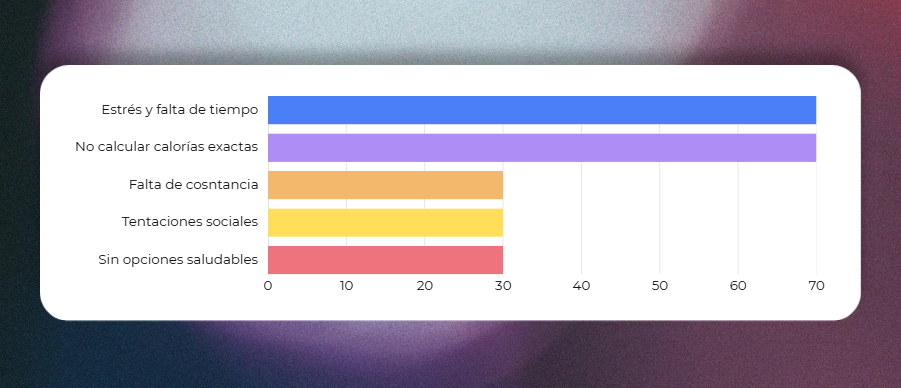
</div>

#### **¿Has utilizado alguna aplicación o servicio para mejorar tu alimentación? ¿Cómo fue tu experiencia?**  

El **100% de los entrevistados** ha utilizado aplicaciones de nutrición previamente. Sin embargo, el **67% reportó una experiencia negativa**.  

Catherine señaló que las interfaces eran tediosas y repetitivas, lo que la llevó a abandonar el uso de estas herramientas. Sebastián indicó que la versión gratuita resultaba demasiado limitada, ya que las funciones más útiles estaban bloqueadas bajo suscripción de pago.  

Por otro lado, Gonzalo tuvo una experiencia regular, mencionando que la aplicación utilizada no permitía especificar detalles como gramos exactos ni el tipo de carne, lo que generaba registros poco precisos.  

#### **CALIFICACIÓN DE EXPERIENCIA PREVIA CON APPS DE NUTRICIÓN**  

<div align="center">
  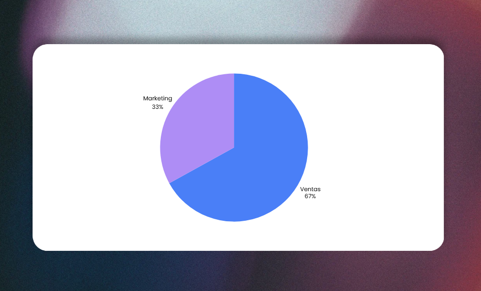
</div>

#### **¿Confías en recomendaciones nutricionales automatizadas o prefieres siempre un especialista?**  

El **100% de los entrevistados** prefiere **combinar ambas opciones**.  

Catherine y Sebastián consideran que la inteligencia artificial puede funcionar como una **guía complementaria al especialista**, ya que cada persona presenta necesidades nutricionales distintas.  

Por otro lado, Gonzalo indicó que confiaría más en la automatización por su **rapidez y capacidad de adaptación**, pero reconoce que la nutrición es un tema serio que requiere **respaldo profesional**.  

#### **PREFERENCIA SOBRE FUENTE DE RECOMENDACIONES NUTRICIONALES**  

<div align="center">
  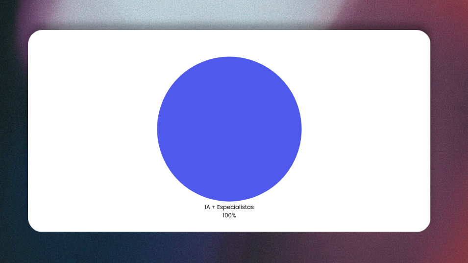
</div>

#### **¿Qué características consideras indispensables en una app de nutrición para que realmente la uses?**  

El **100% de los entrevistados** considera indispensable que la aplicación tenga una **interfaz simple y rápida**, así como una **visualización clara de calorías y nutrientes**.  

Asimismo, el **100%** valora la presencia de **recomendaciones personalizadas**, ya que permiten adaptar la experiencia a sus necesidades individuales.  

Por otro lado, el **67%** mencionó la importancia de contar con **mecanismos de motivación integrada**, como recordatorios o seguimiento del progreso, para mantener la constancia en el uso de la aplicación.  

Finalmente, solo Sebastián destacó el **escaneo de código de barras** como una función clave, ya que facilita el registro de alimentos de manera rápida y sin esfuerzo.  

#### **CARACTERÍSTICAS INDISPENSABLES — % DE ENTREVISTADOS QUE LA MENCIONARON** 

<div align="center">
  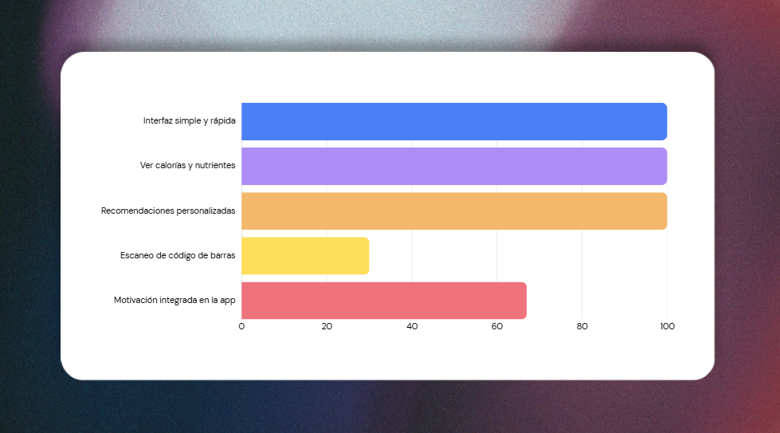
</div>

**Segundo Segmento Objetivo: Empresas que gestionan el bienestar de sus colaboradores**  

En las entrevistas, el **100% de las empresas** gestiona el bienestar de sus colaboradores utilizando **herramientas manuales o básicas**, como Excel, Google Forms u otros métodos sin monitoreo continuo.  

Asimismo, los tres representantes identificaron como principales problemas en su personal:  
- **Sedentarismo**  
- **Malos hábitos alimenticios**  
- **Estrés laboral**  

El **100% de los entrevistados** estaría dispuesto a invertir en **BioTrack**, siempre que la solución demuestre un **impacto claro y medible en la productividad**.

---

**¿Han utilizado alguna herramienta digital para el seguimiento del bienestar? ¿Cómo fue su experiencia?**  

El **33%** utiliza únicamente **Excel** para registros básicos de peso y talla (Geldres).  

Otro **33%** ha probado **encuestas digitales** como Google Forms, obteniendo una experiencia parcial y poco accionable (Beltrán).  

El **33% restante** intentó usar **herramientas digitales especializadas**, pero las consideró complejas y poco adaptadas a sus necesidades (Cortés).  

En general, **ninguna empresa cuenta con una plataforma integral de monitoreo del bienestar**.

---

**HERRAMIENTA DIGITAL ACTUALMENTE USADA PARA SEGUIMIENTO DE BIENESTAR**  

<div align="center">
  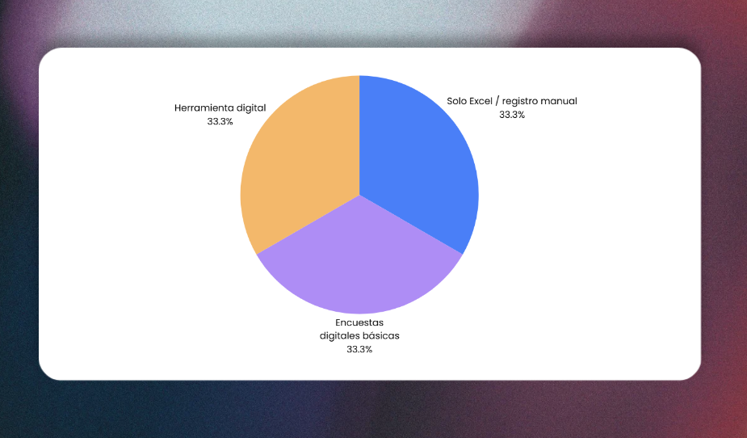
</div>

**¿Qué problemas han identificado relacionados con la alimentación o salud de su personal?**  

El **100% de las empresas** mencionó el **sedentarismo** como el problema principal en su personal.  

Asimismo, el **100%** señaló la presencia de **malos hábitos alimenticios**, evidenciando una falta de cultura nutricional adecuada.  

El **67% de los entrevistados** identificó **estrés y fatiga**, destacando su impacto directo en la productividad (Cortés y Beltrán).  

Por su parte, Geldres fue el único en detallar el **exceso de sodio** en la alimentación y su relación con la **fatiga física**, además de vincular el **sobrepeso** con una menor producción, tomando como referencia el modelo japonés de gestión.  

**PROBLEMAS DE SALUD IDENTIFICADOS EN EL PERSONAL — % DE EMPRESAS**  

<div align="center">
  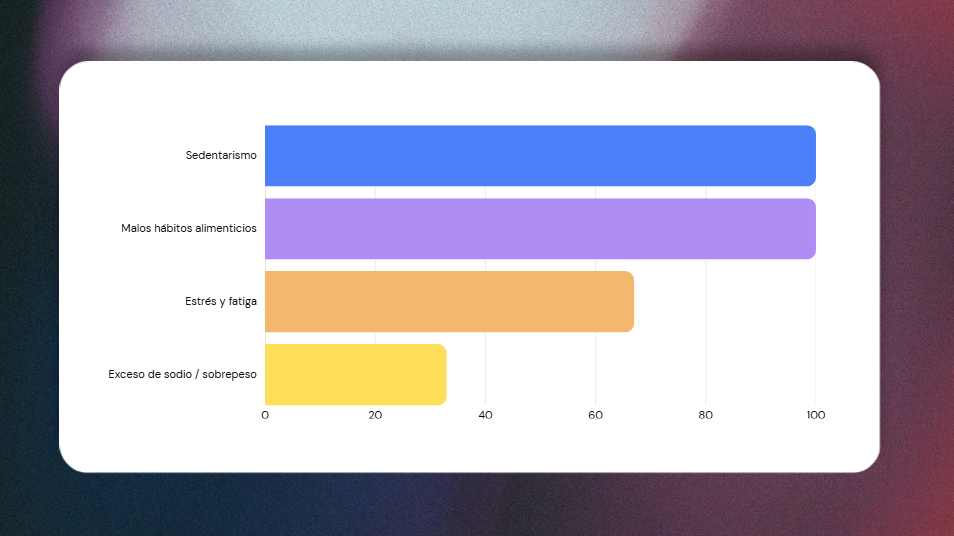
</div>

**¿Qué dificultades encuentran al implementar programas de bienestar o nutrición?**  

El **100% de las empresas** señaló la **baja participación de los colaboradores** como el principal obstáculo al implementar programas de bienestar.  

Asimismo, el **67%** mencionó la **falta de seguimiento continuo** (Cortés y Beltrán), lo que dificulta mantener la constancia y evaluar el progreso de las iniciativas.  

El **67%** también indicó la **dificultad para medir resultados**, evidenciando la ausencia de herramientas que permitan obtener métricas claras y accionables.  

Por su parte, Geldres destacó específicamente el reto de que el personal **respete las dietas y rutinas recomendadas**, debido a jornadas laborales superiores a 8 horas diarias.  

**PRINCIPALES DIFICULTADES AL IMPLEMENTAR PROGRAMAS DE BIENESTAR — % DE EMPRESAS**  

<div align="center">
  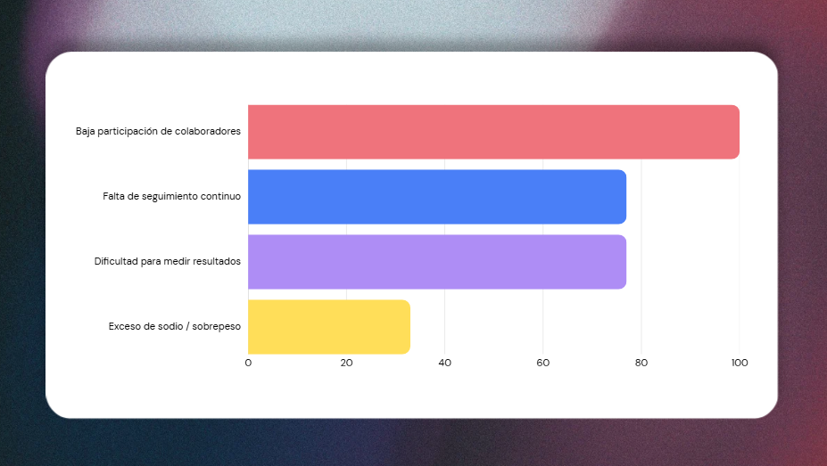
</div>

**¿Qué características consideran indispensables en una solución como BioTrack?**  

El **100% de las empresas** coincidió en tres características clave:  
- **Monitoreo en tiempo real**  
- **Reportes automatizados**  
- **Interfaz intuitiva**  

Asimismo, el **67%** considera indispensable garantizar la **seguridad y privacidad de los datos de salud** (Cortés y Beltrán).  

El **67%** también requiere **alertas de riesgo por colaborador**, que permitan identificar situaciones críticas de manera oportuna (Beltrán y Geldres).  

Finalmente, solo Beltrán destacó la necesidad de una **integración directa con sistemas de Recursos Humanos existentes**, para facilitar la gestión organizacional.  

**CARACTERÍSTICAS INDISPENSABLES EN BIOTRACK — % DE EMPRESAS QUE LA MENCIONARON**  

<div align="center">
  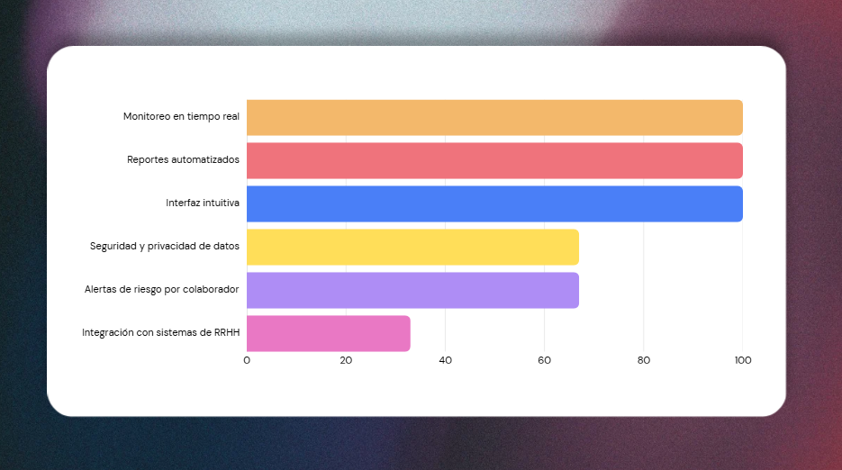
</div>

### 2.3. Needfinding
#### 2.3.1. User Personas
<strong>Segmento Objetivo #1:</strong>


<strong>Segmento Objetivo #2:</strong>


#### 2.3.2. User Task Matrix

En este cuadro presentaremos nuestros segmentos objetivos: Pacientes y Organizaciones. Consideraremos las tareas escenciales que realizarán.

<p align="center">
  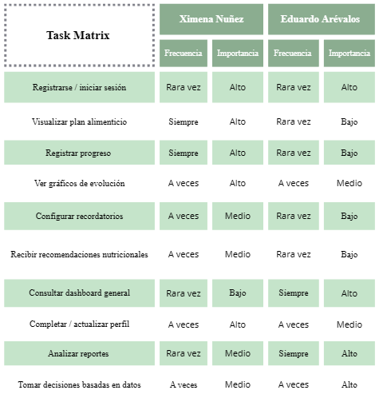
</p>

Al comparar ambos segmentos, se observa una diferencia clara en prioridades y forma de uso. Ximena Núñez utiliza con mayor frecuencia funcionalidades operativas como visualizar planes de alimentación y registrar su progreso, dándoles además alta importancia, lo que refleja un enfoque práctico y constante en el seguimiento personal. Sin embargo, acciones más analíticas como revisar reportes o tomar decisiones basadas en datos tienen una frecuencia menor para ella. En cambio, Eduardo Arévalos muestra un patrón distinto: usa con alta frecuencia herramientas de análisis como el dashboard general y los reportes, asignándoles también alta importancia, lo que evidencia un enfoque más estratégico y orientado a la toma de decisiones. En resumen, mientras Ximena prioriza el registro y seguimiento diario, Eduardo se centra en el análisis e interpretación de la información para actuar.

#### 2.3.3. User Journey Mapping

<strong>Segmento Objetivo #1:</strong>

Este journey representa la experiencia actual de Ximena al intentar mejorar su alimentación, evidenciando la falta de constancia, organización y seguimiento en su rutina diaria. 


<strong>Segmento Objetivo #2:</strong>

Este journey representa cómo Eduardo gestiona actualmente iniciativas de bienestar nutricional en su empresa, mostrando un proceso fragmentado, manual y con poca visibilidad de resultados. 


#### 2.3.4. Empathy Mapping

<strong>Segmento Objetivo #1:</strong>


<strong>Segmento Objetivo #2:</strong>


## 2.4. Big Picture EventStorming


El Big Picture EventStorming nos permite explorar el dominio de BioTrack de manera colaborativa, identificando los eventos de negocio clave a lo largo de la línea de tiempo. A través de este proceso se descubren las interacciones entre actores, comandos y sistemas que conforman la plataforma de gestión nutricional. Hemos dividido este análisis en tres etapas fundamentales: descubrimiento de eventos de dominio, identificación de comandos y actores, y agrupación en bounded contexts.


### Fase 0

El siguiente apartado presenta el descubrimiento inicial de los eventos de negocio de BioTrack. Se identifican cronológicamente los eventos de dominio que ocurren a lo largo del ciclo de vida de los usuarios, abarcando desde el registro y activación de cuentas hasta la configuración del perfil de salud, la gestión corporativa, la planificación nutricional, el seguimiento del progreso y la facturación. En esta fase, los eventos —representados en notas de color naranja— son colocados en el orden en que ocurren dentro del negocio, sin aún vincularlos a comandos ni actores específicos.

<figure style="text-align: center; margin-bottom: 40px;">
  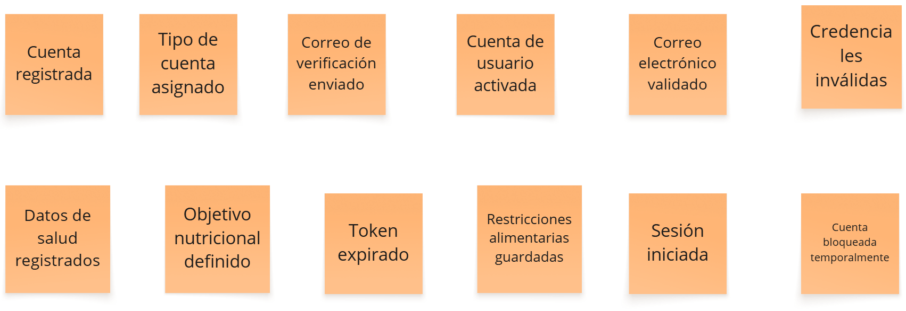
  <figcaption style="margin-top: 10px;">
    <em>Figura X. En esta figura se observan los eventos de dominio correspondientes a la gestión de identidad y perfil del usuario. Se identifican los hitos del ciclo de vida de la cuenta: el registro, la asignación del tipo de cuenta, el envío del correo de verificación, la validación del correo electrónico y la activación de la cuenta. Adicionalmente, se incluyen los eventos de error como la expiración del token de verificación y el bloqueo temporal por credenciales inválidas, junto con el inicio de sesión exitoso. En la fila inferior se presentan los eventos del perfil de salud del paciente: el registro de datos básicos, la definición del objetivo nutricional y el guardado de restricciones alimentarias.</em>
  </figcaption>
</figure>

<figure style="text-align: center; margin-bottom: 40px;">
  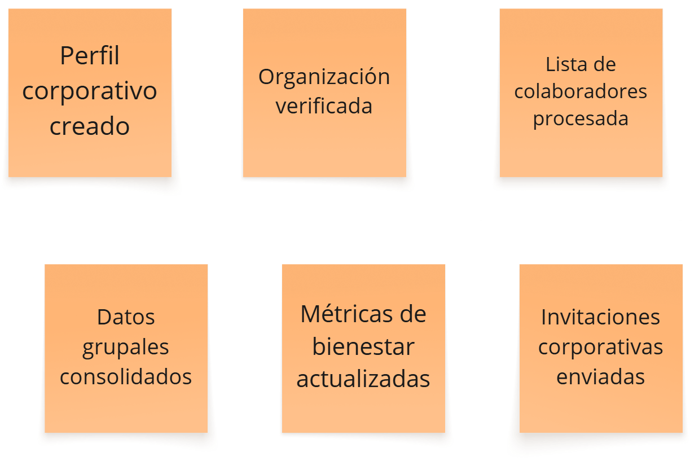
  <figcaption style="margin-top: 10px;">
    <em>Figura X. En la imagen se presentan los eventos de dominio del módulo de gestión corporativa. La fila superior muestra los eventos relacionados con el alta de una organización en la plataforma: la creación del perfil corporativo, la verificación de la organización y el procesamiento de la lista de colaboradores. La fila inferior comprende los eventos derivados de dicho procesamiento: la consolidación de datos grupales de salud, la actualización de métricas de bienestar y el envío de invitaciones corporativas a los colaboradores.</em>
  </figcaption>
</figure>

<figure style="text-align: center; margin-bottom: 40px;">
  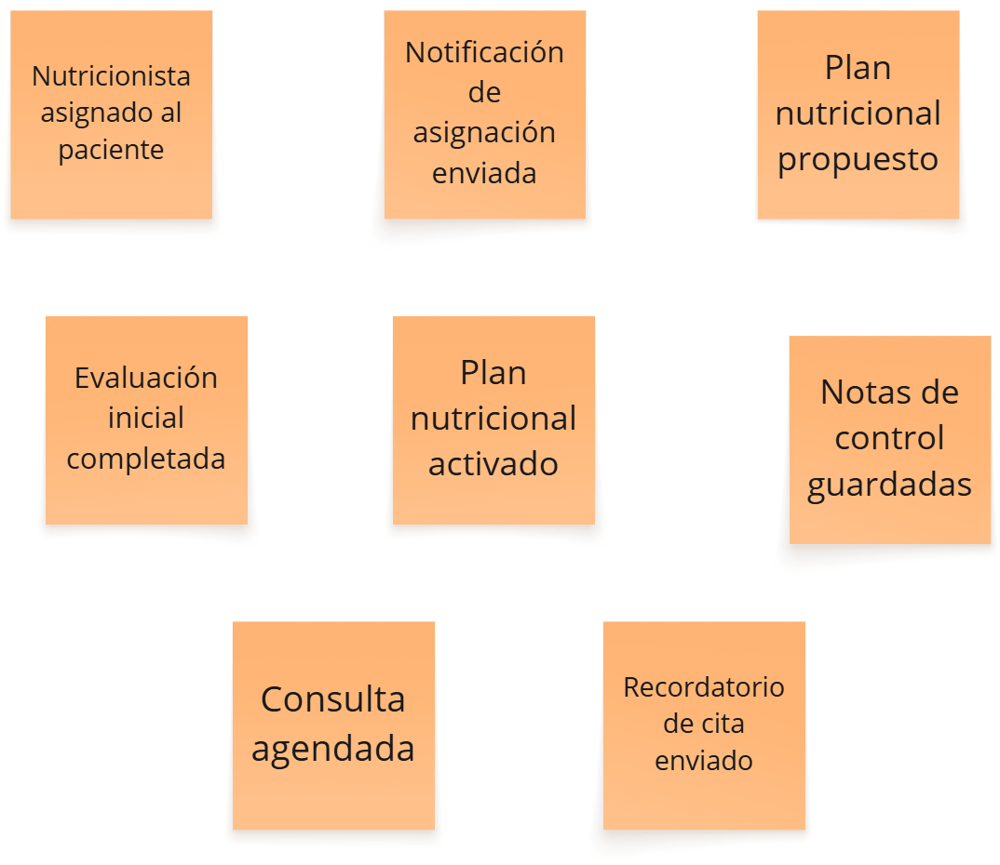
  <figcaption style="margin-top: 10px;">
    <em>Figura X. Se observan los eventos de dominio correspondientes al módulo de planificación nutricional. La primera fila recoge los eventos del inicio del proceso clínico: la asignación del nutricionista al paciente, la notificación de dicha asignación y la propuesta del plan nutricional. La segunda fila muestra los eventos de la evaluación y activación: la evaluación inicial completada, el plan nutricional activado y el guardado de notas de control post-consulta. La fila inferior presenta los eventos de seguimiento: la consulta agendada y el envío del recordatorio de cita.</em>
  </figcaption>
</figure>

<figure style="text-align: center; margin-bottom: 40px;">
  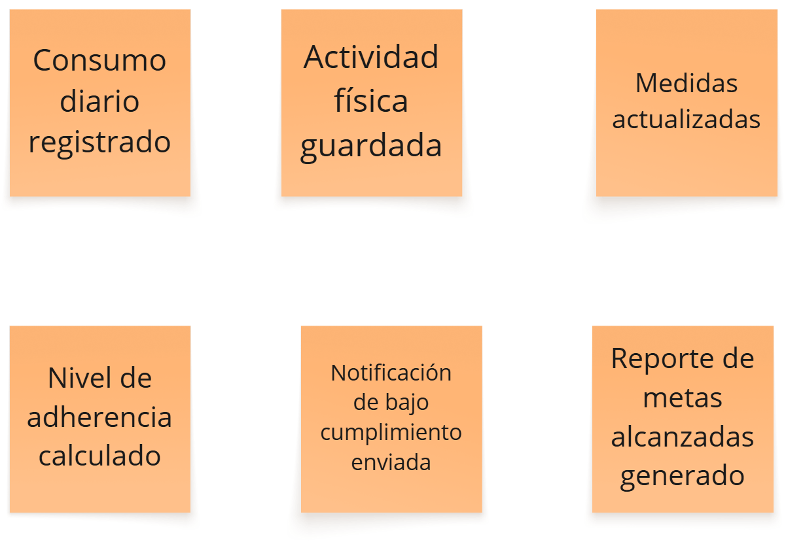
  <figcaption style="margin-top: 10px;">
    <em>Figura X. En esta figura se identifican los eventos de dominio del módulo de seguimiento del progreso. La fila superior muestra los eventos de registro continuo del paciente: el consumo diario registrado, la actividad física guardada y las medidas corporales actualizadas. La fila inferior presenta los eventos de monitoreo automatizado: el cálculo del nivel de adherencia al plan, el envío de la notificación de bajo cumplimiento al nutricionista y la generación del reporte de metas alcanzadas.</em>
  </figcaption>
</figure>

<figure style="text-align: center; margin-bottom: 40px;">
  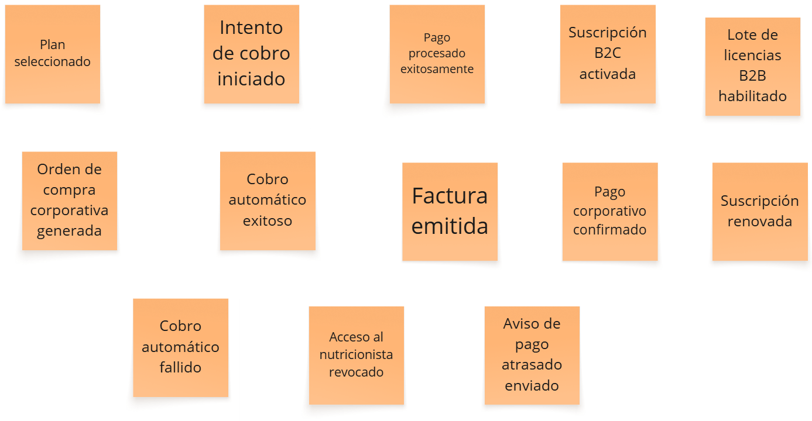
  <figcaption style="margin-top: 10px;">
    <em>Figura X. Se observan los eventos de dominio del módulo de suscripciones y facturación. La fila superior recoge los eventos del flujo de pago individual B2C y corporativo B2B: el plan seleccionado, el intento de cobro iniciado, el pago procesado exitosamente, la suscripción B2C activada y el lote de licencias B2B habilitado. La fila intermedia presenta los eventos del ciclo de facturación corporativa y renovación: la orden de compra generada, el cobro automático exitoso, la factura emitida, el pago corporativo confirmado y la suscripción renovada. La fila inferior recoge los eventos del flujo de cobro fallido: el cobro automático fallido, el acceso al nutricionista revocado y el aviso de pago atrasado enviado.</em>
  </figcaption>
</figure>

<p style="text-align: center;">
  <em>Big Picture EventStorming: Fase 0 - Elaboración propia. Nota: En esta fase inicial se descubren y organizan cronológicamente los eventos de dominio (Domain Events) de la plataforma BioTrack, representados en notas de color naranja.</em>
</p>

En conjunto, los eventos presentados en la Fase 0 evidencian un dominio de negocio amplio y bien articulado que abarca el ciclo completo de la plataforma BioTrack. Se identifican con claridad los hitos críticos de cada área funcional: el ciclo de vida de la cuenta de usuario con sus flujos de éxito y error, la configuración del perfil de salud del paciente, la incorporación y gestión de organizaciones corporativas, el proceso clínico de planificación nutricional desde la asignación del especialista hasta el seguimiento de consultas, el monitoreo continuo del progreso con alertas automáticas, y el modelo de negocio por suscripción con sus flujos de pago, renovación y recuperación ante cobros fallidos. Esta visión cronológica de eventos constituye la base sobre la cual se incorporarán, en las etapas siguientes, los comandos, actores y políticas que darán estructura completa al dominio.

---

### Etapa 1 y 2

El presente apartado introduce la segunda y tercera fase del Big Picture EventStorming de BioTrack, en la cual se añaden los comandos que desencadenan cada evento y se identifican los actores o sistemas responsables de ejecutarlos. Esta capa de análisis permite comprender no solo qué ocurre en el dominio, sino también quién lo provoca y bajo qué condición, revelando la lógica operativa de cada bounded context. A continuación, se presentan los flujos enriquecidos con comandos y actores para cada módulo de la plataforma.

<figure style="text-align: center; margin-bottom: 40px;">
  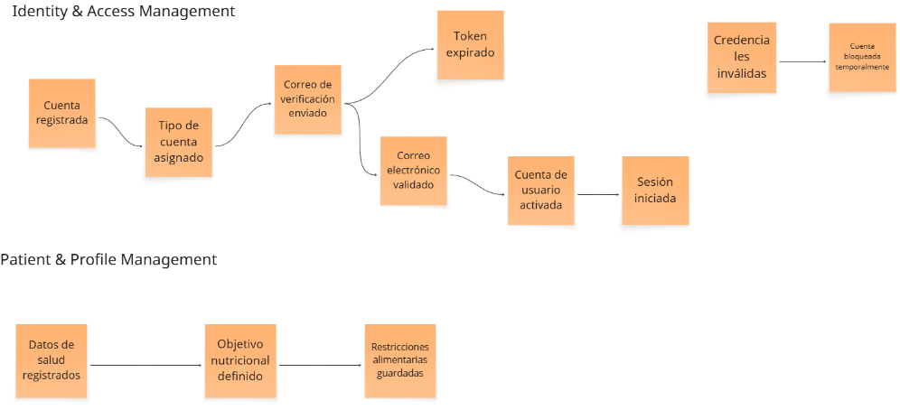
  <figcaption style="margin-top: 10px;">
    <em>Figura X. En esta figura se observa el flujo de Identity & Profile Management con comandos y actores. El usuario ejecuta el comando de registrar cuenta, desencadenando la asignación del tipo de cuenta y el envío del correo de verificación mediante una política que invoca el servicio de Email. Según la acción del usuario al validar el correo, se activa la cuenta o, ante la inacción, expira el token a las 24 horas. El módulo de inicio de sesión bifurca entre el acceso exitoso al Dashboard Principal y el bloqueo temporal por credenciales inválidas, regido por una política de seguridad. En la sección inferior, el paciente registra sus datos de salud, selecciona su objetivo nutricional y registra sus restricciones alimentarias, las cuales quedan guardadas en su perfil.</em>
  </figcaption>
</figure>

<figure style="text-align: center; margin-bottom: 40px;">
  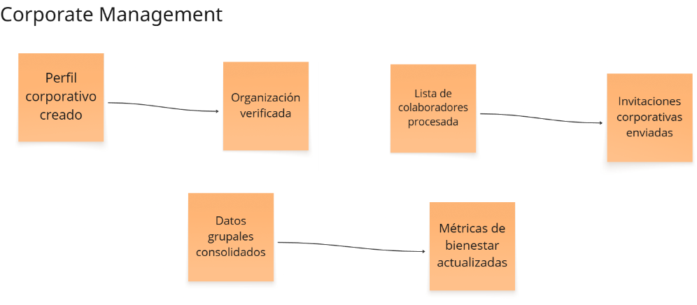
  <figcaption style="margin-top: 10px;">
    <em>Figura X. En la imagen se presenta el flujo de Corporate Management con comandos y actores identificados. El Admin Corporativo ejecuta el comando de registrar datos de empresa, lo que genera el perfil corporativo y activa una política de verificación de identidad fiscal (RUC). Una vez verificada la organización, el administrador sube la lista de colaboradores, cuyo procesamiento activa una política que genera los accesos y envía las invitaciones corporativas a través del servicio de Email. Paralelamente, el sistema consolida las métricas de salud grupales de forma anónima y las publica en el Dashboard Corporativo Anónimo.</em>
  </figcaption>
</figure>

<figure style="text-align: center; margin-bottom: 40px;">
  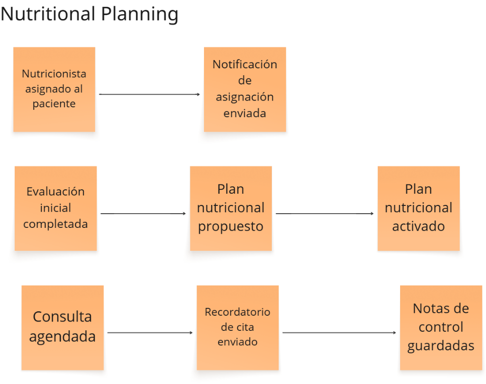
  <figcaption style="margin-top: 10px;">
    <em>Figura X. Se observa el flujo de Nutritional Planning con su capa de comandos y actores. El sistema asigna automáticamente un nutricionista disponible al paciente, notificando a ambas partes vía Email. El nutricionista evalúa el perfil de salud del paciente y ejecuta el comando de crear plan nutricional, lo que genera una propuesta que debe ser aceptada por el paciente mediante una política de aprobación, activando el plan. En el flujo de seguimiento, el paciente agenda una consulta de control, lo que dispara el envío de un recordatorio y posteriormente habilita al nutricionista para registrar las notas de la consulta, las cuales quedan guardadas en el sistema.</em>
  </figcaption>
</figure>

<figure style="text-align: center; margin-bottom: 40px;">
  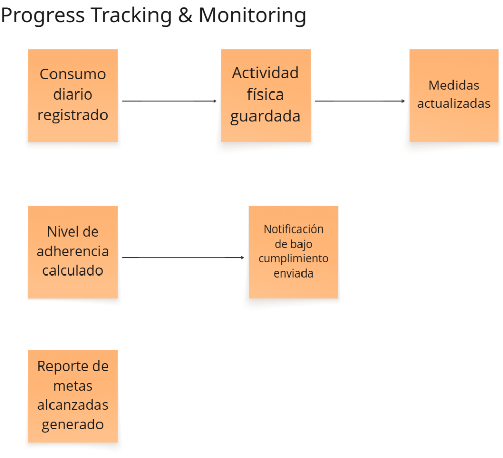
  <figcaption style="margin-top: 10px;">
    <em>Figura X. En esta figura se detalla el flujo de Progress Tracking & Monitoring con comandos y actores. El paciente registra su consumo de alimentos y su actividad física diaria, y actualiza su peso semanal, datos que alimentan el Gráfico de Progreso. De forma paralela, el sistema calcula el nivel de adherencia al plan y, ante un valor bajo, una política activa el envío de una alerta al nutricionista vía Email con una notificación de bajo cumplimiento. Adicionalmente, el sistema genera periódicamente el reporte de evolución con las metas alcanzadas, disponible como Reporte PDF de Resultados.</em>
  </figcaption>
</figure>

<figure style="text-align: center; margin-bottom: 40px;">
  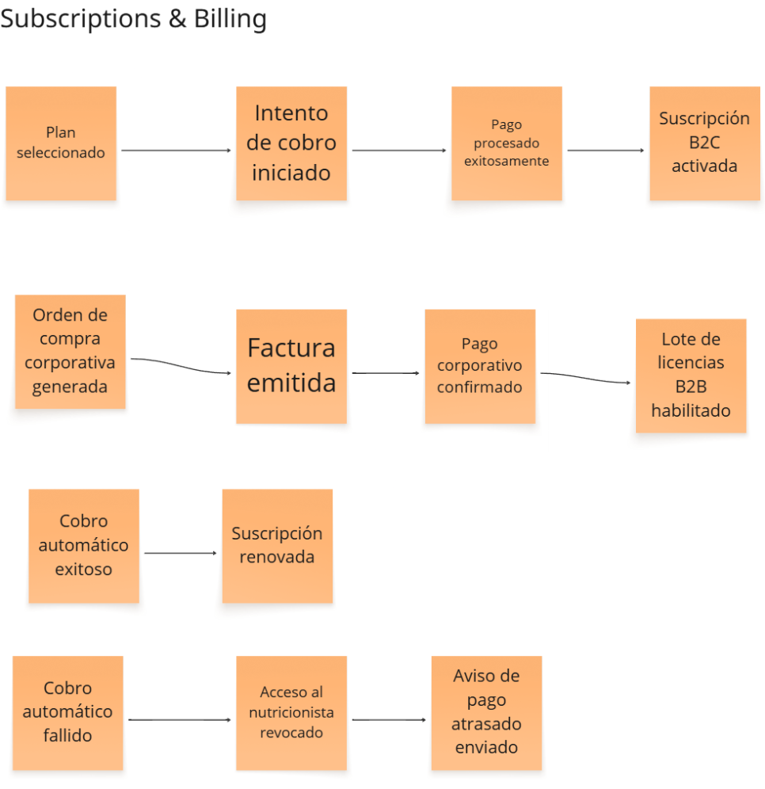
  <figcaption style="margin-top: 10px;">
    <em>Figura X. Se observa el flujo de Subscriptions & Billing con su capa de comandos y actores. El paciente selecciona un plan mensual e ingresa su método de pago, iniciando el intento de cobro a través de la Pasarela de Pagos. Ante un pago exitoso, una política activa los beneficios del plan y genera el Resumen de Facturación B2C. En el flujo corporativo, el Admin Corporativo compra un paquete de licencias, generando una orden de compra que desencadena la emisión de una factura; confirmado el pago, se habilita el lote de licencias B2B. El sistema procesa mensualmente las renovaciones automáticas, bifurcando entre la extensión del plan ante cobro exitoso y la suspensión de funciones premium con aviso de pago atrasado ante cobro fallido.</em>
  </figcaption>
</figure>

<p style="text-align: center;">
  <em>Big Picture EventStorming: Etapa 1 y 2 - Elaboración propia. Nota: Se añaden los comandos (notas azules) que desencadenan los eventos y se identifican los actores y sistemas (notas amarillas y rosadas) que los ejecutan, así como las políticas (notas moradas) que rigen las decisiones de negocio dentro de cada bounded context.</em>
</p>

En conjunto, los flujos presentados revelan una plataforma con una lógica de negocio clara y bien estructurada, donde cada acción del usuario o del sistema tiene un desencadenante definido y una consecuencia trazable. La incorporación de comandos y actores permite visualizar con precisión las responsabilidades de cada rol: el paciente como principal generador de datos de salud, el nutricionista como responsable clínico del plan, el Admin Corporativo como gestor de su organización y el sistema como motor de cálculo, notificación y facturación automática. Las políticas identificadas en color morado evidencian los puntos de decisión críticos del negocio, desde la validación de identidad fiscal hasta el cálculo de adherencia y la gestión de cobros recurrentes, consolidando una visión integral del dominio de BioTrack.

---

### Etapa 3

La siguiente etapa presenta la vista final del Big Picture EventStorming de BioTrack, en la cual los eventos, comandos, actores y políticas quedan agrupados en sus respectivos Bounded Contexts o contextos delimitados. Esta organización permite definir las fronteras naturales del dominio y establecer la base sobre la cual se construirá la arquitectura de software orientada al dominio (DDD). A continuación, se presentan los cinco bounded contexts identificados para la plataforma.

<figure style="text-align: center; margin-bottom: 40px;">
  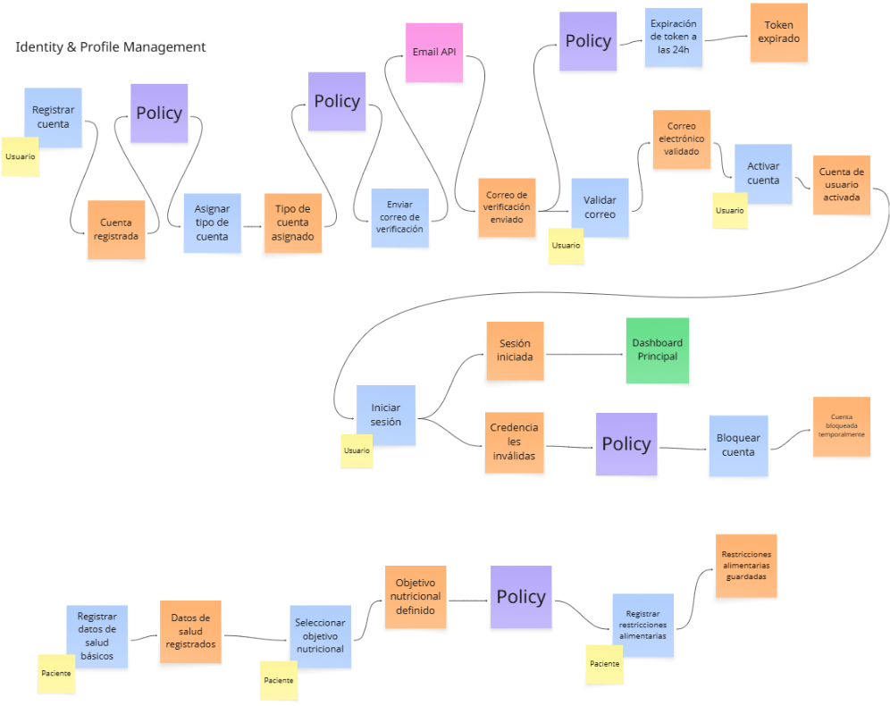
  <figcaption style="margin-top: 10px;">
    <em>Figura X. En esta figura se observa el Bounded Context de Identity & Profile Management. Agrupa todos los eventos, comandos y políticas relacionados con el registro de usuarios, la verificación de correo electrónico, la activación de cuentas, el inicio de sesión con sus flujos de error y el registro del perfil de salud del paciente incluyendo objetivo nutricional y restricciones alimentarias.</em>
  </figcaption>
</figure>

<figure style="text-align: center; margin-bottom: 40px;">
  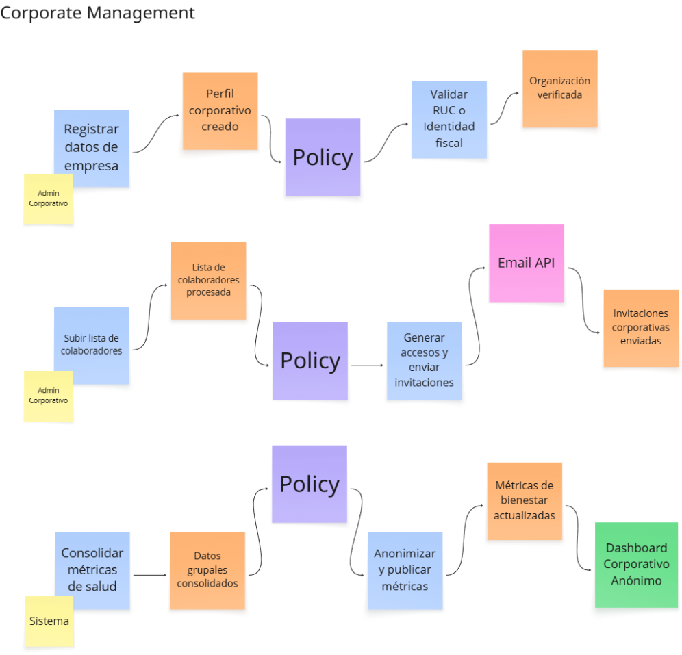
  <figcaption style="margin-top: 10px;">
    <em>Figura X. En la imagen se presenta el Bounded Context de Corporate Management. Consolida los flujos de registro y verificación de empresas, la gestión de colaboradores mediante la carga masiva de listas y el envío de invitaciones corporativas, y la publicación anónima de métricas de bienestar grupal en el Dashboard Corporativo.</em>
  </figcaption>
</figure>

<figure style="text-align: center; margin-bottom: 40px;">
  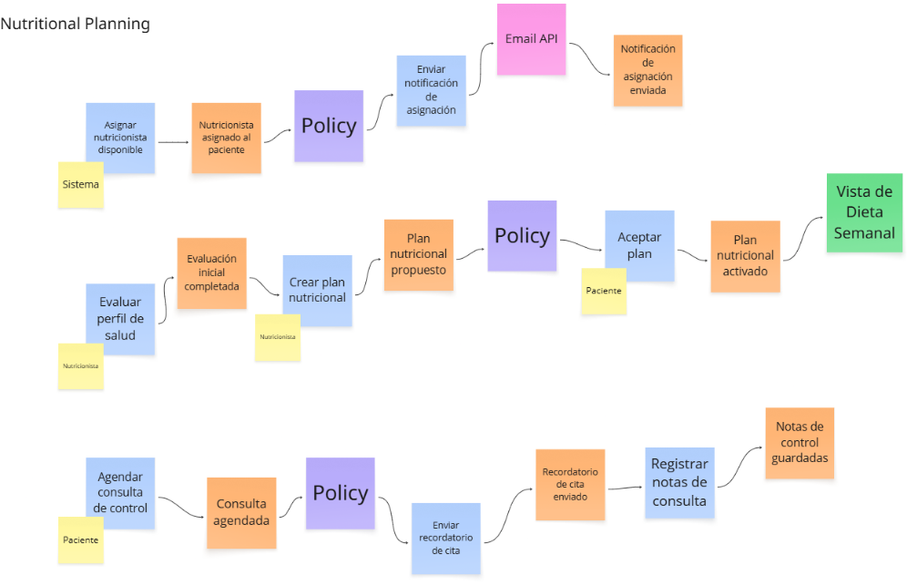
  <figcaption style="margin-top: 10px;">
    <em>Figura X. Se observa el Bounded Context de Nutritional Planning. Abarca la asignación del nutricionista al paciente, la evaluación del perfil de salud, la creación y aprobación del plan nutricional, el agendamiento de consultas de control con recordatorios automáticos y el registro de notas clínicas post-consulta.</em>
  </figcaption>
</figure>

<figure style="text-align: center; margin-bottom: 40px;">
  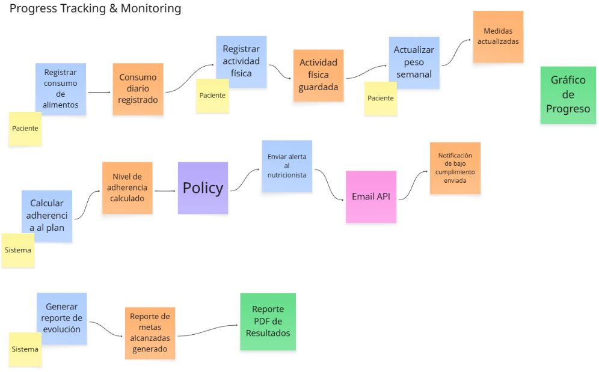
  <figcaption style="margin-top: 10px;">
    <em>Figura X. En esta figura se identifica el Bounded Context de Progress Tracking & Monitoring. Concentra los eventos de registro de consumo alimentario, actividad física y peso semanal, el cálculo automático de adherencia al plan con sus alertas de bajo cumplimiento al nutricionista, y la generación periódica de reportes de evolución y metas alcanzadas.</em>
  </figcaption>
</figure>

<figure style="text-align: center; margin-bottom: 40px;">
  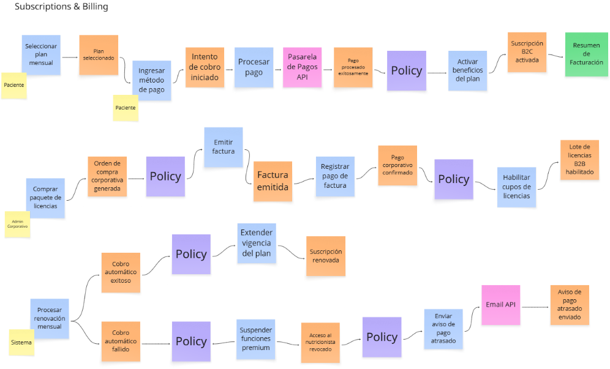
  <figcaption style="margin-top: 10px;">
    <em>Figura X. Se observa el Bounded Context de Subscriptions & Billing. Engloba los flujos de suscripción individual B2C y corporativa B2B, incluyendo el procesamiento de pagos, la emisión de facturas, la habilitación de licencias, la renovación automática mensual y los flujos de cobro fallido con suspensión de acceso y notificación de pago atrasado.</em>
  </figcaption>
</figure>

<p style="text-align: center;">
  <em>Big Picture EventStorming: Etapa 3 - Elaboración propia. Nota: Se identifican los Agregados (notas amarillas grandes) que encapsulan las reglas de negocio y se agrupan los eventos en sus cinco Bounded Contexts: Identity & Profile Management, Corporate Management, Nutritional Planning, Progress Tracking & Monitoring, y Subscriptions & Billing.</em>
</p>

En síntesis, la Etapa 3 del Big Picture EventStorming de BioTrack establece con claridad las fronteras del dominio de negocio mediante cinco bounded contexts bien diferenciados. Cada contexto encapsula una responsabilidad específica: la gestión de identidad y perfiles garantiza el acceso seguro y la configuración inicial del usuario; el contexto corporativo habilita el modelo B2B con privacidad de datos; la planificación nutricional centraliza la relación clínica entre paciente y nutricionista; el seguimiento del progreso provee la capa de monitoreo continuo que diferencia a BioTrack de soluciones básicas; y el módulo de suscripciones y facturación sostiene el modelo de negocio escalable. Esta delimitación constituye la base arquitectónica sobre la cual se diseñarán los componentes de software en las fases posteriores del proyecto.

### 2.5. Ubiquitous Language

| N° | Palabra técnica | Significado |
| :---: | :--- | :--- |
| 1 | **Nutritional Assessment (Evaluación Nutricional)** | Proceso inicial y periódico donde el especialista analiza el estado físico, hábitos y necesidades específicas del usuario para establecer un punto de partida. |
| 2 | **Dietary Plan (Plan Dietético)** | Guía estructurada de alimentación diseñada por un profesional, que especifica las porciones, tipos de alimentos y horarios que el paciente debe seguir. |
| 3 | **Food Intake Record (Registro de Ingesta)** | Documento o registro cotidiano donde el paciente detalla los alimentos consumidos y el cumplimiento de las pautas del plan nutricional. |
| 4 | **Nutritional Adherence (Adherencia Nutricional)** | Grado de coincidencia entre el comportamiento del paciente y las recomendaciones prescritas por el especialista a lo largo del tiempo. |
| 5 | **Body Measurement (Medición Corporal)** | Conjunto de medidas físicas (como peso, porcentaje de grasa y masa muscular) que sirven como indicadores objetivos del progreso del usuario. |
| 6 | **Adherence Alert (Alerta de Adherencia)** | Aviso de prioridad emitido al profesional de la nutrición cuando se detecta una desviación significativa o una caída prolongada en el cumplimiento del paciente. |
| 7 | **Wellness Report (Reporte de Bienestar)** | Documento estadístico consolidado que permite a las organizaciones visualizar el estado de salud general de sus colaboradores de forma anónima. |
| 8 | **Health Goal (Meta de Salud)** | Objetivo específico, medible y temporal definido conjuntamente entre el nutricionista y el paciente para guiar el seguimiento. |
| 9 | **Follow-up Consultation (Consulta de Seguimiento)** | Sesión periódica donde el nutricionista evalúa el registro diario de datos y ajusta el plan dietético según los resultados observados.  |
| 10 | **Nutritional Risk (Riesgo Nutricional)** | Identificación de condiciones o hábitos que pueden comprometer la salud del paciente si no se intervienen de manera oportuna. |
| 11 | **Corporate Subscriber (Suscriptor Corporativo)** | Organización que adquiere los servicios de monitoreo nutricional preventivo para ofrecerlos como beneficio laboral a su personal. |

*(Tabla 10. Ubiquitous Languages - Elaboración propia.)*

---

## 📋 Capítulo III: Requirements Specification

### 3.1. User Stories


| Epic / Story ID | Título | Descripción | Criterios de Aceptación | Relacionado con (Epic ID) |
|-----------------|--------|------------|--------------------------|----------------------------|
| **EP01** | Identity & Profile Management | Registro, verificación de correo, activación de cuenta, inicio de sesión y configuración inicial del perfil del paciente. |
| US01 | Registrar cuenta de usuario | Como usuario, quiero registrar una nueva cuenta en la plataforma, para poder acceder a los servicios del sistema. | **Scenario 1: Registro exitoso**<br>Given el usuario accede al formulario de registro,<br>When completa todos los campos requeridos con información válida y envía el formulario,<br>Then el sistema crea la cuenta y muestra un mensaje de confirmación de registro.<br><br>**Scenario 2: Campos incompletos**<br>Given el usuario accede al formulario de registro,<br>When omite uno o más campos obligatorios e intenta enviar el formulario,<br>Then el sistema muestra un mensaje de error indicando los campos faltantes y no registra la cuenta.<br><br>**Scenario 3: Email ya registrado**<br>Given el usuario intenta registrarse con un correo ya existente,<br>When envía el formulario,<br>Then el sistema muestra un mensaje indicando que el correo ya está en uso y no crea una cuenta duplicada. | EP01 |
| US02 | Asignar tipo de cuenta automáticamente | Como usuario, quiero que el sistema asigne automáticamente el tipo de cuenta correspondiente a mis datos de registro. | **Scenario 1: Asignación correcta**<br>Given el usuario ha completado el registro exitosamente,<br>When el sistema procesa los datos del registro,<br>Then el sistema asigna el tipo de cuenta correspondiente y lo registra en el perfil del usuario.<br><br>**Regla de negocio:** El tipo de cuenta se determina según los datos provistos en el registro; no puede ser modificado libremente por el usuario una vez asignado. | EP01 |
| US03 | Recibir correo de verificación | Como usuario, quiero recibir un correo electrónico de verificación al registrarme. | **Scenario 1: Envío exitoso**<br>Given el usuario ha completado el registro,<br>When el sistema procesa la solicitud,<br>Then se envía un correo de verificación al email registrado.<br><br>**Scenario 2: Fallo en el envío**<br>Given el sistema intenta enviar el correo,<br>When ocurre un error,<br>Then el sistema notifica al usuario y ofrece reintentar. | EP01 |
| US04 | Validar correo electrónico | Como usuario, quiero validar mi correo mediante un enlace. | **Scenario 1: Validación exitosa**<br>Given el usuario recibe el correo,<br>When hace clic en el enlace dentro del período válido,<br>Then el sistema marca el correo como validado.<br><br>**Scenario 2: Token expirado**<br>Given el usuario intenta validar,<br>When el token ha expirado,<br>Then el sistema muestra un mensaje de error. | EP01 |
| US05 | Reenviar enlace de verificación | Como usuario, quiero solicitar un nuevo enlace si el anterior expira. | **Scenario 1: Reenvío exitoso**<br>Given el usuario solicita un nuevo enlace,<br>When el sistema procesa la solicitud,<br>Then se envía un nuevo correo de verificación.<br><br>**Scenario 2: Límite alcanzado**<br>Given el usuario ha solicitado múltiples reenvíos,<br>When supera el límite permitido,<br>Then el sistema bloquea temporalmente la solicitud. | EP01 |
| US06 | Activar cuenta | Como usuario, quiero que mi cuenta se active automáticamente al validar mi correo. | **Scenario 1: Activación exitosa**<br>Given el usuario valida su correo,<br>When el sistema procesa la validación,<br>Then la cuenta queda activa.<br><br>**Scenario 2: Cuenta ya activada**<br>Given el usuario intenta validar nuevamente,<br>When la cuenta ya está activa,<br>Then el sistema muestra un mensaje informativo. | EP01 |
| US07 | Iniciar sesión | Como usuario, quiero iniciar sesión con mi correo y contraseña. | **Scenario 1: Inicio de sesión exitoso**<br>Given el usuario accede al login,<br>When ingresa credenciales válidas,<br>Then el sistema inicia sesión y redirige al dashboard.<br><br>**Scenario 2: Credenciales inválidas**<br>Given el usuario intenta iniciar sesión,<br>When ingresa datos incorrectos,<br>Then el sistema muestra un error y no inicia sesión. | EP01 |
| US08 | Bloquear cuenta por intentos fallidos | Como usuario, quiero que el sistema bloquee mi cuenta tras múltiples intentos fallidos. | **Scenario 1: Bloqueo temporal activado**<br>Given el usuario supera el número de intentos permitidos,<br>When el sistema detecta el exceso,<br>Then bloquea la cuenta temporalmente.<br><br>**Regla de negocio:** El bloqueo es temporal. | EP01 |
| US09 | Registrar datos de salud | Como paciente, quiero registrar mis datos de salud básicos. | **Scenario 1: Registro exitoso**<br>Given el paciente ha iniciado sesión,<br>When ingresa datos válidos,<br>Then el sistema guarda la información.<br><br>**Scenario 2: Valores fuera de rango**<br>Given el paciente ingresa datos inválidos,<br>When intenta guardar,<br>Then el sistema muestra errores. | EP01 |
| US10 | Seleccionar objetivo nutricional | Como paciente, quiero seleccionar mi objetivo nutricional. | **Scenario 1: Selección exitosa**<br>Given el paciente tiene datos registrados,<br>When selecciona un objetivo,<br>Then el sistema lo guarda en el perfil.<br><br>**Scenario 2: Sin selección**<br>Given el paciente intenta continuar,<br>When no selecciona un objetivo,<br>Then el sistema no permite avanzar. | EP01 |
| **EP02** | Corporate Management | Registro y verificación de empresa, incorporación de colaboradores, gestión de accesos y métricas grupales anonimizadas. 
| US11 | Registrar restricciones alimentarias | Como paciente, quiero registrar mis restricciones alimentarias, para que el sistema las considere en mi plan nutricional. | **Scenario 1: Registro exitoso**<br>Given el paciente tiene su objetivo definido,<br>When registra sus restricciones y confirma,<br>Then el sistema guarda la información.<br><br>**Scenario 2: Sin restricciones**<br>Given el paciente no tiene restricciones,<br>When confirma sin seleccionar,<br>Then el sistema registra que no posee restricciones. | EP01 |
| US12 | Registrar datos de empresa | Como Admin Corporativo, quiero registrar los datos de mi empresa, para crear el perfil corporativo. | **Scenario 1: Registro exitoso**<br>Given el Admin accede al formulario,<br>When completa los campos correctamente,<br>Then el sistema crea el perfil.<br><br>**Scenario 2: Datos incompletos**<br>Given el Admin intenta registrar,<br>When faltan campos,<br>Then el sistema muestra errores. | EP02 |
| US13 | Validar RUC de empresa | Como Admin Corporativo, quiero validar el RUC de mi empresa, para verificar su identidad fiscal. | **Scenario 1: Validación exitosa**<br>Given el sistema valida el RUC,<br>When es correcto,<br>Then la empresa queda verificada.<br><br>**Scenario 2: RUC inválido**<br>Given el RUC es incorrecto,<br>When el sistema valida,<br>Then muestra error. | EP02 |
| US14 | Subir lista de colaboradores | Como Admin Corporativo, quiero subir una lista de colaboradores, para generar accesos. | **Scenario 1: Carga exitosa**<br>Given el Admin sube archivo válido,<br>When el sistema procesa,<br>Then genera accesos.<br><br>**Scenario 2: Formato incorrecto**<br>Given el archivo es inválido,<br>When se procesa,<br>Then se rechaza. | EP02 |
| US15 | Enviar invitaciones a colaboradores | Como Admin Corporativo, quiero enviar invitaciones por correo, para que accedan al sistema. | **Scenario 1: Envío exitoso**<br>Given existen accesos generados,<br>When se envían correos,<br>Then los usuarios reciben invitación.<br><br>**Scenario 2: Error en envío**<br>Given falla el envío,<br>When ocurre error,<br>Then se notifica al admin. | EP02 |
| US16 | Visualizar dashboard corporativo | Como Admin Corporativo, quiero visualizar métricas anonimizadas, para tomar decisiones. | **Scenario 1: Datos disponibles**<br>Given existen métricas,<br>When accede al dashboard,<br>Then se muestran datos.<br><br>**Scenario 2: Sin datos**<br>Given no hay registros,<br>When accede,<br>Then muestra mensaje. | EP02 |
| US17 | Consolidar métricas de salud | Como Sistema, quiero consolidar datos anonimizados, para mostrarlos en dashboard. | **Scenario 1: Consolidación exitosa**<br>Given hay datos suficientes,<br>When el sistema procesa,<br>Then publica métricas.<br><br>**Scenario 2: Datos insuficientes**<br>Given pocos datos,<br>When procesa,<br>Then no publica. | EP02 |
| **EP03** | Nutritional Planning | Asignación de nutricionista, evaluación, creación y seguimiento del plan nutricional. |
| US18 | Asignar nutricionista | Como Sistema, quiero asignar un nutricionista, para iniciar el plan. | **Scenario 1: Asignación exitosa**<br>Given hay nutricionistas disponibles,<br>When se asigna,<br>Then se registra.<br><br>**Scenario 2: No disponible**<br>Given no hay nutricionistas,<br>When intenta asignar,<br>Then queda en espera. | EP03 |
| US19 | Notificar asignación | Como paciente, quiero recibir notificación, para saber mi nutricionista. | **Scenario 1: Envío exitoso**<br>Given se asigna nutricionista,<br>When se completa,<br>Then se notifica.<br><br>**Scenario 2: Error envío**<br>Given falla envío,<br>When ocurre error,<br>Then se reintenta. | EP03 |
| US20 | Evaluar perfil del paciente | Como nutricionista, quiero evaluar al paciente, para crear el plan. | **Scenario 1: Evaluación completa**<br>Given accede al perfil,<br>When completa datos,<br>Then se guarda.<br><br>**Scenario 2: Incompleta**<br>Given faltan campos,<br>When intenta guardar,<br>Then muestra error. | EP03 |
| US21 | Crear plan nutricional | Como nutricionista, quiero crear un plan nutricional personalizado, para guiar al paciente según su evaluación. | **Scenario 1: Plan creado**<br>Given el nutricionista completó la evaluación,<br>When crea el plan con datos completos,<br>Then el sistema lo registra como "propuesto".<br><br>**Scenario 2: Datos incompletos**<br>Given faltan campos,<br>When intenta enviar,<br>Then el sistema muestra error. | EP03 |
| US22 | Aceptar plan nutricional | Como paciente, quiero aceptar el plan propuesto, para iniciar su uso. | **Scenario 1: Aceptación exitosa**<br>Given el plan está "propuesto",<br>When el paciente lo acepta,<br>Then el sistema lo activa.<br><br>**Scenario 2: Rechazo**<br>Given el paciente revisa,<br>When rechaza con comentarios,<br>Then se notifica al nutricionista. | EP03 |
| US23 | Visualizar dieta semanal | Como paciente, quiero ver mi dieta semanal, para saber qué comer. | **Scenario 1: Plan activo**<br>Given existe un plan activo,<br>When accede a la vista,<br>Then se muestra organizado por días.<br><br>**Scenario 2: Sin plan**<br>Given no hay plan,<br>When accede,<br>Then se muestra mensaje. | EP03 |
| US24 | Agendar consulta | Como paciente, quiero agendar una consulta, para dar seguimiento. | **Scenario 1: Agendamiento exitoso**<br>Given hay horarios disponibles,<br>When selecciona fecha y confirma,<br>Then se registra la cita.<br><br>**Scenario 2: Sin disponibilidad**<br>Given no hay horarios,<br>When intenta agendar,<br>Then se sugieren alternativas. | EP03 |
| US25 | Enviar recordatorio de cita | Como Sistema, quiero enviar recordatorios, para reducir inasistencias. | **Scenario 1: Recordatorio enviado**<br>Given hay cita programada,<br>When faltan 24h,<br>Then se envía recordatorio.<br><br>**Scenario 2: Error envío**<br>Given falla envío,<br>When ocurre error,<br>Then se reintenta. | EP03 |
| US26 | Registrar notas de consulta | Como nutricionista, quiero registrar notas, para mantener historial. | **Scenario 1: Guardado exitoso**<br>Given el nutricionista registra notas,<br>When confirma,<br>Then se guardan.<br><br>**Scenario 2: Campo vacío**<br>Given no hay notas,<br>When intenta guardar,<br>Then muestra error. | EP03 |
| **EP04** | Progress Tracking & Monitoring | Registro de alimentación, actividad física y seguimiento del progreso. | 
| US27 | Registrar consumo de alimentos | Como paciente, quiero registrar mis alimentos, para hacer seguimiento. | **Scenario 1: Registro exitoso**<br>Given el paciente tiene plan activo,<br>When registra alimentos,<br>Then se guarda en historial.<br><br>**Scenario 2: Registro vacío**<br>Given no ingresa datos,<br>When intenta guardar,<br>Then muestra error. | EP04 |
| US28 | Registrar actividad física | Como paciente, quiero registrar actividad física, para calcular adherencia. | **Scenario 1: Registro válido**<br>Given ingresa datos correctos,<br>When confirma,<br>Then se guarda.<br><br>**Scenario 2: Datos inválidos**<br>Given valores incorrectos,<br>When guarda,<br>Then muestra error. | EP04 |
| US29 | Actualizar peso semanal | Como paciente, quiero actualizar mi peso, para ver progreso. | **Scenario 1: Actualización exitosa**<br>Given ingresa peso válido,<br>When guarda,<br>Then se actualiza el gráfico.<br><br>**Scenario 2: Valor inválido**<br>Given valor incorrecto,<br>When guarda,<br>Then muestra error. | EP04 |
| US30 | Visualizar gráfico de progreso | Como paciente, quiero ver mi progreso, para evaluar resultados. | **Scenario 1: Datos disponibles**<br>Given existen registros,<br>When accede,<br>Then se muestra gráfico.<br><br>**Scenario 2: Sin datos**<br>Given no hay registros,<br>When accede,<br>Then muestra mensaje. | EP04 |
| US31 | Calcular nivel de adherencia al plan | Como Sistema, quiero calcular periódicamente el nivel de adherencia del paciente a su plan nutricional, para identificar a tiempo a los pacientes con bajo cumplimiento. | **Scenario 1: Adherencia calculada**<br>Given el sistema tiene registros de consumo de alimentos y actividad física del paciente,<br>When ejecuta el cálculo de adherencia,<br>Then el sistema determina el nivel de adherencia al plan y lo registra en el perfil del paciente.<br><br>**Regla de negocio:** El nivel de adherencia se calcula comparando los registros reales del paciente contra las metas del plan nutricional activo. | EP04 |
| US32 | Enviar alerta de bajo cumplimiento al nutricionista | Como Sistema, quiero enviar automáticamente una alerta al nutricionista cuando el nivel de adherencia de un paciente esté por debajo del umbral definido, para que el nutricionista pueda intervenir oportunamente. | **Scenario 1: Alerta enviada por bajo cumplimiento**<br>Given el sistema ha calculado el nivel de adherencia de un paciente,<br>When el nivel de cumplimiento es inferior al umbral establecido por la política del sistema,<br>Then el sistema envía una alerta de bajo cumplimiento al nutricionista vía Email API con el detalle del paciente afectado.<br><br>**Scenario 2: Cumplimiento adecuado**<br>Given el sistema calcula el nivel de adherencia,<br>When el nivel supera el umbral establecido,<br>Then el sistema registra el buen cumplimiento y no genera ninguna alerta. | EP04 |
| US33 | Generar reporte PDF de evolución del paciente | Como Sistema, quiero generar automáticamente un reporte PDF con la evolución y metas alcanzadas del paciente, para que el nutricionista pueda consultar el progreso de manera consolidada. | **Scenario 1: Reporte generado exitosamente**<br>Given el sistema tiene datos suficientes de seguimiento del paciente (consumo, actividad, peso),<br>When se ejecuta el proceso de generación del reporte de evolución,<br>Then el sistema genera un Reporte PDF de Resultados con las metas alcanzadas y lo pone disponible para el nutricionista.<br><br>**Scenario 2: Datos insuficientes**<br>Given el sistema intenta generar el reporte,<br>When no hay registros suficientes del paciente para generar el reporte,<br>Then el sistema no genera el PDF y notifica que se necesitan más datos de seguimiento para producir el reporte. | EP04 |
| **EP05** | **Subscriptions & Billing — Contratación de planes individuales B2C y corporativos, procesamiento de pagos, emisión de facturas, renovación automática y gestión de pagos atrasados.** | 
| US34 | Seleccionar y contratar plan mensual individual (B2C) | Como paciente, quiero seleccionar un plan mensual de suscripción e ingresar mi método de pago, para activar los beneficios del plan y acceder a los servicios de la plataforma. | **Scenario 1: Suscripción B2C activada exitosamente**<br>Given el paciente accede a la sección de planes de suscripción,<br>When selecciona un plan mensual, ingresa su método de pago y el pago es procesado exitosamente por el Pasarela de Pagos API,<br>Then el sistema activa los beneficios del plan, registra la suscripción B2C y muestra el Resumen de Facturación al paciente.<br><br>**Scenario 2: Pago rechazado**<br>Given el paciente intenta contratar un plan mensual,<br>When el Pasarela de Pagos API rechaza el pago,<br>Then el sistema notifica al paciente del rechazo, no activa el plan y solicita un método de pago alternativo. | EP05 |
| US35 | Visualizar resumen de facturación | Como paciente, quiero visualizar un resumen de mi facturación luego de realizar un pago, para tener constancia del plan contratado, el monto pagado y la fecha de vencimiento. | **Scenario 1: Resumen disponible post-pago**<br>Given el paciente ha completado el proceso de pago exitosamente,<br>When accede al Resumen de Facturación,<br>Then el sistema muestra el detalle del plan contratado, el monto, la fecha de pago y la fecha de próxima renovación.<br><br>**Scenario 2: Sin pagos realizados**<br>Given el paciente no ha realizado ningún pago,<br>When accede al Resumen de Facturación,<br>Then el sistema muestra un mensaje indicando que no hay facturación registrada aún. | EP05 |
| US36 | Comprar paquete corporativo de licencias | Como Admin Corporativo, quiero comprar un paquete de licencias corporativas, para que el sistema genere la factura correspondiente y habilite los cupos de acceso para mis colaboradores. | **Scenario 1: Compra exitosa y licencias habilitadas**<br>Given el Admin Corporativo accede a la sección de planes corporativos,<br>When selecciona un paquete de licencias, el sistema genera la orden de compra y el pago corporativo es confirmado,<br>Then el sistema emite la factura, registra el pago y habilita los cupos de licencias correspondientes para el Admin.<br><br>**Scenario 2: Pago corporativo rechazado**<br>Given el Admin Corporativo intenta adquirir el paquete corporativo,<br>When el pago corporativo es rechazado,<br>Then el sistema notifica al Admin del rechazo y no habilita ninguna licencia hasta que el pago sea confirmado. | EP05 |
| US37 | Emitir y limitar factura corporativa | Como Admin Corporativo, quiero recibir una factura detallada por la compra del paquete de licencias, para contar con el documento formal necesario para los registros contables de mi empresa. | **Scenario 1: Factura emitida correctamente**<br>Given el pago corporativo ha sido confirmado,<br>When el sistema procesa la emisión de la factura,<br>Then el sistema genera y emite la factura con el detalle del paquete adquirido, el monto y los datos de la empresa verificada.<br><br>**Regla de negocio:** La factura solo se emite una vez confirmado el pago y está limitada al monto y cantidad de licencias del paquete seleccionado. | EP05 |
| US38 | Procesar renovación mensual automática exitosa | Como Sistema, quiero procesar automáticamente la renovación mensual de los planes activos cuando el cobro es exitoso, para garantizar la continuidad del servicio sin intervención manual. | **Scenario 1: Renovación automática exitosa**<br>Given un plan de suscripción está próximo a vencer,<br>When el sistema ejecuta el cobro automático y el Pasarela de Pagos API lo procesa exitosamente,<br>Then el sistema extiende la vigencia del plan, la suscripción queda como "renovada" y el usuario mantiene acceso a todos los beneficios. | EP05 |
| US39 | Suspender funciones premium por pago atrasado | Como Sistema, quiero suspender automáticamente las funciones premium del usuario cuando el cobro de renovación falla, para gestionar los pagos atrasados y notificar al usuario oportunamente. | **Scenario 1: Suspensión por cobro fallido**<br>Given el sistema intenta el cobro automático de renovación mensual,<br>When el cobro automático falla,<br>Then el sistema suspende el acceso a las funciones premium del usuario y lo notifica con un aviso de pago atrasado vía Email API.<br><br>**Scenario 2: Reactivación tras pago regularizado**<br>Given el usuario tiene el acceso premium suspendido por pago atrasado,<br>When regulariza su pago exitosamente,<br>Then el sistema reactiva las funciones premium y envía una confirmación de reactivación al usuario. | EP05 |
| US40 | Recibir aviso de pago atrasado | Como usuario, quiero recibir un aviso por correo cuando mi pago de renovación haya fallado, para poder regularizar mi situación y evitar la pérdida del acceso a los servicios premium. | **Scenario 1: Aviso recibido correctamente**<br>Given el sistema ha suspendido las funciones premium del usuario por cobro fallido,<br>When el Email API procesa el envío del aviso,<br>Then el usuario recibe un correo con el detalle del pago atrasado, el monto adeudado y las instrucciones para regularizar el pago.<br><br>**Scenario 2: Fallo en envío del aviso**<br>Given el sistema intenta enviar el aviso de pago atrasado,<br>When el Email API devuelve un error,<br>Then el sistema registra el fallo y reintenta el envío según la política de reintentos definida. | EP05 |
| EP06 | Landing Page — Sitio web estático con contenido segmentado para visitantes generales, pacientes individuales, empresas corporativas y nutricionistas. Incluye acciones de conversión y vínculo con la plataforma web. |  
| US41 | Visualizar propuesta de valor en la landing page | Como visitante, quiero visualizar la propuesta de valor de la plataforma en la landing page, para entender qué servicios ofrece y decidir si me registro. | **Scenario 1: Contenido visible y completo**<br>Given el visitante accede a la landing page,<br>When la página carga correctamente,<br>Then el visitante puede ver las secciones de propuesta de valor, beneficios clave y características principales de la plataforma.<br><br>**Scenario 2: Visualización en dispositivo móvil**<br>Given el visitante accede a la landing page desde un dispositivo móvil,<br>When la página carga,<br>Then el contenido se adapta correctamente al tamaño de pantalla (diseño responsive) sin pérdida de información relevante. | EP06 |
| US42 | Visualizar sección para pacientes individuales | Como visitante del segmento paciente, quiero ver el contenido específico para pacientes individuales en la landing page, para evaluar si la plataforma cubre mis necesidades de salud y nutrición. | **Scenario 1: Sección de pacientes accesible**<br>Given el visitante del segmento paciente navega a la sección correspondiente de la landing page,<br>When accede a dicha sección,<br>Then el sistema muestra características, beneficios y planes disponibles dirigidos a pacientes individuales, junto con un CTA claro para iniciar el registro.<br><br>**Scenario 2: Navegación a registro desde CTA**<br>Given el visitante del segmento paciente visualiza el CTA de registro,<br>When hace clic en él,<br>Then el sistema redirige al visitante a la pantalla de registro de cuenta de usuario. | EP06 |
| US43 | Visualizar sección para empresas corporativas | Como visitante del segmento empresa, quiero ver el contenido específico para organizaciones corporativas en la landing page, para evaluar si la plataforma es adecuada para implementar en mi empresa. | **Scenario 1: Sección corporativa accesible**<br>Given el visitante del segmento empresa navega a la sección corporativa de la landing page,<br>When accede a dicha sección,<br>Then el sistema muestra características, beneficios y planes corporativos disponibles, con un CTA para contactar ventas o iniciar el registro corporativo.<br><br>**Scenario 2: Navegación a registro corporativo desde CTA**<br>Given el visitante del segmento empresa visualiza el CTA de registro corporativo,<br>When hace clic en él,<br>Then el sistema redirige al visitante a la pantalla de registro de datos de empresa. | EP06 |
| US44 | Visualizar sección para nutricionistas | Como visitante del segmento nutricionista, quiero ver el contenido específico para profesionales de nutrición en la landing page, para entender cómo la plataforma puede apoyar mi práctica profesional. | **Scenario 1: Sección para nutricionistas accesible**<br>Given el visitante del segmento nutricionista navega a la sección correspondiente de la landing page,<br>When accede a dicha sección,<br>Then el sistema muestra las herramientas disponibles para nutricionistas, beneficios de unirse a la plataforma y un CTA para registrarse como profesional.<br><br>**Scenario 2: Navegación a registro desde CTA**<br>Given el visitante nutricionista visualiza el CTA de registro profesional,<br>When hace clic en él,<br>Then el sistema redirige al visitante a la pantalla de registro correspondiente al perfil de nutricionista. | EP06 |
| US45 | Visualizar planes y precios en la landing page | Como visitante, quiero ver los planes disponibles con sus precios en la landing page, para comparar las opciones y decidir cuál se ajusta mejor a mis necesidades antes de registrarme. | **Scenario 1: Sección de precios visible**<br>Given el visitante accede a la landing page,<br>When navega a la sección de planes y precios,<br>Then el sistema muestra los planes disponibles (individual y corporativo) con sus características, precios y un CTA para contratar cada uno.<br><br>**Scenario 2: CTA de plan redirige a registro**<br>Given el visitante selecciona el CTA de un plan en la sección de precios,<br>When hace clic en "Contratar" o equivalente,<br>Then el sistema redirige al visitante a la pantalla de registro o inicio de sesión para continuar con la contratación. | EP06 |
| US46 | Navegar entre secciones de la landing page | Como visitante, quiero navegar fácilmente entre las distintas secciones de la landing page mediante un menú de navegación, para acceder rápidamente a la información que me interesa. | **Scenario 1: Navegación por menú**<br>Given el visitante se encuentra en la landing page,<br>When hace clic en un ítem del menú de navegación,<br>Then la página desplaza la vista hasta la sección correspondiente sin necesidad de recargar la página.<br><br>**Scenario 2: Menú responsivo en móvil**<br>Given el visitante accede a la landing page desde un dispositivo móvil,<br>When abre el menú de navegación,<br>Then el menú se muestra en formato adaptado (ej. hamburguesa) con todos los ítems de navegación accesibles. | EP06 |
| EP07 | RESTful API – Technical Stories — Endpoints del API RESTful que exponen las funcionalidades del sistema para ser consumidas por el frontend u otros clientes autorizados. |
| TS01 | API: Endpoint de registro de usuario | Como Developer, quiero consumir el endpoint de registro de usuario, para integrar la creación de nuevas cuentas desde el cliente frontend. | **Scenario 1: Request válido — 201 Created**<br>Given el Developer envía POST /api/v1/users/register con body JSON válido (nombre, email, contraseña, tipo),<br>When el servidor procesa la solicitud,<br>Then el servidor responde con HTTP 201 y el objeto del usuario creado (sin exponer la contraseña).<br><br>**Scenario 2: Datos inválidos — 400 Bad Request**<br>Given el Developer envía POST /api/v1/users/register con campos faltantes o inválidos,<br>When el servidor procesa la solicitud,<br>Then el servidor responde con HTTP 400 y un body con el detalle de los errores de validación por campo.<br><br>**Scenario 3: Email duplicado — 409 Conflict**<br>Given el Developer envía POST /api/v1/users/register con un email ya registrado,<br>When el servidor verifica la unicidad del email,<br>Then el servidor responde con HTTP 409 y un mensaje indicando que el email ya está en uso. | EP07 |
| TS02 | API: Endpoint de autenticación y emisión de token | Como Developer, quiero consumir el endpoint de inicio de sesión, para obtener un token JWT de autenticación y gestionar el acceso del usuario en el cliente. | **Scenario 1: Credenciales válidas — 200 OK**<br>Given el Developer envía POST /api/v1/auth/login con email y contraseña válidos,<br>When el servidor verifica las credenciales,<br>Then el servidor responde con HTTP 200 y el token JWT con tiempo de expiración de 24 horas.<br><br>**Scenario 2: Credenciales inválidas — 401 Unauthorized**<br>Given el Developer envía POST /api/v1/auth/login con credenciales incorrectas,<br>When el servidor procesa la solicitud,<br>Then el servidor responde con HTTP 401 y un mensaje de error de autenticación.<br><br>**Scenario 3: Cuenta bloqueada — 403 Forbidden**<br>Given el Developer envía POST /api/v1/auth/login para una cuenta bloqueada temporalmente,<br>When el servidor verifica el estado de la cuenta,<br>Then el servidor responde con HTTP 403 y un mensaje indicando que la cuenta está bloqueada temporalmente. | EP07 |
| TS03 | API: Endpoint de verificación de correo electrónico | Como Developer, quiero consumir el endpoint de verificación de correo, para que el cliente pueda procesar la validación del token enviado al email del usuario. | **Scenario 1: Token válido — 200 OK**<br>Given el Developer envía GET /api/v1/auth/verify-email?token={token} con un token válido y vigente,<br>When el servidor valida el token,<br>Then el servidor responde con HTTP 200 confirmando que el correo fue verificado y la cuenta activada.<br><br>**Scenario 2: Token expirado — 410 Gone**<br>Given el Developer envía GET /api/v1/auth/verify-email?token={token} con un token expirado (más de 24h),<br>When el servidor valida el token,<br>Then el servidor responde con HTTP 410 y un mensaje indicando que el token ha expirado. | EP07 |
| TS04 | API: Endpoints de gestión del perfil de salud del paciente | Como Developer, quiero consumir los endpoints de perfil de salud del paciente, para registrar, consultar y actualizar los datos de salud, objetivos y restricciones alimentarias desde el cliente. | **Scenario 1: Registro de datos de salud — 201 Created**<br>Given el Developer envía POST /api/v1/patients/{id}/health-profile con token de paciente válido y datos de salud,<br>When el servidor procesa la solicitud,<br>Then el servidor responde con HTTP 201 y el perfil de salud creado.<br><br>**Scenario 2: Consulta de perfil — 200 OK**<br>Given el Developer envía GET /api/v1/patients/{id}/health-profile con token válido,<br>When el servidor procesa la solicitud,<br>Then el servidor responde con HTTP 200 y los datos del perfil de salud del paciente.<br><br>**Scenario 3: Sin autorización — 401 / 403**<br>Given el Developer envía una solicitud sin token o con token de un rol no autorizado,<br>When el servidor verifica la autenticación y autorización,<br>Then el servidor responde con HTTP 401 o HTTP 403. | EP07 |
| TS05 | API: Endpoints de gestión de planes nutricionales | Como Developer, quiero consumir los endpoints de planes nutricionales, para crear, consultar, actualizar y cambiar el estado de los planes desde el cliente. | **Scenario 1: Creación de plan — 201 Created**<br>Given el Developer envía POST /api/v1/nutritional-plans con token de nutricionista válido,<br>When el servidor procesa la solicitud,<br>Then el servidor responde con HTTP 201 y el plan con estado "propuesto".<br><br>**Scenario 2: Aceptación del plan — 200 OK**<br>Given el Developer envía PATCH /api/v1/nutritional-plans/{id}/accept,<br>Then el plan pasa a "activado".<br><br>**Scenario 3: Plan no encontrado — 404** | EP07 |
| TS06 | API: Endpoints de registro de progreso del paciente | Como Developer, quiero consumir los endpoints de seguimiento de progreso, para registrar el consumo de alimentos, actividad física y peso semanal del paciente desde el cliente. | **Scenario 1: Registro consumo — 201**<br>POST food-log<br><br>**Scenario 2: Actividad — 201**<br>POST activity-log<br><br>**Scenario 3: Peso — 200**<br>PATCH weight | EP07 |
| TS07 | API: Endpoints de suscripciones y pagos | Como Developer, quiero consumir los endpoints de suscripciones y pagos, para gestionar la contratación de planes, el procesamiento de pagos y el estado de las suscripciones desde el cliente. | **Scenario 1: Pago exitoso — 200**<br>Then suscripción activa<br><br>**Scenario 2: Pago rechazado — 402**<br>Then error pago<br><br>**Scenario 3: Consulta — 200** | EP07 |
| TS08 | API: Endpoint de generación de reporte de evolución | Como Developer, quiero consumir el endpoint de generación de reporte de evolución, para obtener el reporte PDF con el progreso del paciente. | **Scenario 1: Reporte — 200 PDF**<br><br>**Scenario 2: Datos insuficientes — 422** | EP07 |
| TS09 | API: Endpoint de gestión corporativa de colaboradores | Como Developer, quiero consumir los endpoints de gestión corporativa, para registrar empresas, subir listas de colaboradores y consultar métricas grupales. | **Scenario 1: Subida — 202**<br><br>**Scenario 2: Métricas — 200**<br><br>**Scenario 3: Sin datos — 204** | EP07 |

### 3.2. Impact Mapping

<figure style="text-align: center; margin-bottom: 40px;">
    
    </figure>

### 3.3. Product Backlog

| # Orden | User Story Id | Título | Descripción | Story Points |
|--------|--------------|--------|------------|-------------|
| 1 | US41 | Visualizar propuesta de valor en la landing page | Como visitante, quiero visualizar la propuesta de valor de la plataforma en la landing page, para entender qué servicios ofrece y decidir si me registro. | 1 |
| 2 | US46 | Navegar entre secciones de la landing page | Como visitante, quiero navegar fácilmente entre las distintas secciones de la landing page mediante un menú de navegación, para acceder rápidamente a la información que me interesa. | 2 |
| 3 | US42 | Visualizar sección para pacientes individuales | Como visitante del segmento paciente, quiero ver el contenido específico para pacientes individuales en la landing page, para evaluar si la plataforma cubre mis necesidades de salud y nutrición. | 2 |
| 4 | US43 | Visualizar sección para empresas corporativas | Como visitante del segmento empresa, quiero ver el contenido específico para organizaciones corporativas en la landing page, para evaluar si la plataforma es adecuada para implementar en mi empresa. | 2 |
| 5 | US44 | Visualizar sección para nutricionistas | Como visitante del segmento nutricionista, quiero ver el contenido específico para profesionales de nutrición en la landing page, para entender cómo la plataforma puede apoyar mi práctica profesional. | 2 |
| 6 | US45 | Visualizar planes y precios en la landing page | Como visitante, quiero ver los planes disponibles con sus precios en la landing page, para comparar las opciones y decidir cuál se ajusta mejor a mis necesidades antes de registrarme. | 3 |
| 7 | US01 | Registrar cuenta de usuario | Como usuario, quiero registrarme en la plataforma ingresando mis datos personales, para acceder a los servicios de BioTrack. | 3 |
| 8 | US02 | Asignar tipo de cuenta automáticamente | Como sistema, quiero asignar automáticamente el tipo de cuenta (paciente, empresa o nutricionista), para ofrecer funcionalidades adecuadas al usuario. | 2 |
| 9 | US03 | Recibir correo de verificación | Como usuario, quiero recibir un correo electrónico de verificación tras registrarme, para validar mi identidad y activar mi cuenta. | 2 |
| 10 | US04 | Validar correo electrónico | Como usuario, quiero validar mi correo electrónico mediante un enlace de verificación, para completar correctamente el proceso de registro. | 2 |
| 11 | US05 | Reenviar enlace de verificación | Como usuario, quiero solicitar el reenvío del enlace de verificación en caso no haya recibido el correo inicial, para poder activar mi cuenta correctamente. | 2 |
| 12 | US06 | Activar cuenta de usuario | Como usuario, quiero que mi cuenta sea activada después de validar mi correo electrónico, para poder acceder a la plataforma sin restricciones. | 1 |
| 13 | US07 | Iniciar sesión en la plataforma | Como usuario, quiero iniciar sesión ingresando mis credenciales, para acceder a mi cuenta y utilizar las funcionalidades de BioTrack. | 2 |
| 14 | US08 | Bloquear cuenta por intentos fallidos | Como sistema, quiero bloquear temporalmente la cuenta tras varios intentos fallidos de inicio de sesión, para proteger la seguridad del usuario. | 3 |
| 15 | US09 | Registrar datos de salud | Como paciente, quiero registrar mis datos de salud (peso, altura, edad, etc.), para personalizar mi experiencia dentro de la plataforma. | 3 |
| 16 | US10 | Seleccionar objetivo nutricional | Como paciente, quiero seleccionar mi objetivo nutricional (bajar de peso, mantener, aumentar masa, etc.), para que el sistema adapte las recomendaciones a mis necesidades. | 2 |
| 17 | US11 | Registrar restricciones alimentarias | Como paciente, quiero registrar mis restricciones alimentarias (alergias, intolerancias), para evitar recomendaciones que afecten mi salud. | 2 |
| 18 | US12 | Registrar empresa | Como empresa, quiero registrar los datos de mi organización en la plataforma, para poder gestionar el acceso de mis colaboradores. | 3 |
| 19 | US13 | Validar RUC de la empresa | Como sistema, quiero validar el RUC ingresado por la empresa, para asegurar la autenticidad de la organización registrada. | 3 |
| 20 | US14 | Subir lista de colaboradores | Como empresa, quiero cargar la lista de colaboradores en la plataforma, para facilitar su registro y acceso al sistema. | 4 |
| 21 | US15 | Enviar invitaciones a colaboradores | Como empresa, quiero enviar invitaciones a mis colaboradores mediante correo electrónico, para que puedan registrarse en la plataforma. | 3 |
| 22 | US16 | Visualizar dashboard corporativo | Como empresa, quiero visualizar un dashboard con métricas de salud y participación de mis colaboradores, para monitorear su bienestar general. | 4 |
| 23 | US17 | Anonimizar métricas de colaboradores | Como sistema, quiero anonimizar los datos de los colaboradores en los reportes corporativos, para proteger su privacidad. | 5 |
| 24 | US18 | Asignar nutricionista al paciente | Como sistema, quiero asignar un nutricionista a cada paciente, para garantizar un seguimiento profesional. | 4 |
| 25 | US19 | Notificar asignación de nutricionista | Como sistema, quiero notificar al paciente sobre la asignación de su nutricionista, para que esté informado y pueda iniciar su proceso. | 2 |
| 26 | US20 | Evaluar perfil del paciente | Como nutricionista, quiero evaluar el perfil de salud del paciente, para diseñar un plan nutricional adecuado. | 4 |
| 27 | US21 | Crear plan nutricional personalizado | Como nutricionista, quiero crear un plan nutricional personalizado, para ayudar al paciente a alcanzar sus objetivos de salud. | 5 |
| 28 | US22 | Aceptar plan nutricional | Como paciente, quiero aceptar el plan nutricional asignado, para comenzar a seguirlo dentro de la plataforma. | 3 |
| 29 | US23 | Visualizar dieta semanal | Como paciente, quiero ver mi dieta semanal organizada, para saber qué alimentos consumir cada día. | 3 |
| 30 | US24 | Agendar consulta nutricional | Como paciente, quiero agendar consultas con mi nutricionista, para recibir seguimiento continuo. | 3 |
| 31 | US25 | Recibir recordatorio de consulta | Como paciente, quiero recibir recordatorios de mis consultas programadas, para no olvidarlas y asistir puntualmente. | 2 |
| 32 | US26 | Registrar notas de consulta | Como nutricionista, quiero registrar notas de cada consulta realizada, para llevar un historial del paciente. | 3 |
| 33 | US27 | Registrar consumo de alimentos | Como paciente, quiero registrar los alimentos que consumo diariamente, para llevar un control de mi dieta. | 3 |
| 34 | US28 | Registrar actividad física | Como paciente, quiero registrar mi actividad física diaria, para complementar el seguimiento de mi salud. | 3 |
| 35 | US29 | Actualizar peso | Como paciente, quiero registrar y actualizar mi peso periódicamente, para monitorear mi progreso. | 2 |
| 36 | US30 | Visualizar gráfico de progreso | Como paciente, quiero ver gráficos de mi evolución (peso, hábitos, etc.), para analizar mi avance. | 3 |
| 37 | US31 | Calcular nivel de adherencia | Como sistema, quiero calcular el nivel de adherencia del paciente a su plan nutricional, para medir su constancia. | 4 |
| 38 | US32 | Enviar alertas de bajo cumplimiento | Como sistema, quiero enviar alertas cuando el paciente no cumple su plan, para motivarlo a retomar sus hábitos. | 3 |
| 39 | US33 | Generar reporte de evolución | Como sistema, quiero generar reportes en PDF del progreso del paciente, para facilitar el seguimiento y análisis. | 4 |
| 40 | US34 | Contratar plan individual | Como usuario, quiero contratar un plan de suscripción individual, para acceder a funcionalidades premium. | 5 |
| 41 | US35 | Visualizar historial de facturación | Como usuario, quiero visualizar el historial de mis pagos y facturación, para llevar un control de mis suscripciones. | 2 |
| 42 | US36 | Comprar plan corporativo | Como empresa, quiero adquirir un paquete corporativo de licencias, para brindar acceso a mis colaboradores. | 5 |
| 43 | US37 | Emitir factura corporativa | Como empresa, quiero recibir una factura por la compra del plan corporativo, para fines administrativos y contables. | 3 |
| 44 | US38 | Renovación automática de suscripción | Como sistema, quiero renovar automáticamente la suscripción del usuario, para evitar interrupciones en el servicio. | 4 |
| 45 | US39 | Suspender funciones premium | Como sistema, quiero suspender el acceso a funciones premium cuando no se realice el pago, para controlar el uso del servicio. | 3 |
| 46 | US40 | Recibir aviso de pago atrasado | Como usuario, quiero recibir notificaciones cuando tenga pagos pendientes, para regularizar mi suscripción. | 2 |

---

## 🎨 Capítulo IV: Product Design

## 4.1. Style Guidelines

Esta sección define los lineamientos de estilo que aseguran una identidad visual consistente, accesible y escalable en todas las interfaces de BioTrack (web y móvil). Se establecen criterios de marca, tipografía, paleta de colores, espaciado y grid, así como estados e interacción (focus, hover, error) con enfoque en WCAG 2.1 AA. Los tokens de diseño y reglas responsive facilitan la implementación y el mantenimiento entre equipos de diseño y desarrollo, actuando como fuente única de verdad que garantiza coherencia y calidad a medida que el producto evoluciona.

---

### 4.1.1. General Style Guidelines

El sistema de diseño de BioTrack está fundamentado en los principios de claridad, accesibilidad y calidez clínica. La plataforma conecta pacientes, nutricionistas y empresas en un entorno de gestión de bienestar corporativo, por lo que cada decisión visual refuerza confianza profesional, legibilidad en dashboards de datos y una experiencia de uso intuitiva. En la Frontend Web Application, los lineamientos se implementan a través del design system propio de BioTrack, cuyos componentes están alineados con los estándares WCAG 2.1 AA y el principio de diseño inclusivo.

**Paleta de Colores**

- **Colores Primarios**

| **Código HEX** | **Color** | **Descripción** |
|---|---|---|
| **#0F4C81** | *(insertar imagen del swatch #0F4C81)* | Color primario de BioTrack. Representa confianza médica y profesionalismo. Se utiliza en encabezados, sidebar de navegación, botones institucionales y gradientes de marca. |
| **#0A3660** | *(insertar imagen del swatch #0A3660)* | Azul oscuro. Variante del azul principal para gradientes profundos, estados activos y fondo del panel de autenticación. Garantiza contraste máximo. |
| **#E8F0F9** | *(insertar imagen del swatch #E8F0F9)* | Azul claro. Fondo de chips, badges informativos, estados hover de ítems de menú y tarjetas seleccionadas. Comunica proximidad sin la intensidad del azul primario. |
| **#10B981** | *(insertar imagen del swatch #10B981)* | Verde principal. Color de acción y confirmación. Botones CTA primarios, indicadores de estado positivo, barras de progreso y métricas de adherencia. Comunica salud y logro. |
| **#0A9268** | *(insertar imagen del swatch #0A9268)* | Verde oscuro. Estado hover y pressed del botón primario. Asegura contraste WCAG AA en todos los estados de interacción activa. |
| **#D1FAE5** | *(insertar imagen del swatch #D1FAE5)* | Verde claro. Fondo de alertas de éxito, tarjetas de confirmación y badges de estado "Activo". Complementa al verde principal en notificaciones no intrusivas. |

- **Colores Secundarios y de Estado**

| **Código HEX** | **Color** | **Descripción** |
|---|---|---|
| **#1F2937** | *(insertar imagen del swatch #1F2937)* | Gris oscuro. Tipografía principal, encabezados de módulo, elementos de mayor peso visual. Máximo contraste sobre fondos claros. |
| **#4B5563** | *(insertar imagen del swatch #4B5563)* | Gris medio. Texto secundario, metadatos, subtítulos, descripciones y placeholders. Contraste mínimo 4.5:1 sobre fondos claros. |
| **#F3F4F6** | *(insertar imagen del swatch #F3F4F6)* | Gris claro. Fondo de tarjetas, campos inactivos, fondos de módulos secundarios y estados disabled. |
| **#E5E7EB** | *(insertar imagen del swatch #E5E7EB)* | Gris borde. Bordes de tarjetas, divisores de sección, líneas de tabla y contornos de inputs en estado neutro. |
| **#F8FAFB** | *(insertar imagen del swatch #F8FAFB)* | Fondo de la aplicación. Off-white cálido que evita el deslumbramiento del blanco puro y da amplitud al dashboard. |
| **#DC3545** | *(insertar imagen del swatch #DC3545)* | Rojo de alerta. Estado de error crítico, campos inválidos, cuenta bloqueada y pago rechazado. Reservado exclusivamente para señales de peligro. |
| **#FBBF24** | *(insertar imagen del swatch #FBBF24)* | Amarillo. Estrellas de valoración en testimoniales y alertas preventivas de baja adherencia al plan. |

---

**Fonts / Tipografía**

Hemos seleccionado cuidadosamente dos familias tipográficas para BioTrack, buscando un equilibrio entre autoridad clínica y legibilidad funcional en todos los contextos de uso. La combinación de DM Serif Display para títulos y Poppins para textos operativos potencia la jerarquía visual, proyecta una identidad de salud moderna y accesible, y acompaña con coherencia los flujos clave de gestión nutricional, seguimiento de progreso y administración corporativa.

<p align="center">
  <!-- INSERTAR AQUÍ: imagen de la jerarquía tipográfica mostrando DM Serif Display en H1/H2 y Poppins en H3/body/microcopy con sus tamaños y pesos -->
  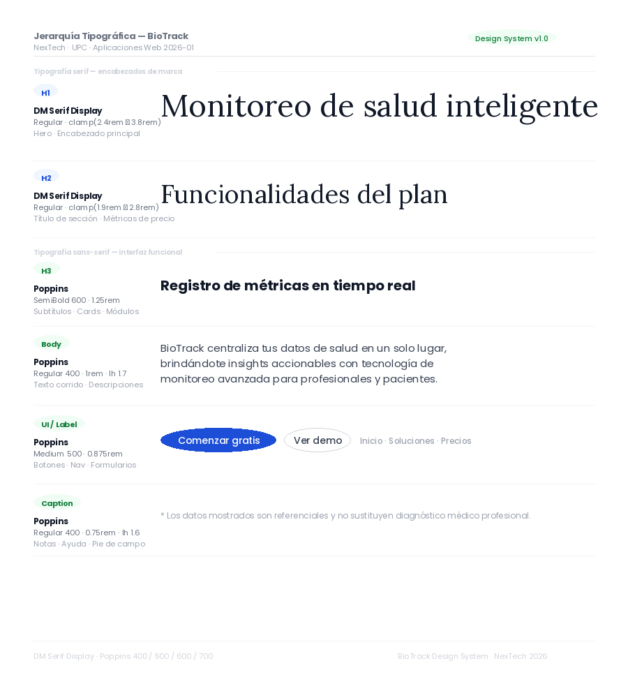
</p>

- **DM Serif Display** fue elegida para los títulos H1 y H2 por su estilo serif elegante con remates refinados que transmite autoridad médica, profesionalismo y calidez humana. Su carácter distintivo diferencia BioTrack de plataformas tecnológicas genéricas y aporta una presencia memorable en encabezados de la landing y módulos de la aplicación.

- **DM Serif Display (Regular — clamp 2.4rem→3.8rem)** garantiza jerarquías nítidas en los encabezados principales (H1), permitiendo que el usuario identifique rápidamente el contexto de cada sección.

- **DM Serif Display (Regular — clamp 1.9rem→2.8rem)** se utiliza en títulos de sección (H2) y métricas destacadas de precio, ofreciendo presencia visual sin saturar la interfaz.

- **Poppins** fue escogida para textos funcionales e interfaces operativas por su geometría limpia, alta legibilidad en densidades de datos y soporte completo de caracteres latinos en múltiples pesos (400, 500, 600, 700), ideal para dashboards de salud con tablas, formularios y métricas en tiempo real.

| **Uso** | **Fuente** | **Tamaño / Peso** | **Responsive (clamp)** |
|---|---|---|---|
| Título H1 | DM Serif Display | clamp(2.4rem, 5vw, 3.8rem) / 400 | 38px → 61px |
| Título H2 | DM Serif Display | clamp(1.9rem, 3.5vw, 2.8rem) / 400 | 30px → 45px |
| Título H3 / Subtítulo | Poppins | 1.25rem / SemiBold 600 | Fijo — 20px |
| Eyebrow / Label | Poppins | 0.72rem / Bold 600 · uppercase · ls .12em | Fijo — sin escala |
| Cuerpo de texto | Poppins | 1rem (16px) / Regular 400 · lh 1.6 | clamp(15px, 0.6vw+12px, 16px) |
| Texto de apoyo | Poppins | 0.875rem / Regular 400 | clamp(13px, 0.5vw, 14px) |
| Microcopy / Badge | Poppins | 0.72rem / Bold 600 · uppercase | Fijo — no escala |
| Precio / Métrica destacada | DM Serif Display | 2.8rem / peso heredado | Por contexto |

---

**Espaciado y márgenes**

BioTrack adopta un sistema de espaciado basado en múltiplos de 8pt para garantizar coherencia matemática y armonía visual:

- **Márgenes generales y contenedores:** 24 px de padding horizontal. Container max-width 1200px centrado.
- **Separación entre secciones principales (landing):** 100 px de padding vertical.
- **Gap entre tarjetas y componentes en grids:** 20 px (features, pricing, testimoniales).
- **Padding interno de tarjetas:** 28–48 px según el tamaño del componente.
- **Márgenes en botones:** 10 px vertical, 22–30 px horizontal según variante.
- **Separación ícono–texto:** 8 px fijos en botones e ítems de menú.
- **Interlineado:** 1.6× el tamaño de fuente base; 1.75× en párrafos descriptivos extensos.
- **Ritmo 8pt recomendado:** múltiplos de 8 (8/16/24/32/40/48 px) entre bloques de contenido.

---

**Branding y logo**

El diseño visual de BioTrack combina rigor médico con modernidad tecnológica. Sus elementos se definen de la siguiente manera:

- **Isotipo y nombre:** "BioTrack" alude al seguimiento (tracking) biológico y nutricional. Se presenta en Poppins con peso diferenciado: "Bio" en verde-cian
 (#10B981, bold 700) y "Track" en gris oscuro (#1F2937, medium 500). El isotipo acompañante representa un nodo de actividad vital que sintetiza bienestar y tecnología. El logo-mark es un cuadrado de 34–36px con border-radius 9–10px y gradiente 135deg de azul a verde.

- **Identidad cromática:** La paleta se articula en torno al binomio Azul (#0F4C81) + Verde (#10B981). El azul aporta confianza clínica; el verde comunica salud activa y resultados positivos. Juntos diferencian a BioTrack de plataformas hospitalarias frías y de apps de fitness informales.

- **Gradientes de marca:** Hero landing: `linear-gradient(145deg, #f0f6ff 0%, #f8fafb 60%, #e8f5ef 100%)`. Panel auth: `linear-gradient(160deg, #0a3660 0%, #0F4C81 55%, #1a6aa8 100%)`. CTA final: `linear-gradient(135deg, #0F4C81 0%, #0a3660 100%)`.

<p align="center">
  <!-- INSERTAR AQUÍ: imagen del logotipo BioTrack completo (isotipo + nombre) en sus variantes: positivo sobre blanco, negativo sobre azul, y versión reducida solo isotipo -->
  
</p>

---

### 4.1.2. Web Style Guidelines

Esta sección establece los estándares visuales y de interacción que rigen la experiencia de escritorio de BioTrack. Los lineamientos definen cómo cada decisión de color, tipografía, iconografía y componente se traduce en patrones concretos para la interfaz web responsiva, garantizando coherencia entre diseño y desarrollo en todos los puntos de contacto digitales.

---

**Estructura de la página**

La interfaz web de BioTrack se articula en tres zonas funcionales: una Navbar fija, un área de contenido central y un Footer informativo. Esta distribución garantiza orientación permanente del usuario, acceso inmediato a las acciones prioritarias y coherencia estructural entre la Landing Page y la Web Application.

| **Ubicación** | **Contenido** |
|---|---|
| **Navbar fija (sticky) — altura 68px** | Logotipo BioTrack a la izquierda (enlace al Dashboard o al inicio). Menú principal: Funciones, Segmentos, Cómo funciona, Precios. CTAs: "Iniciar sesión" (btn-outline) y "Comenzar gratis" (btn-primary). Fondo glass-morphism (rgba blanco 88%, blur 12px). Al scroll: borde inferior + shadow-sm activos. |
| **Zona central — max-width 1200px centrado** | Hero grid 1fr/1fr. Secciones de features en grid 3 columnas. Segmentos con pill tabs. Pasos How it works. Stats band. Pricing grid 3 columnas. Testimoniales. CTA final. Padding horizontal 24px. |
| **Footer — fondo #1F2937** | Grid 2fr/1fr/1fr/1fr/1fr. Brand column (logo, descripción 280px, social icons). 4 columnas de links (Producto, Segmentos, Recursos, Legal). Footer-bottom flex con copyright y links legales. |

---

**Tipografía (web desktop)**

En la interfaz web de escritorio, la jerarquía tipográfica de BioTrack se aplica con valores fijos para resoluciones ≥ 1025px. DM Serif Display lidera las jerarquías de título; Poppins asegura legibilidad en cuerpos de texto, formularios y microcopy operativo.

| **Uso** | **Fuente** | **Tamaño / Peso** | **Responsive (clamp)** |
|---|---|---|---|
| Título H1 | DM Serif Display | 3.8rem / Regular | clamp(2.4rem, 5vw, 3.8rem) |
| Título H2 | DM Serif Display | 2.8rem / Regular | clamp(1.9rem, 3.5vw, 2.8rem) |
| Título H3 / Subtítulo | Poppins | 1.25rem / SemiBold 600 | Fijo |
| Eyebrow label | Poppins | 0.72rem / Bold 600 · uppercase | Fijo — no escala |
| Cuerpo de texto | Poppins | 1rem / Regular 400 · lh 1.6 | clamp(15px, 0.6vw+12px, 16px) |
| Texto de apoyo / caption | Poppins | 0.875rem / Regular 400 | clamp(13px, 0.5vw, 14px) |
| Microcopy / Badge | Poppins | 0.72rem / Bold 600 · uppercase | Fijo — no escala |

---

**Colores (paleta y contraste)**

La aplicación cromática sigue una distribución semántica estricta que refuerza la identidad de marca, la accesibilidad WCAG 2.1 AA y la claridad operativa del usuario.

| **Uso en interfaz web** | **Color / HEX** | **Descripción** |
|---|---|---|
| **Botón CTA primario, indicador activo, borde focus** | `#10B981` — Verde principal | Concentra la llamada a la acción. Contraste ≥ 4.5:1 sobre fondos blancos. Hover: #0A9268 con sombra green 35%. |
| **Navbar, sidebar activo, gradientes institucionales** | `#0F4C81` — Azul principal | Autoridad y confianza institucional. Step numbers, featured cards, botones blue. |
| **Fondo general de la aplicación** | `#F8FAFB` | Off-white cálido como lienzo principal del dashboard. |
| **Superficies de tarjeta y formulario** | `#FFFFFF` | Fondo de cards, inputs activos y modales. |
| **Tipografía principal** | `#1F2937` — Gris oscuro | Máximo contraste en H1–H3, sidebar ítems y encabezados de módulo. |
| **Texto secundario, placeholders** | `#4B5563` — Gris medio | Fechas, descripciones breves, labels de formulario. Contraste mínimo 4.5:1. |
| **Bordes de tarjeta, divisores, inputs neutros** | `#E5E7EB` — Gris borde | Delimita estructuralmente sin competir con elementos de acción. |
| **Estado éxito / adherencia positiva** | `#10B981` / `#D1FAE5` | Verde para indicadores activos; verde claro para fondos de alertas success. |
| **Estado error / cuenta bloqueada / pago rechazado** | `#DC3545` — Rojo alerta | Exclusivo para errores críticos y estados de peligro. |

---

**Iconografía**

La iconografía de BioTrack sigue un estilo de trazo lineal (outline) coherente con la tipografía Poppins. Los íconos apoyan visualmente cada acción del usuario: registrar datos de salud, revisar el plan nutricional, hacer seguimiento de progreso y navegar entre módulos.

| **Aspecto** | **Especificación** |
|---|---|
| **Estilo** | Trazo lineal (stroke/outline), esquinas redondeadas, peso de trazo uniforme de 2px. Familias recomendadas: Lucide Icons, Heroicons o Material Symbols Outlined. |
| **Tamaños** | 44px en feature cards e íconos de KPI; 24px en sidebar y botones; 20px en campos de formulario; 16–18px en badges y microcopy. |
| **Color según estado** | `#10B981` en acciones primarias activas; `#0F4C81` en navegación y sidebar activo; `#4B5563` en estados inactivos; `#DC3545` en error; `#10B981` en confirmación. |
| **Accesibilidad** | Cada ícono interactivo debe incluir `aria-label` descriptivo o texto visible acompañante. Ningún estado puede depender exclusivamente del ícono. |
| **Espaciado ícono–texto** | 8px fijos entre el ícono y su etiqueta en botones e ítems de menú. |

---

**Componentes clave (web)**

Los siguientes componentes conforman el vocabulario visual interactivo de BioTrack. El Verde (#10B981) y el Azul (#0F4C81) actúan como ejes cromáticos de acción e identidad.

| **Componente** | **Estilo base** | **Variantes / Estados** |
|---|---|---|
| **BOTONES** | | |
| Botón primario (CTA) | Fondo `#10B981` · texto `#FFFFFF` · Poppins 0.9rem SemiBold · border-radius 50px · padding 10px 22px · gap 8px. | **Hover:** fondo `#0A9268` · translateY(-1px) · sombra rgba(16,185,129,.35). **Focus:** outline 3px `#0F4C81`. **Disabled:** fondo `#E5E7EB` · texto `#4B5563`. |
| Botón outline | Borde 2px `#E5E7EB` · fondo transparente · texto `#1F2937` · Poppins 0.9rem SemiBold · border-radius 50px. | **Hover:** border-color `#10B981` · color `#10B981`. **Focus:** outline 3px `#0F4C81`. |
| Botón ghost | Sin borde ni fondo · texto `#1F2937` · Poppins 0.9rem. | **Hover:** color `#0F4C81`. Para links y acciones secundarias. |
| Botón white (sobre azul) | Fondo `#FFFFFF` · texto `#0F4C81` · border-radius 50px. | **Hover:** fondo `#E8F0F9` · translateY(-1px). Uso en CTA final y paneles con gradiente azul. |
| **FORMULARIOS E INPUTS** | | |
| Campo de texto (Input) | Borde 1.5px `#E5E7EB` · fondo `#FFFFFF` · Poppins 0.88rem · border-radius 8px · padding 11px 14px. | **Focus:** borde `#0F4C81`. **Error:** borde `#DC3545` · fondo `#FFF5F5` · mensaje error debajo. **OK:** borde `#10B981`. |
| Selector tipo de cuenta | Display flex de chips pill. Chip inactivo: borde `#E5E7EB`, texto gris. | **Activo:** borde `#0F4C81` · fondo `#E8F0F9` · texto `#0F4C81` · font-weight 600. |
| **TARJETAS** | | |
| Tarjeta de feature | Fondo `#F3F4F6` · border-radius 14px · padding 28px 24px · borde 1.5px transparente. | **Hover:** border-color `#E8F0F9` · shadow-md · translateY(-4px). **fc-large:** gradiente azul, span 2 columnas, texto blanco. |
| Tarjeta KPI (dashboard) | Fondo `#F3F4F6` · valor en DM Serif Display 2rem · label Poppins 0.72rem · ícono 44px. | **mc-primary:** fondo `#0F4C81`, texto blanco. **mc-green:** fondo `#10B981`, texto blanco. |
| Tarjeta de precio | Fondo `#FFFFFF` · border-radius 24px · padding 36px 28px · borde 1.5px `#E5E7EB`. | **price-featured:** gradiente azul · scale(1.04) · shadow-lg · featured-badge verde. |
| Tarjeta de testimonial | Fondo `#F3F4F6` · border-radius 14px · padding 28px 24px · borde `#E5E7EB`. | **testi-featured:** gradiente azul, texto blanco. Stars: `#FBBF24`. |
| **NAVEGACIÓN** | | |
| Sidebar de la app | Fondo `#FFFFFF` · ancho 240px · borde-right 1px `#E5E7EB` · padding 20px 0. Ítems: Poppins 0.82rem 500, color `#4B5563`, padding 9px 20px. | **Activo:** color `#0F4C81` · fondo `#E8F0F9` · border-left 3px `#0F4C81` · font-weight 600. **Hover:** fondo `#E8F0F9`. |
| Navbar de la app (topbar) | Fondo `#FFFFFF` · height 60px · borde-bottom 1px `#E5E7EB`. Logo + nav links + notif-btn + user-avatar. | Notif-dot rojo sobre el botón de notificaciones. User-avatar circular con iniciales. |
| **NOTIFICACIONES Y ALERTAS** | | |
| Alert / Banner de estado | Padding 14–16px · border-radius 8px · display flex · gap 12px · borde 1px. | **Success:** fondo `#D1FAE5` · borde `#6EE7B7` · texto `#065F46`. **Error:** fondo `#FEE2E2` · borde `#FECACA`. **Warning:** fondo `#FEF3C7` · borde `#FCD34D`. **Info:** fondo `#E8F0F9`. |
| Badge / Chip | Display inline-flex · gap 4px · padding 3px 10px · border-radius 50px · Poppins 0.72rem Bold. | **Green:** `#D1FAE5` / `#0A9268`. **Blue:** `#E8F0F9` / `#0F4C81`. **Red:** `#FEE2E2` / `#991B1B`. **Gray:** `#F3F4F6` / `#4B5563`. |
| Progress bar | Height 8px · fondo `#F3F4F6` · border-radius 4px · overflow hidden. | Fill: `#10B981` (verde), `#0F4C81` (azul), `#DC3545` (rojo), `#F59E0B` (naranja). |

---

**Diseño responsivo**

BioTrack adopta un enfoque responsive que asegura una experiencia óptima en escritorio, tablet y móvil.

**Principio general:** Toda funcionalidad disponible en escritorio debe ser accesible en tablet y móvil. Objetivos táctiles mínimos de 44×44px. Separación mínima de 8px entre controles interactivos.

| **Dispositivo** | **Ancho** | **Columnas** | **Gutter** | **Especificaciones clave** |
|---|---|---|---|---|
| Mobile | ≤ 640px | 1–2 | 16px | Navbar hamburguesa en overlay. Hero: 1 columna. Features: 1fr. Pricing: 1fr max-width 380px. Footer: 1fr. Hero-actions: flex-direction column. |
| Tablet | 641–1024px | 2 | 20px | Hero: 1 columna centrado. Features: 2fr con fc-large span 2. Stats: 2fr. Footer: 1fr 1fr. Sidebar colapsable. |
| Desktop | ≥ 1025px | 12 | 24px | Container max-width 1200px centrado. Hero: 1fr 1fr. Features: 3fr. Pricing: 3fr. Footer: 2fr 1fr 1fr 1fr 1fr. Sidebar fijo 240px. |

| **Requisito** | **Valor / Especificación** |
|---|---|
| Objetivos táctiles mínimos | 44×44px en todos los breakpoints. Botones con min-height 40px. |
| Separación entre controles | Mínimo 8px entre elementos interactivos adyacentes. |
| Focus visible | `outline 3px #0F4C81` para elementos nativos; sin supresión de outline en ningún componente. |
| Animaciones | `transition: .25s cubic-bezier(.4,0,.2,1)`. Float 6s ease-in-out en hero mockup. data-reveal con opacity/translateY .6s. |

---

## 4.2. Information Architecture

La arquitectura de información de BioTrack organiza la Landing Page como un recorrido de conversión claro para tres segmentos objetivo: pacientes individuales que buscan mejorar su nutrición, empresas corporativas que desean ofrecer bienestar a sus colaboradores, y nutricionistas que quieren digitalizar su práctica profesional.

### 4.2.1. Organization Systems

Para la Landing Page se emplea una organización **jerárquica y secuencial**. Es jerárquica porque el usuario puede acceder a secciones clave desde la barra de navegación, y secuencial porque el contenido está ordenado como una narrativa de conversión: propuesta de valor → beneficios por segmento → cómo funciona → métricas de impacto → planes → testimonios → llamado a la acción.

| **Nivel** | **Sección** | **Propósito dentro de la arquitectura** |
|---|---|---|
| Global | Navbar | Acceso rápido a las secciones principales e inicio de sesión. |
| Principal | Hero section | Propuesta de valor y CTAs principales de conversión. |
| Confianza | Trust Band | Logos de empresas que usan BioTrack; reduce fricción. |
| Funcional | Funcionalidades | Agrupa las features principales: dashboard, plan nutricional, progreso, bienestar corporativo. |
| Segmentado | Segmentos (tabs) | Contenido diferenciado para Paciente, Empresa y Nutricionista. |
| Explicativo | Cómo funciona | Proceso de adopción en 4 pasos para reducir percepción de complejidad. |
| Métricas | Stats / Impacto | Cifras de usuarios activos, adherencia, satisfacción y planes activos. |
| Comercial | Precios | Planes disponibles (Starter, Profesional, Empresarial) con CTA de contratación. |
| Confianza | Testimoniales | Opiniones de pacientes y nutricionistas que validan la propuesta. |
| Conversión | CTA Final | Llamado de cierre para registrarse o agendar una demo. |
| Cierre | Footer | Navegación secundaria, redes sociales, legal y datos de marca. |

### 4.2.2. Labeling Systems

El sistema de etiquetado utiliza términos breves, directos y orientados a la acción. Las etiquetas evitan lenguaje técnico y priorizan conceptos familiares para cada segmento.

| **Etiqueta** | **Tipo** | **Uso dentro de la landing** |
|---|---|---|
| **Funciones** | Navegación principal | Lleva a la sección de características y módulos de la plataforma. |
| **Segmentos** | Navegación principal | Dirige al contenido diferenciado por perfil de usuario. |
| **Cómo funciona** | Navegación principal | Explica el proceso de onboarding en pasos simples. |
| **Precios** | Navegación principal | Permite comparar los planes antes de registrarse. |
| **Iniciar sesión** | Acción de acceso | Permite que un usuario existente entre a su cuenta. |
| **Comenzar gratis** | CTA principal | Dirige al flujo de registro de nueva cuenta. |
| **Ver planes** | CTA secundario | Desplaza al visitante directamente a la sección de precios. |
| **Plan Starter** | Etiqueta comercial | Plan gratuito con funcionalidades básicas para pacientes. |
| **Plan Profesional** | Etiqueta comercial | Plan de pago con seguimiento completo y nutricionista asignado. |
| **Plan Empresarial** | Etiqueta comercial | Plan corporativo con dashboard anónimo y licencias por equipo. |
| **Paciente** | Tab de segmento | Activa el panel con beneficios y características para pacientes individuales. |
| **Empresa** | Tab de segmento | Activa el panel con contenido y CTA para administradores corporativos. |
| **Nutricionista** | Tab de segmento | Activa el panel con herramientas para profesionales de nutrición. |
| **Comienza tu transformación** | CTA final | Refuerza el cierre de conversión al final del recorrido. |

### 4.2.3. SEO Tags and Meta Tags

La Landing Page incluye metadatos orientados a indexación básica, compatibilidad móvil, carga de recursos visuales y reconocimiento de marca.

**Título de la página:**

```html
<title>BioTrack | Gestión nutricional y bienestar corporativo</title>
```

**Codificación de caracteres:**

```html
<meta charset="UTF-8" />
```

**Configuración responsive:**

```html
<meta name="viewport" content="width=device-width, initial-scale=1.0" />
```

**Descripción SEO:**

```html
<meta
  name="description"
  content="BioTrack conecta pacientes, nutricionistas y empresas en una
  plataforma de bienestar corporativo personalizada. Planes nutricionales,
  seguimiento de progreso y métricas de salud organizacional."
/>
```

**Ícono de marca:**

```html
<link rel="icon" type="image/png" href="./assets/biotrack-icon.png" />
```

**Optimización de carga tipográfica:**

```html
<link rel="preconnect" href="https://fonts.googleapis.com" />
<link rel="preconnect" href="https://fonts.gstatic.com" crossorigin />
```

Para producción se recomienda complementar con Open Graph:

```html
<meta name="author" content="NexTech — UPC" />
<meta name="copyright" content="BioTrack by NexTech" />
<meta property="og:title"
  content="BioTrack | Gestión nutricional y bienestar corporativo" />
<meta property="og:description"
  content="Conecta tu equipo con planes de nutrición personalizados.
  Nutricionistas, pacientes y empresas en una sola plataforma." />
<meta property="og:type" content="website" />
```

### 4.2.4. Searching Systems

La Landing Page no incorpora un buscador global porque su profundidad de contenido es baja y su objetivo es guiar al usuario hacia la conversión. Utiliza un sistema de **descubrimiento dirigido**.

| **Mecanismo** | **Funcionamiento** | **Sección relacionada** |
|---|---|---|
| Navegación por anchors | Salto directo a secciones clave mediante links internos del navbar. | Funciones, Segmentos, Precios, Testimonios |
| Tabs de segmento | Filtran el contenido según el perfil del visitante (Paciente / Empresa / Nutricionista). | Sección de Segmentos |
| Tarjetas de features | Agrupan funcionalidades por tema para facilitar el descubrimiento del valor. | Sección de Funcionalidades |
| Comparativa de planes | Ayuda al usuario a identificar el plan adecuado comparando características y precios. | Sección de Precios |
| CTAs contextuales | Dirigen al registro o a los planes según el momento del recorrido del visitante. | Hero, Segmentos, CTA Final |

### 4.2.5. Navigation Systems

El sistema de navegación se basa en una combinación de enlaces internos, CTAs de conversión y accesos transaccionales.

| **Elemento de navegación** | **Destino** | **Función** |
|---|---|---|
| Logo BioTrack | `#top` | Retorna al inicio de la landing. |
| Funciones | `#funciones` | Desplaza a la sección de features principales. |
| Segmentos | `#segmentos` | Muestra el contenido diferenciado por perfil. |
| Cómo funciona | `#como-funciona` | Explica el proceso en pasos. |
| Precios | `#precios` | Navega a la comparativa de planes. |
| Iniciar sesión | `./login.html` | Acceso para usuarios registrados. |
| Comenzar gratis | `./register.html` | Flujo de registro de nueva cuenta. |
| Ver planes | `#precios` | Scroll directo a la sección comercial. |
| Comienza tu transformación | `./register.html` | CTA de cierre de conversión al final del recorrido. |

| **Flujo** | **Recorrido esperado** |
|---|---|
| Visitante nuevo que explora la solución | Hero → Trust Band → Funciones → Segmentos → Cómo funciona → Precios |
| Visitante que evalúa costo | Hero → Ver planes → Precios → Comenzar gratis |
| Empresa buscando solución corporativa | Navbar → Segmentos → Tab Empresa → CTA registro corporativo |
| Nutricionista buscando herramientas | Segmentos → Tab Nutricionista → CTA registro profesional |
| Usuario existente | Navbar → Iniciar sesión |
| Usuario listo para registrarse | Hero o CTA Final → Comenzar gratis → Registro |

---

## 4.3. Landing Page UI Design

La Landing Page de BioTrack está diseñada como el primer punto de contacto para visitantes de los tres segmentos objetivo. Su estructura prioriza una comunicación clara de la propuesta de valor diferenciada, beneficios operativos y conversión hacia el registro. El diseño mantiene navegación lineal, secciones de lectura rápida y CTAs visibles para reducir fricción.

### 4.3.1. Landing Page Wireframe

Los wireframes representan la distribución base de cada sección antes de aplicar el acabado visual final. Permiten validar la jerarquía de información, el orden del contenido, la ubicación de los CTAs y la consistencia del recorrido de conversión.

- **Navbar / Header**

<p align="center">
  <!-- INSERTAR AQUÍ: captura del wireframe del navbar en escala de grises mostrando logo izquierda, links centro, CTAs derecha y versión mobile hamburguesa -->
  
</p>

- **Hero section**

<p align="center">
  <!-- INSERTAR AQUÍ: captura del wireframe del hero mostrando grid 2 columnas: texto+CTA izquierda y dashboard mockup derecha, con blobs y grid pattern de fondo -->
  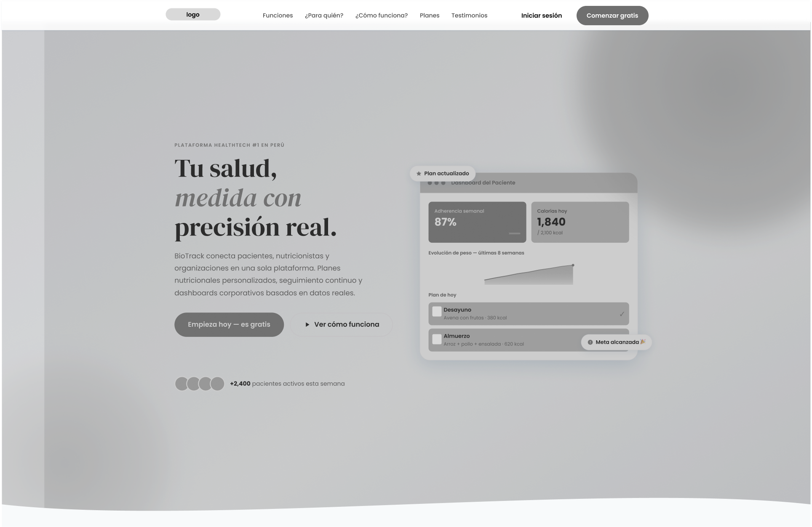
</p>

- **Trust Band**

<p align="center">
  <!-- INSERTAR AQUÍ: captura del wireframe de la banda de logos de confianza con label y chips de empresa en fila centrada -->
  
</p>

- **Sección de Funcionalidades**

<p align="center">
  <!-- INSERTAR AQUÍ: captura del wireframe del grid de features con 4 tarjetas estándar y 1 tarjeta fc-large azul de span 2 columnas -->
  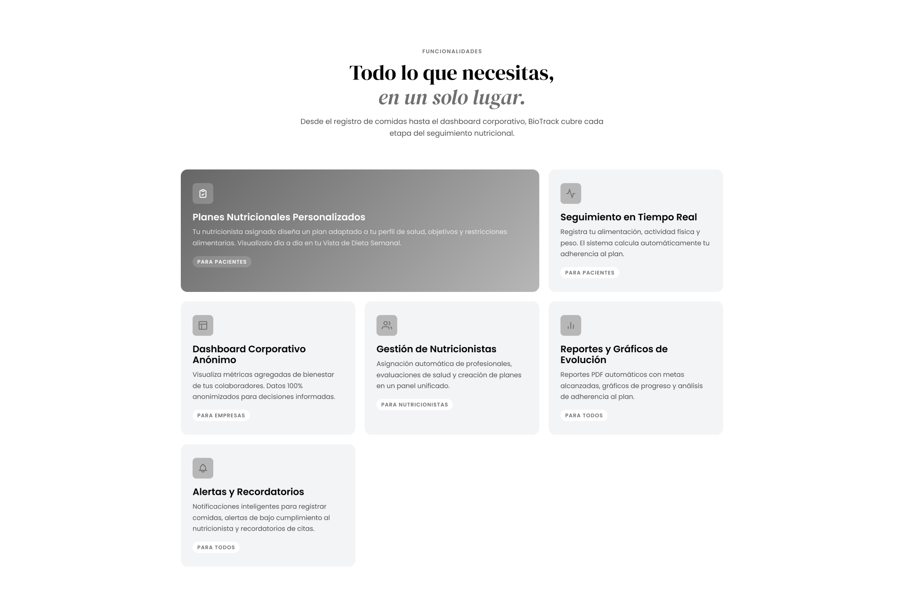
</p>

- **Sección de Segmentos (tabs)**

<p align="center">
  <!-- INSERTAR AQUÍ: captura del wireframe de los tabs de segmento (Paciente / Empresa / Nutricionista) con el panel de contenido activo mostrando grid 2 columnas: info+beneficios y stats -->
  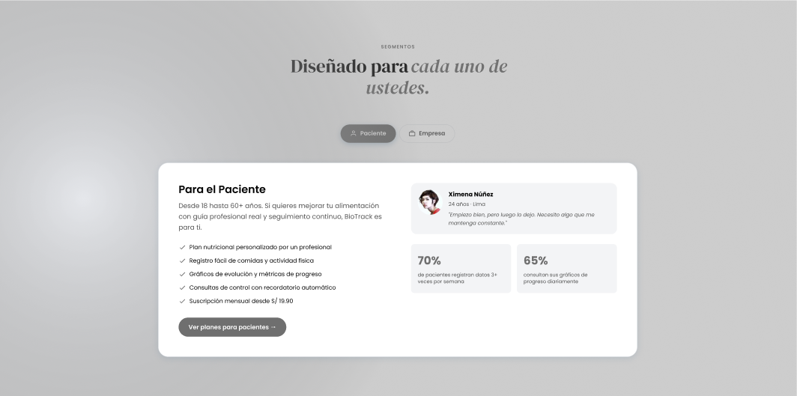
</p>

- **Sección Cómo Funciona (4 pasos)**

<p align="center">
  <!-- INSERTAR AQUÍ: captura del wireframe de los 4 steps verticales con step-number circular, contenido textual y step-connector punteado entre pasos -->
  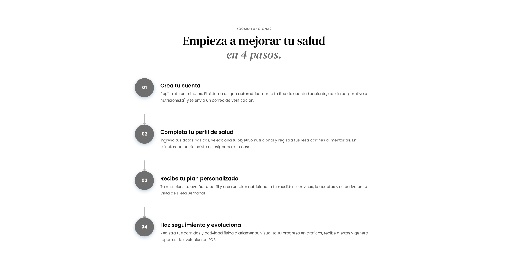
</p>

- **Sección Stats / Impacto**

<p align="center">
  <!-- INSERTAR AQUÍ: captura del wireframe de la banda de stats con fondo azul oscuro y 4 stat-items con cifra grande y label descriptivo en grid de 4 columnas -->
  
</p>

- **Sección de Precios (3 planes)**

<p align="center">
  <!-- INSERTAR AQUÍ: captura del wireframe del pricing grid de 3 columnas con toggle mensual/anual arriba, plan central destacado a mayor escala y lista de features con checkmarks -->
  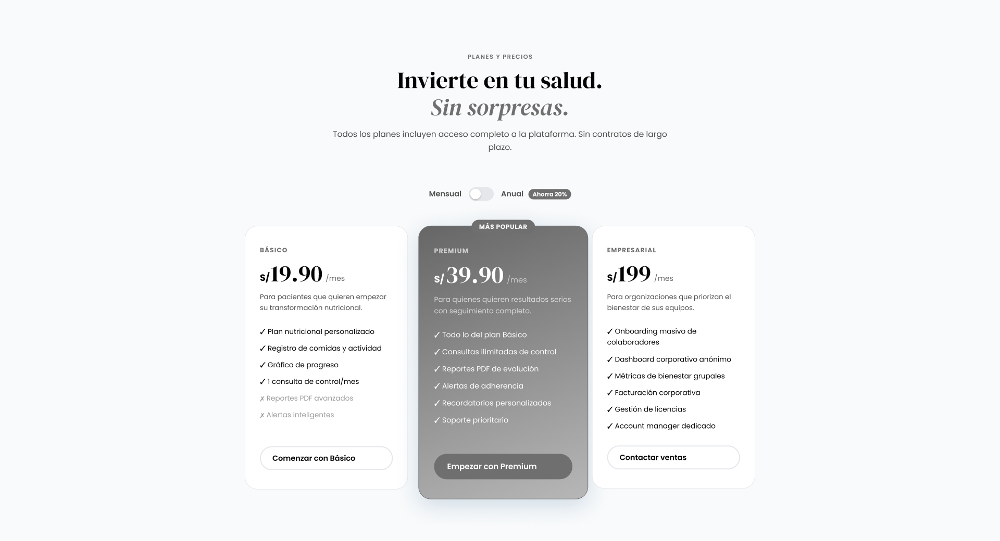
</p>

- **Sección de Testimoniales**

<p align="center">
  <!-- INSERTAR AQUÍ: captura del wireframe del grid de 3 testimoniales con estrellas, cita, avatar y nombre/cargo, con la tarjeta central en fondo azul destacado -->
  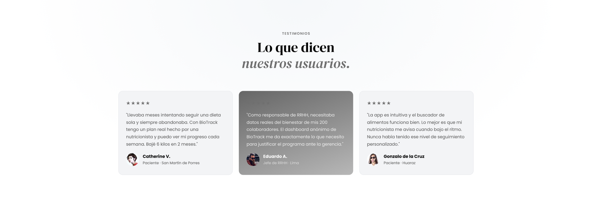
</p>

- **CTA Final**

<p align="center">
  <!-- INSERTAR AQUÍ: captura del wireframe del CTA final con caja de gradiente azul redondeada, H2, párrafo y 2 botones centrados (btn-white + btn-ghost-white) -->
  
</p>

- **Footer**

<p align="center">
  <!-- INSERTAR AQUÍ: captura del wireframe del footer con grid 5 columnas: columna brand izquierda más ancha y 4 columnas de links, más footer-bottom con copyright -->
  
</p>

### 4.3.2. Landing Page Mock-up

Los mockups muestran la propuesta visual aplicada sobre la estructura validada en los wireframes. Se integran colores, tipografía, espaciado, jerarquía visual y todos los componentes del design system.

- **Navbar / Header**

<p align="center">
  <!-- INSERTAR AQUÍ: captura del mockup del navbar con el logo BioTrack (logo-mark gradient + texto), links Poppins gris con underline verde animado y botones btn-outline + btn-primary verde -->
  
</p>

- **Hero section**

<p align="center">
  <!-- INSERTAR AQUÍ: captura del mockup del hero completo con gradiente de fondo azul-verde suave, blobs difusos, grid pattern, eyebrow verde, H1 DM Serif, botones, social proof con avatars y dashboard mockup flotante con animación float y floating badges -->
  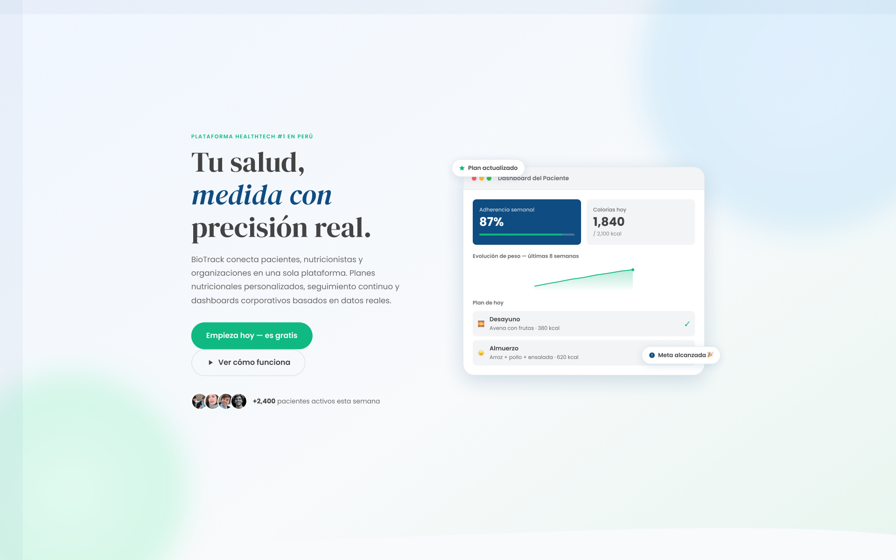
</p>

- **Trust Band**

<p align="center">
  <!-- INSERTAR AQUÍ: captura del mockup de la banda de confianza con fondo #F8FAFB, label uppercase gris y chips de logos con borde #E5E7EB -->
  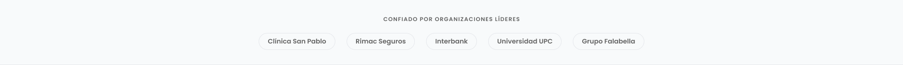
</p>

- **Sección de Funcionalidades**

<p align="center">
  <!-- INSERTAR AQUÍ: captura del mockup del grid de features con tarjetas #F3F4F6 border-radius 14px, feature-icons en azul claro y verde claro, y fc-large con gradiente azul abarcando 2 columnas -->
  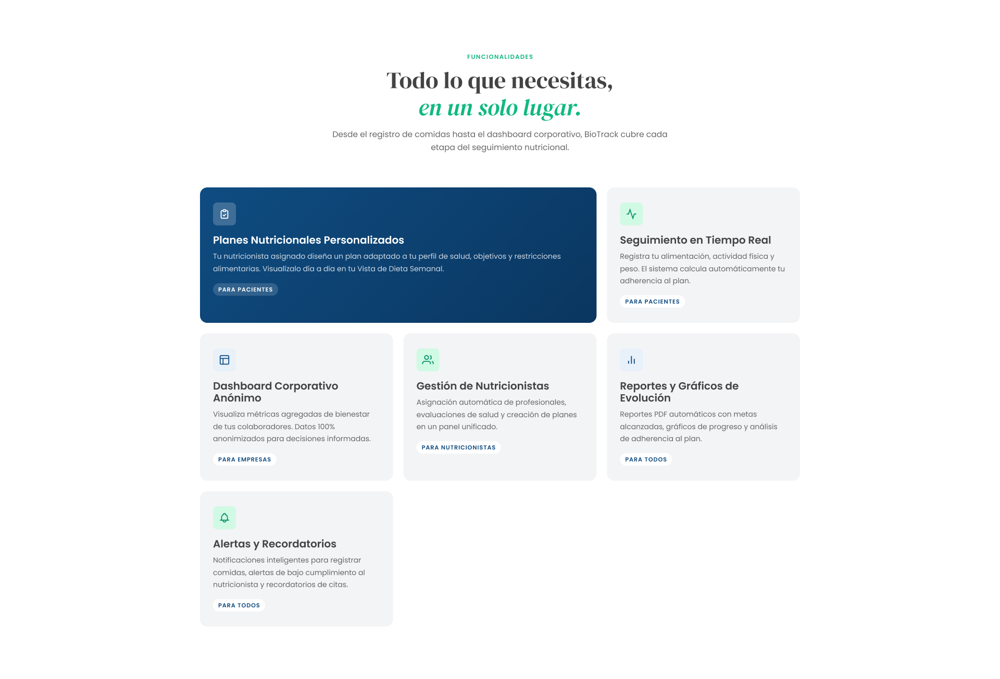
</p>

- **Sección de Segmentos (tabs)**

<p align="center">
  <!-- INSERTAR AQUÍ: captura del mockup de los tabs de segmento con pill-tab activa en azul, panel de contenido blanco con shadow-md, persona card, benefits list con SVG checks verdes y stat-cards con cifras azules DM Serif -->
  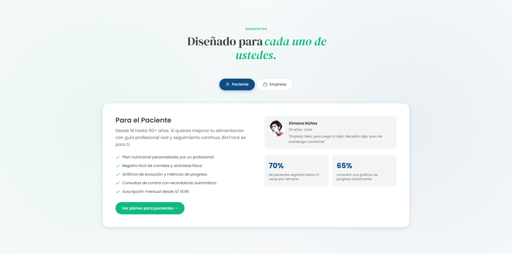
</p>

- **Sección Cómo Funciona**

<p align="center">
  <!-- INSERTAR AQUÍ: captura del mockup de los 4 pasos con step-number círculos azules (#0F4C81) con box-shadow, step-connector línea azul claro y step-content con H3 Poppins + párrafo gris -->
  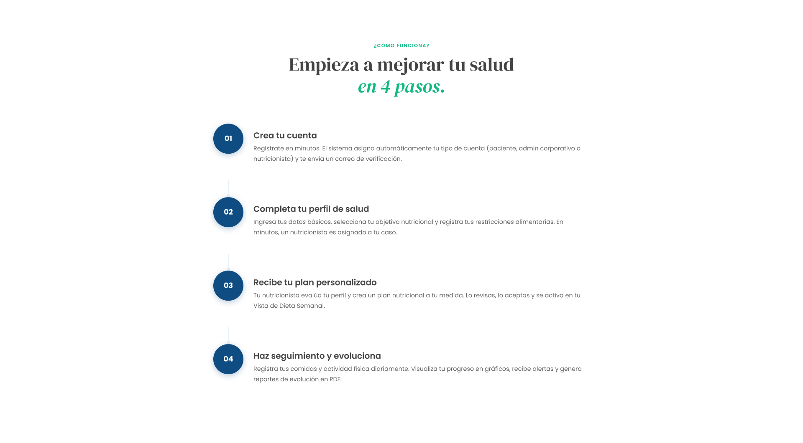
</p>

- **Sección Stats / Impacto**

<p align="center">
  <!-- INSERTAR AQUÍ: captura del mockup de la banda stats con gradiente linear-gradient(135deg, #0F4C81, #0A3660), 4 stat-items con cifras DM Serif Display blancas de ~3.5rem y labels opacity .75 -->
  
</p>

- **Sección de Precios (3 planes)**

<p align="center">
  <!-- INSERTAR AQUÍ: captura del mockup del pricing grid con toggle anual/mensual (switch verde), plan Profesional con gradiente azul price-featured en escala 1.04 con featured-badge verde "Más popular", y plans Starter y Empresarial flanqueando con borde gris -->
  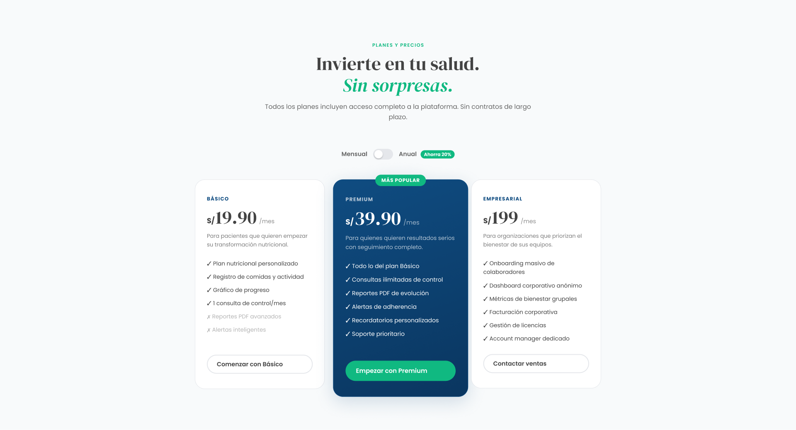
</p>

- **Sección de Testimoniales**

<p align="center">
  <!-- INSERTAR AQUÍ: captura del mockup del grid de 3 testimoniales: 2 cards con fondo #F3F4F6 y 1 testi-featured con gradiente azul, todas con estrellas #FBBF24 y avatar circular 42px -->
  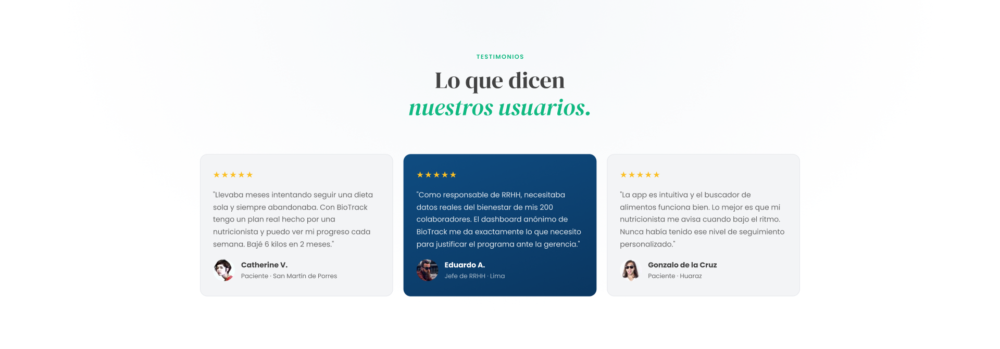
</p>

- **CTA Final**

<p align="center">
  <!-- INSERTAR AQUÍ: captura del mockup del CTA final con cta-box gradiente azul border-radius 40px, cta-blob verde decorativo, H2 DM Serif blanco con em en #D1FAE5 y 2 botones (btn-white + btn-ghost-white) -->
  
</p>

- **Footer**

<p align="center">
  <!-- INSERTAR AQUÍ: captura del mockup del footer con fondo #1F2937, logo BioTrack en versión negativa, descripción en rgba(255,255,255,.75), social icons circulares con hover verde, columnas de links con hover verde y footer-bottom en rgba(255,255,255,.45) -->
  
</p>

### 4.4. Web Applications UX/UI Design
#### 4.4.1. Web Applications Wireframes
#### 4.4.2. Web Applications Wireflow Diagrams
#### 4.4.3. Web Applications Mock-ups
#### 4.4.4. Web Applications User Flow Diagrams

### 4.5. Web Applications Prototyping

# 4.6. Domain-Driven Software Architecture

## 4.6.1. Design-Level Event Storming

A continuación se presentan los Bounded Contexts identificados a partir del Event Storming, junto con sus respectivos diagramas PlantUML y BC Canvas.

---

### BC01 — Gestión de Identidad y Autenticación

**Descripción:** Maneja el registro de usuarios, verificación de correo, activación de cuenta, inicio de sesión con credenciales, bloqueo por intentos fallidos y asignación automática del tipo de cuenta. Es el punto de entrada del sistema para los tres perfiles: Paciente, Nutricionista y Admin Corporativo.

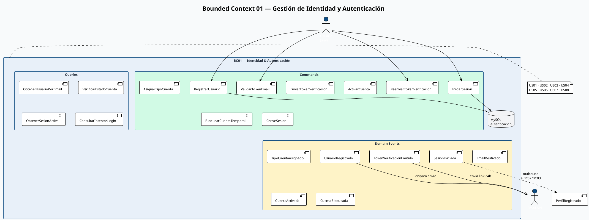
```plantuml
@startuml BC01_IdentidadAutenticacion
!theme plain
skinparam backgroundColor #F8FAFB
skinparam defaultFontName Poppins
skinparam defaultFontSize 12

skinparam rectangle {
  BackgroundColor #E8F0F9
  BorderColor #0F4C81
  FontColor #1F2937
}
skinparam actor {
  BackgroundColor #0F4C81
  FontColor white
}

title Bounded Context 01 — Gestión de Identidad y Autenticación

actor "Usuario\n(any)" as USR
actor "Email API" as EMAIL

rectangle "BC01 — Identidad & Autenticación" {

  rectangle "Commands" #D1FAE5 {
    [RegistrarUsuario]
    [AsignarTipoCuenta]
    [EnviarTokenVerificacion]
    [ValidarTokenEmail]
    [ReenviarTokenVerificacion]
    [ActivarCuenta]
    [IniciarSesion]
    [BloquearCuentaTemporal]
    [CerrarSesion]
  }

  rectangle "Queries" #E8F0F9 {
    [ObtenerUsuarioPorEmail]
    [VerificarEstadoCuenta]
    [ObtenerSesionActiva]
    [ConsultarIntentosLogin]
  }

  rectangle "Domain Events" #FEF3C7 {
    [UsuarioRegistrado]
    [TipoCuentaAsignado]
    [TokenVerificacionEmitido]
    [EmailVerificado]
    [CuentaActivada]
    [SesionIniciada]
    [CuentaBloqueada]
  }

  database "MySQL\nautenticacion" as DB #F3F4F6
}

USR --> [RegistrarUsuario]
USR --> [IniciarSesion]
USR --> [ValidarTokenEmail]
USR --> [ReenviarTokenVerificacion]
[UsuarioRegistrado] --> EMAIL : dispara envío
[TokenVerificacionEmitido] --> EMAIL : envía link 24h
[RegistrarUsuario] --> DB
[IniciarSesion] --> DB
[SesionIniciada] ..> [PerfilRegistrado] : outbound\na BC02/BC03

note right of "BC01 — Identidad & Autenticación"
  US01 · US02 · US03 · US04
  US05 · US06 · US07 · US08
end note

@enduml
```
- Asi es como quedaria el Bounded Context de Gestion de Identidad y Autenticación :
<p align="center">
  <!-- INSERTAR AQUÍ: captura del mockup del footer con fondo #1F2937, logo BioTrack en versión negativa, descripción en rgba(255,255,255,.75), social icons circulares con hover verde, columnas de links con hover verde y footer-bottom en rgba(255,255,255,.45) -->
  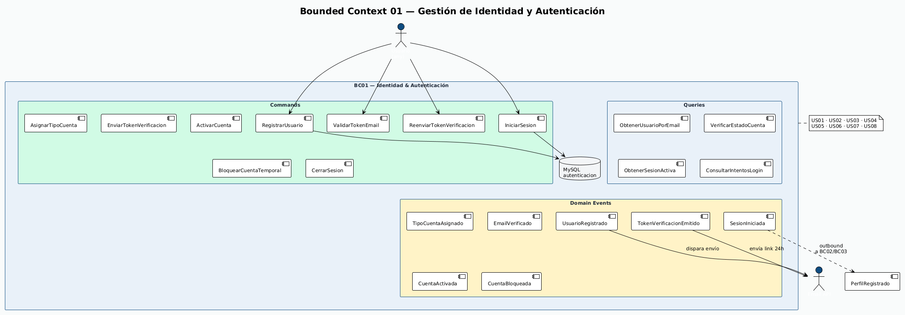
</p>

---

### BC02 — Perfil y Configuración del Paciente

**Descripción:** Gestiona el registro de datos de salud (peso, talla, IMC, glucosa, presión), la selección del objetivo nutricional, las restricciones alimentarias y el estado de completitud del perfil. Cuando el perfil se completa, emite un evento que dispara la asignación automática de nutricionista en BC03.

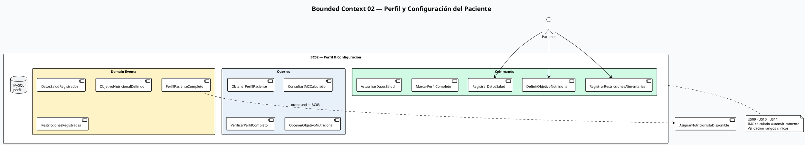
```plantuml
@startuml BC02_PerfilPaciente
!theme plain
skinparam backgroundColor #F8FAFB
skinparam defaultFontName Poppins
skinparam defaultFontSize 12

title Bounded Context 02 — Perfil y Configuración del Paciente

actor "Paciente" as PAC

rectangle "BC02 — Perfil & Configuración" {

  rectangle "Commands" #D1FAE5 {
    [RegistrarDatosSalud]
    [DefinirObjetivoNutricional]
    [RegistrarRestriccionesAlimentarias]
    [MarcarPerfilCompleto]
    [ActualizarDatosSalud]
  }

  rectangle "Queries" #E8F0F9 {
    [ObtenerPerfilPaciente]
    [ConsultarIMCCalculado]
    [VerificarPerfilCompleto]
    [ObtenerObjetivoNutricional]
  }

  rectangle "Domain Events" #FEF3C7 {
    [DatosSaludRegistrados]
    [ObjetivoNutricionalDefinido]
    [RestriccionesRegistradas]
    [PerfilPacienteCompleto]
  }

  database "MySQL\nperfil" as DB #F3F4F6
}

PAC --> [RegistrarDatosSalud]
PAC --> [DefinirObjetivoNutricional]
PAC --> [RegistrarRestriccionesAlimentarias]
[PerfilPacienteCompleto] ..> [AsignarNutricionistaDisponible] : outbound → BC03

note bottom of "BC02 — Perfil & Configuración"
  US09 · US10 · US11
  IMC calculado automáticamente
  Validación rangos clínicos
end note

@enduml
```
- Asi es como quedaria el Bounded Context de Gestion de Perfil y Configuración del Paciente :
<p align="center">
  <!-- INSERTAR AQUÍ: captura del mockup del footer con fondo #1F2937, logo BioTrack en versión negativa, descripción en rgba(255,255,255,.75), social icons circulares con hover verde, columnas de links con hover verde y footer-bottom en rgba(255,255,255,.45) -->
  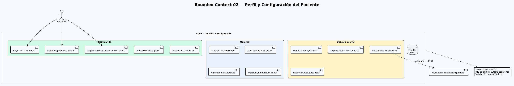
</p>

---

### BC03 — Gestión Corporativa

**Descripción:** Maneja el registro y validación fiscal de empresas (RUC), la carga de listas de colaboradores, el envío de invitaciones corporativas y la generación/consulta del Dashboard Corporativo con métricas anonimizadas. Aplica estrictamente la regla de negocio: nunca expone datos individuales de salud al Admin Corporativo.

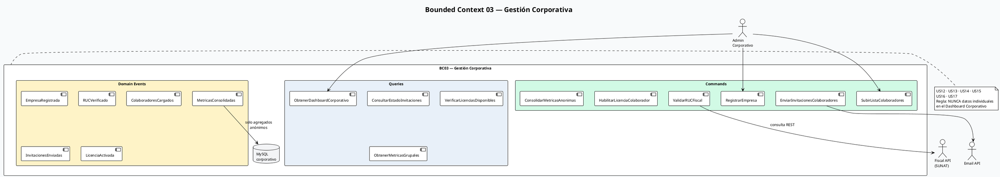
```plantuml
@startuml BC03_GestionCorporativa
!theme plain
skinparam backgroundColor #F8FAFB
skinparam defaultFontName Poppins
skinparam defaultFontSize 12

title Bounded Context 03 — Gestión Corporativa

actor "Admin\nCorporativo" as ADM
actor "Email API" as EMAIL
actor "Fiscal API\n(SUNAT)" as SUNAT

rectangle "BC03 — Gestión Corporativa" {

  rectangle "Commands" #D1FAE5 {
    [RegistrarEmpresa]
    [ValidarRUCFiscal]
    [SubirListaColaboradores]
    [EnviarInvitacionesColaboradores]
    [HabilitarLicenciaColaborador]
    [ConsolidarMetricasAnonimas]
  }

  rectangle "Queries" #E8F0F9 {
    [ObtenerDashboardCorporativo]
    [ConsultarEstadoInvitaciones]
    [VerificarLicenciasDisponibles]
    [ObtenerMetricasGrupales]
  }

  rectangle "Domain Events" #FEF3C7 {
    [EmpresaRegistrada]
    [RUCVerificado]
    [ColaboradoresCargados]
    [InvitacionesEnviadas]
    [MetricasConsolidadas]
    [LicenciaActivada]
  }

  database "MySQL\ncorporativo" as DB #F3F4F6
}

ADM --> [RegistrarEmpresa]
ADM --> [SubirListaColaboradores]
ADM --> [ObtenerDashboardCorporativo]
[ValidarRUCFiscal] --> SUNAT : consulta REST
[EnviarInvitacionesColaboradores] --> EMAIL
[MetricasConsolidadas] --> DB : solo agregados\nanónimos

note right of "BC03 — Gestión Corporativa"
  US12 · US13 · US14 · US15
  US16 · US17
  Regla: NUNCA datos individuales
  en el Dashboard Corporativo
end note

@enduml
```
- Asi es como quedaria el Bounded Context de Gestion de Gestión Corporativa :
<p align="center">
  <!-- INSERTAR AQUÍ: captura del mockup del footer con fondo #1F2937, logo BioTrack en versión negativa, descripción en rgba(255,255,255,.75), social icons circulares con hover verde, columnas de links con hover verde y footer-bottom en rgba(255,255,255,.45) -->
  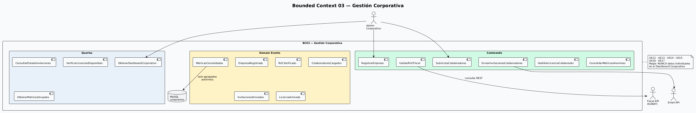
</p>

---

### BC04 — Planificación Nutricional

**Descripción:** Gestiona la asignación automática de nutricionistas, las evaluaciones iniciales de salud, la creación y ciclo de vida de los planes nutricionales (propuesto → activado/rechazado), la dieta semanal y el agendamiento de consultas de control con recordatorios automáticos.

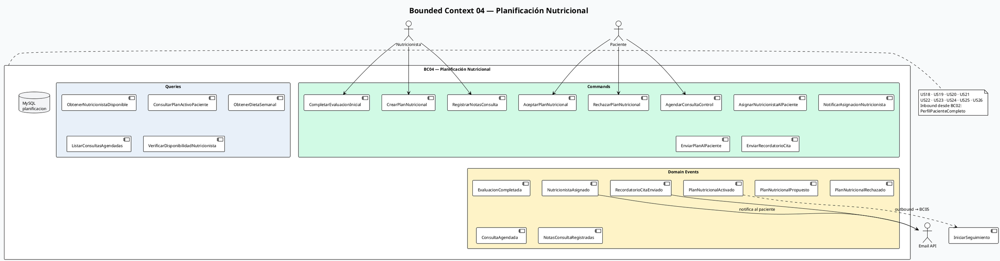
```plantuml
@startuml BC04_PlanificacionNutricional
!theme plain
skinparam backgroundColor #F8FAFB
skinparam defaultFontName Poppins
skinparam defaultFontSize 12

title Bounded Context 04 — Planificación Nutricional

actor "Nutricionista" as NUT
actor "Paciente" as PAC
actor "Email API" as EMAIL

rectangle "BC04 — Planificación Nutricional" {

  rectangle "Commands" #D1FAE5 {
    [AsignarNutricionistaAlPaciente]
    [NotificarAsignacionNutricionista]
    [CompletarEvaluacionInicial]
    [CrearPlanNutricional]
    [EnviarPlanAlPaciente]
    [AceptarPlanNutricional]
    [RechazarPlanNutricional]
    [AgendarConsultaControl]
    [EnviarRecordatorioCita]
    [RegistrarNotasConsulta]
  }

  rectangle "Queries" #E8F0F9 {
    [ObtenerNutricionistaDisponible]
    [ConsultarPlanActivoPaciente]
    [ObtenerDietaSemanal]
    [ListarConsultasAgendadas]
    [VerificarDisponibilidadNutricionista]
  }

  rectangle "Domain Events" #FEF3C7 {
    [NutricionistaAsignado]
    [EvaluacionCompletada]
    [PlanNutricionalPropuesto]
    [PlanNutricionalActivado]
    [PlanNutricionalRechazado]
    [ConsultaAgendada]
    [RecordatorioCitaEnviado]
    [NotasConsultaRegistradas]
  }

  database "MySQL\nplanificacion" as DB #F3F4F6
}

NUT --> [CompletarEvaluacionInicial]
NUT --> [CrearPlanNutricional]
NUT --> [RegistrarNotasConsulta]
PAC --> [AceptarPlanNutricional]
PAC --> [RechazarPlanNutricional]
PAC --> [AgendarConsultaControl]
[NutricionistaAsignado] --> EMAIL : notifica al paciente
[RecordatorioCitaEnviado] --> EMAIL
[PlanNutricionalActivado] ..> [IniciarSeguimiento] : outbound → BC05

note right of "BC04 — Planificación Nutricional"
  US18 · US19 · US20 · US21
  US22 · US23 · US24 · US25 · US26
  Inbound desde BC02:
  PerfilPacienteCompleto
end note

@enduml
```
- Asi es como quedaria el Bounded Context de Gestion de Gestión Corporativa :
<p align="center">
  <!-- INSERTAR AQUÍ: captura del mockup del footer con fondo #1F2937, logo BioTrack en versión negativa, descripción en rgba(255,255,255,.75), social icons circulares con hover verde, columnas de links con hover verde y footer-bottom en rgba(255,255,255,.45) -->
  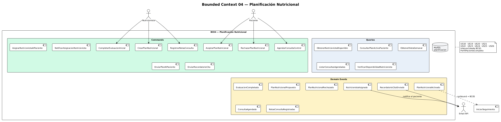
</p>

---

### BC05 — Seguimiento y Monitoreo del Progreso

**Descripción:** Gestiona el registro diario de consumo de alimentos, actividad física y peso semanal. Calcula automáticamente el porcentaje de adherencia al plan nutricional, envía alertas al nutricionista cuando el cumplimiento cae por debajo del umbral y genera reportes PDF de evolución.


```plantuml
@startuml BC05_SeguimientoProgreso
!theme plain
skinparam backgroundColor #F8FAFB
skinparam defaultFontName Poppins
skinparam defaultFontSize 12

title Bounded Context 05 — Seguimiento y Monitoreo del Progreso

actor "Paciente" as PAC
actor "Nutricionista" as NUT
actor "Email API" as EMAIL
actor "PDF Service" as PDF

rectangle "BC05 — Seguimiento & Monitoreo" {

  rectangle "Commands" #D1FAE5 {
    [RegistrarConsumoAlimentos]
    [RegistrarActividadFisica]
    [ActualizarPesoSemanal]
    [CalcularAdherenciaSemanal]
    [EnviarAlertaBajoCumplimiento]
    [GenerarReportePDFEvolucion]
  }

  rectangle "Queries" #E8F0F9 {
    [ObtenerHistorialConsumo]
    [ConsultarGraficoProgresoPeso]
    [ObtenerAdherenciaSemanal]
    [ListarReportesEvolucion]
    [VerificarRegistrosDiarios]
  }

  rectangle "Domain Events" #FEF3C7 {
    [ConsumoRegistrado]
    [ActividadRegistrada]
    [PesoActualizado]
    [AdherenciaCalculada]
    [AlertaBajoCumplimientoEnviada]
    [ReportePDFGenerado]
    [MetricasListasParaConsolidar]
  }

  database "MySQL\nseguimiento" as DB #F3F4F6
}

PAC --> [RegistrarConsumoAlimentos]
PAC --> [RegistrarActividadFisica]
PAC --> [ActualizarPesoSemanal]
[AdherenciaCalculada] --> EMAIL : si % < umbral → alerta NUT
[AlertaBajoCumplimientoEnviada] --> NUT
[GenerarReportePDFEvolucion] --> PDF
[MetricasListasParaConsolidar] ..> [ConsolidarMetricasAnonimas] : outbound → BC03

note right of "BC05 — Seguimiento & Monitoreo"
  US27 · US28 · US29 · US30
  US31 · US32 · US33
  Inbound desde BC04:
  PlanNutricionalActivado
end note

@enduml
```
- Asi es como quedaria el Bounded Context de Seguimiento y Monitoreo del Progreso :
<p align="center">
  <!-- INSERTAR AQUÍ: captura del mockup del footer con fondo #1F2937, logo BioTrack en versión negativa, descripción en rgba(255,255,255,.75), social icons circulares con hover verde, columnas de links con hover verde y footer-bottom en rgba(255,255,255,.45) -->
  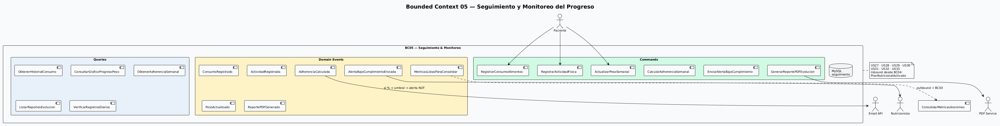
</p>

---

### BC06 — Suscripciones y Facturación

**Descripción:** Gestiona la contratación de planes individuales B2C y corporativos B2B, el procesamiento de pagos vía Pasarela de Pagos API, la emisión automática de facturas, la renovación automática mensual y el manejo de pagos atrasados con suspensión y avisos por correo.

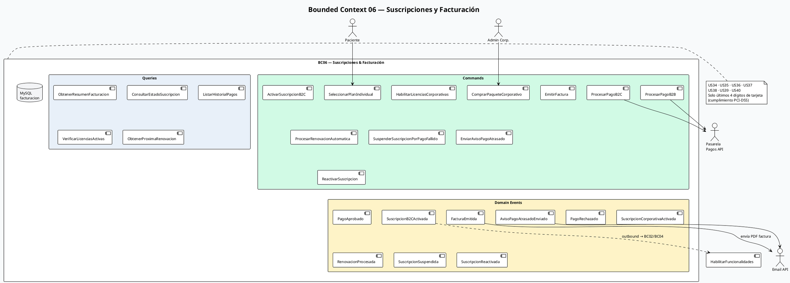
```plantuml
@startuml BC06_SuscripcionesFacturacion
!theme plain
skinparam backgroundColor #F8FAFB
skinparam defaultFontName Poppins
skinparam defaultFontSize 12

title Bounded Context 06 — Suscripciones y Facturación

actor "Paciente" as PAC
actor "Admin Corp." as ADM
actor "Pasarela\nPagos API" as PAGO
actor "Email API" as EMAIL

rectangle "BC06 — Suscripciones & Facturación" {

  rectangle "Commands" #D1FAE5 {
    [SeleccionarPlanIndividual]
    [ProcesarPagoB2C]
    [ActivarSuscripcionB2C]
    [ComprarPaqueteCorporativo]
    [ProcesarPagoB2B]
    [HabilitarLicenciasCorporativas]
    [EmitirFactura]
    [ProcesarRenovacionAutomatica]
    [SuspenderSuscripcionPorPagoFallido]
    [EnviarAvisoPagoAtrasado]
    [ReactivarSuscripcion]
  }

  rectangle "Queries" #E8F0F9 {
    [ObtenerResumenFacturacion]
    [ConsultarEstadoSuscripcion]
    [ListarHistorialPagos]
    [VerificarLicenciasActivas]
    [ObtenerProximaRenovacion]
  }

  rectangle "Domain Events" #FEF3C7 {
    [SuscripcionB2CActivada]
    [PagoAprobado]
    [PagoRechazado]
    [FacturaEmitida]
    [SuscripcionCorporativaActivada]
    [RenovacionProcesada]
    [SuscripcionSuspendida]
    [AvisoPagoAtrasadoEnviado]
    [SuscripcionReactivada]
  }

  database "MySQL\nfacturacion" as DB #F3F4F6
}

PAC --> [SeleccionarPlanIndividual]
ADM --> [ComprarPaqueteCorporativo]
[ProcesarPagoB2C] --> PAGO
[ProcesarPagoB2B] --> PAGO
[FacturaEmitida] --> EMAIL : envía PDF factura
[AvisoPagoAtrasadoEnviado] --> EMAIL
[SuscripcionB2CActivada] ..> [HabilitarFuncionalidades] : outbound → BC02/BC04

note right of "BC06 — Suscripciones & Facturación"
  US34 · US35 · US36 · US37
  US38 · US39 · US40
  Solo últimos 4 dígitos de tarjeta
  (cumplimiento PCI-DSS)
end note

@enduml
```
- Asi es como quedaria el Bounded Context de suscripcion y facturación :
<p align="center">
  <!-- INSERTAR AQUÍ: captura del mockup del footer con fondo #1F2937, logo BioTrack en versión negativa, descripción en rgba(255,255,255,.75), social icons circulares con hover verde, columnas de links con hover verde y footer-bottom en rgba(255,255,255,.45) -->
  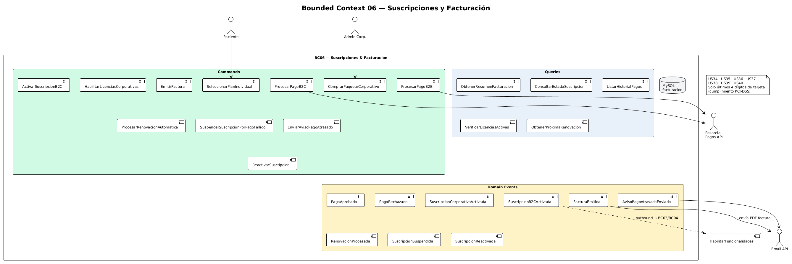
</p>

---

### Unión de Bounded Contexts

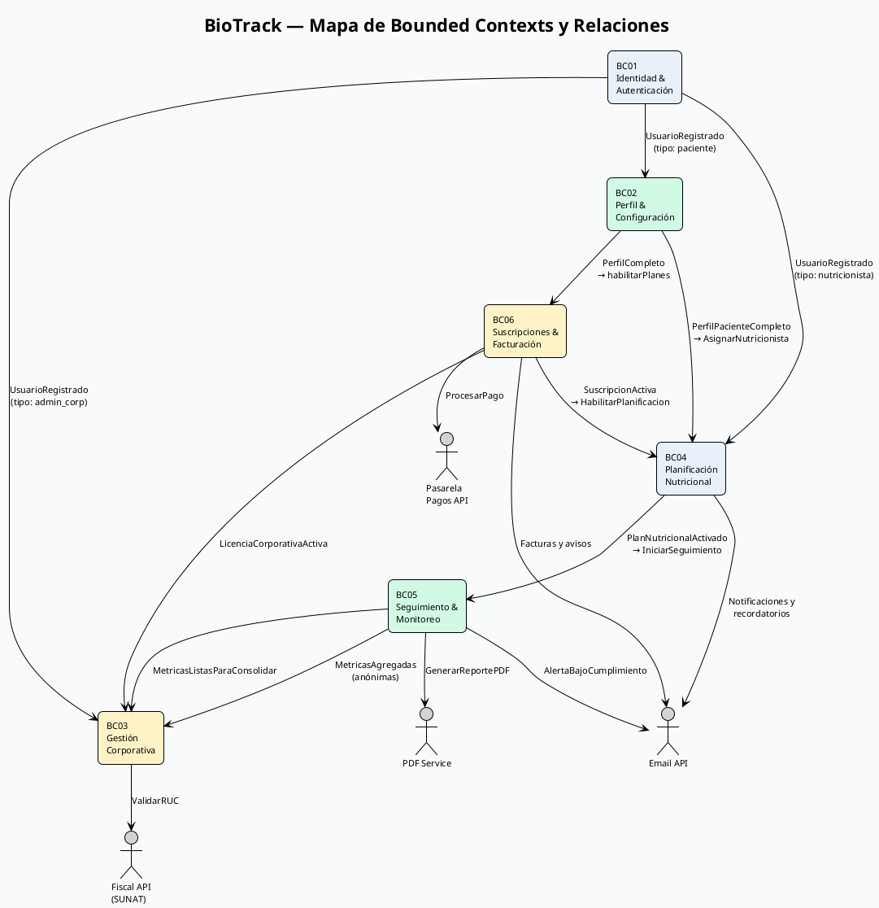
```plantuml
@startuml Union_BoundedContexts
!theme plain
skinparam backgroundColor #F8FAFB
skinparam defaultFontName Poppins
skinparam defaultFontSize 11

title BioTrack — Mapa de Bounded Contexts y Relaciones

skinparam rectangle {
  RoundCorner 12
}

rectangle "BC01\nIdentidad &\nAutenticación" as BC01 #E8F0F9
rectangle "BC02\nPerfil &\nConfiguración" as BC02 #D1FAE5
rectangle "BC03\nGestión\nCorporativa" as BC03 #FEF3C7
rectangle "BC04\nPlanificación\nNutricional" as BC04 #E8F0F9
rectangle "BC05\nSeguimiento &\nMonitoreo" as BC05 #D1FAE5
rectangle "BC06\nSuscripciones &\nFacturación" as BC06 #FEF3C7

actor "Email API" as EMAIL #lightgrey
actor "Pasarela\nPagos API" as PAGO #lightgrey
actor "Fiscal API\n(SUNAT)" as SUNAT #lightgrey
actor "PDF Service" as PDF #lightgrey

BC01 --> BC02 : UsuarioRegistrado\n(tipo: paciente)
BC01 --> BC03 : UsuarioRegistrado\n(tipo: admin_corp)
BC01 --> BC04 : UsuarioRegistrado\n(tipo: nutricionista)

BC02 --> BC04 : PerfilPacienteCompleto\n→ AsignarNutricionista
BC02 --> BC06 : PerfilCompleto\n→ habilitarPlanes

BC03 <-- BC05 : MetricasListasParaConsolidar
BC03 --> SUNAT : ValidarRUC

BC04 --> BC05 : PlanNutricionalActivado\n→ IniciarSeguimiento
BC04 --> EMAIL : Notificaciones y\nrecordatorios

BC05 --> BC03 : MetricasAgregadas\n(anónimas)
BC05 --> PDF  : GenerarReportePDF
BC05 --> EMAIL : AlertaBajoCumplimiento

BC06 --> BC04 : SuscripcionActiva\n→ HabilitarPlanificacion
BC06 --> BC03 : LicenciaCorporativaActiva
BC06 --> PAGO : ProcesarPago
BC06 --> EMAIL : Facturas y avisos

@enduml
```
- Aqui todos los Bounded Contexts relacionados entre sí :
<p align="center">
  <!-- INSERTAR AQUÍ: captura del mockup del footer con fondo #1F2937, logo BioTrack en versión negativa, descripción en rgba(255,255,255,.75), social icons circulares con hover verde, columnas de links con hover verde y footer-bottom en rgba(255,255,255,.45) -->
  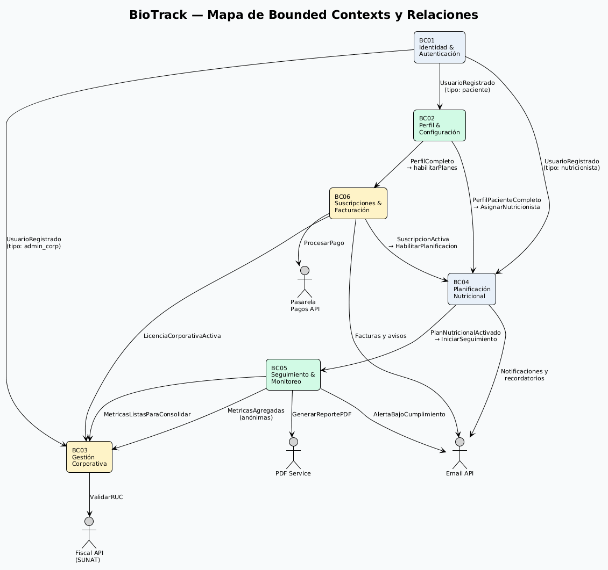
</p>

---

### Flujo: Registro y Activación de Cuenta (BC01 → BC02)

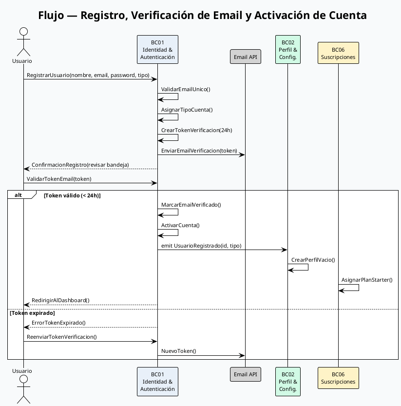
```plantuml
@startuml Flujo_RegistroActivacion
!theme plain
skinparam backgroundColor #F8FAFB
skinparam defaultFontName Poppins
skinparam defaultFontSize 11

title Flujo — Registro, Verificación de Email y Activación de Cuenta

actor "Usuario" as USR
participant "BC01\nIdentidad &\nAutenticación" as BC01 #E8F0F9
participant "Email API" as EMAIL #lightgrey
participant "BC02\nPerfil &\nConfig." as BC02 #D1FAE5
participant "BC06\nSuscripciones" as BC06 #FEF3C7

USR -> BC01 : RegistrarUsuario(nombre, email, password, tipo)
BC01 -> BC01 : ValidarEmailUnico()
BC01 -> BC01 : AsignarTipoCuenta()
BC01 -> BC01 : CrearTokenVerificacion(24h)
BC01 -> EMAIL : EnviarEmailVerificacion(token)
BC01 --> USR : ConfirmacionRegistro(revisar bandeja)

USR -> BC01 : ValidarTokenEmail(token)
alt Token válido (< 24h)
  BC01 -> BC01 : MarcarEmailVerificado()
  BC01 -> BC01 : ActivarCuenta()
  BC01 -> BC02 : emit UsuarioRegistrado(id, tipo)
  BC02 -> BC02 : CrearPerfilVacio()
  BC06 -> BC06 : AsignarPlanStarter()
  BC01 --> USR : RedirigirAlDashboard()
else Token expirado
  BC01 --> USR : ErrorTokenExpirado()
  USR -> BC01 : ReenviarTokenVerificacion()
  BC01 -> EMAIL : NuevoToken()
end

@enduml
```
- Imagen del flujo 1 :
<p align="center">
  <!-- INSERTAR AQUÍ: captura del mockup del footer con fondo #1F2937, logo BioTrack en versión negativa, descripción en rgba(255,255,255,.75), social icons circulares con hover verde, columnas de links con hover verde y footer-bottom en rgba(255,255,255,.45) -->
  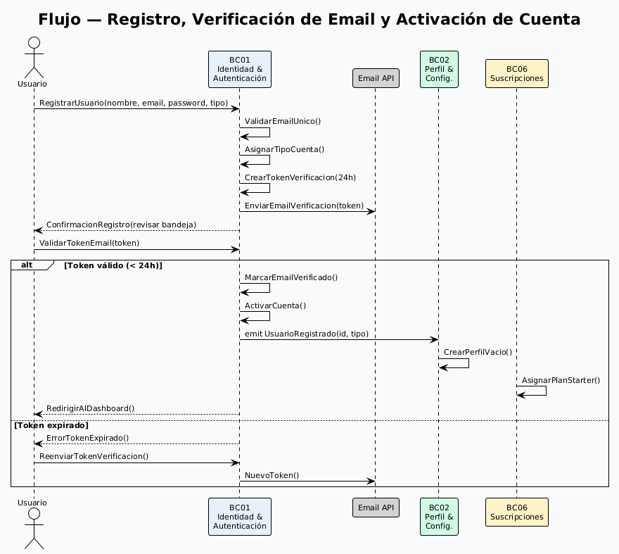
</p>

---

### Flujo: Planificación Nutricional (BC02 → BC04 → BC05)

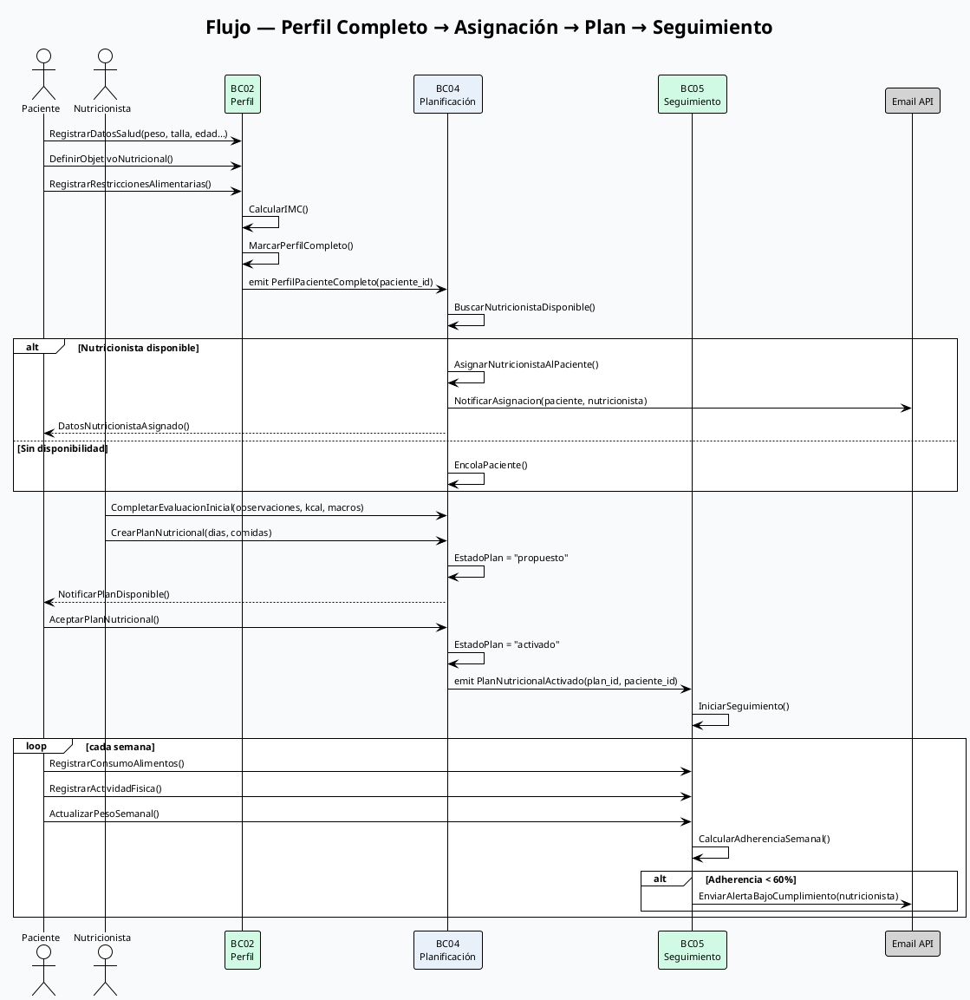
```plantuml
@startuml Flujo_PlanificacionNutricional
!theme plain
skinparam backgroundColor #F8FAFB
skinparam defaultFontName Poppins
skinparam defaultFontSize 11

title Flujo — Perfil Completo → Asignación → Plan → Seguimiento

actor "Paciente" as PAC
actor "Nutricionista" as NUT
participant "BC02\nPerfil" as BC02 #D1FAE5
participant "BC04\nPlanificación" as BC04 #E8F0F9
participant "BC05\nSeguimiento" as BC05 #D1FAE5
participant "Email API" as EMAIL #lightgrey

PAC -> BC02 : RegistrarDatosSalud(peso, talla, edad...)
PAC -> BC02 : DefinirObjetivoNutricional()
PAC -> BC02 : RegistrarRestriccionesAlimentarias()
BC02 -> BC02 : CalcularIMC()
BC02 -> BC02 : MarcarPerfilCompleto()
BC02 -> BC04 : emit PerfilPacienteCompleto(paciente_id)

BC04 -> BC04 : BuscarNutricionistaDisponible()
alt Nutricionista disponible
  BC04 -> BC04 : AsignarNutricionistaAlPaciente()
  BC04 -> EMAIL : NotificarAsignacion(paciente, nutricionista)
  BC04 --> PAC  : DatosNutricionistaAsignado()
else Sin disponibilidad
  BC04 -> BC04 : EncolaPaciente()
end

NUT -> BC04 : CompletarEvaluacionInicial(observaciones, kcal, macros)
NUT -> BC04 : CrearPlanNutricional(dias, comidas)
BC04 -> BC04 : EstadoPlan = "propuesto"
BC04 --> PAC  : NotificarPlanDisponible()

PAC -> BC04 : AceptarPlanNutricional()
BC04 -> BC04 : EstadoPlan = "activado"
BC04 -> BC05 : emit PlanNutricionalActivado(plan_id, paciente_id)
BC05 -> BC05 : IniciarSeguimiento()

loop cada semana
  PAC -> BC05 : RegistrarConsumoAlimentos()
  PAC -> BC05 : RegistrarActividadFisica()
  PAC -> BC05 : ActualizarPesoSemanal()
  BC05 -> BC05 : CalcularAdherenciaSemanal()
  alt Adherencia < 60%
    BC05 -> EMAIL : EnviarAlertaBajoCumplimiento(nutricionista)
  end
end

@enduml
```
- Imagen del flujo 2 :
<p align="center">
  <!-- INSERTAR AQUÍ: captura del mockup del footer con fondo #1F2937, logo BioTrack en versión negativa, descripción en rgba(255,255,255,.75), social icons circulares con hover verde, columnas de links con hover verde y footer-bottom en rgba(255,255,255,.45) -->
  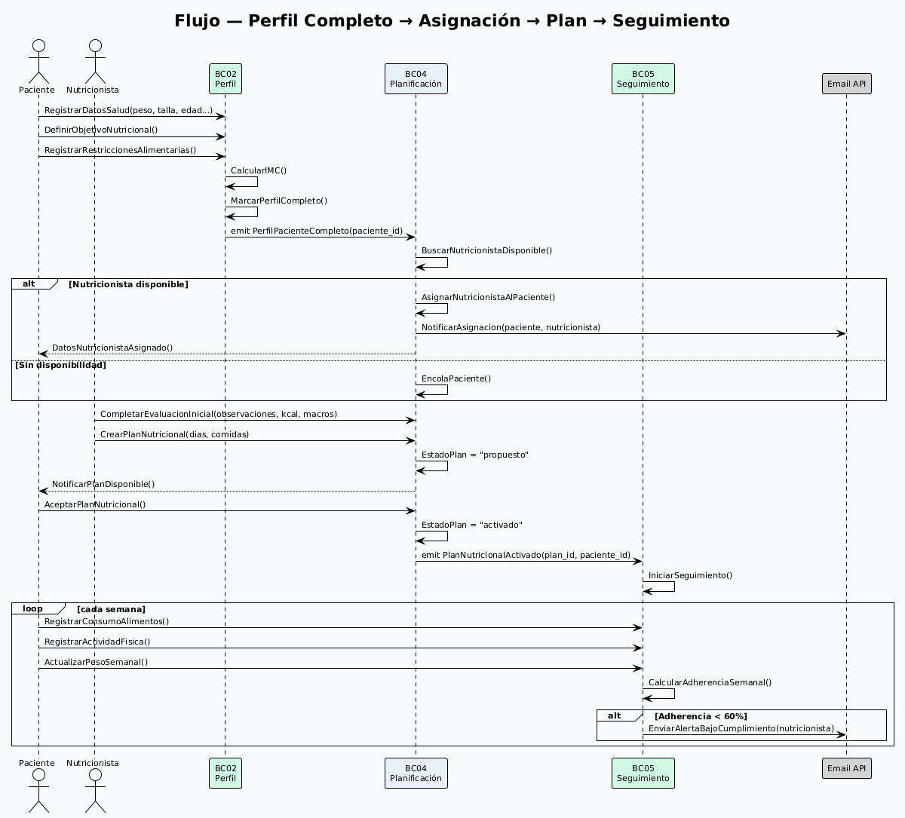
</p>

---

### Flujo: Suscripción B2C (BC06 → BC04)

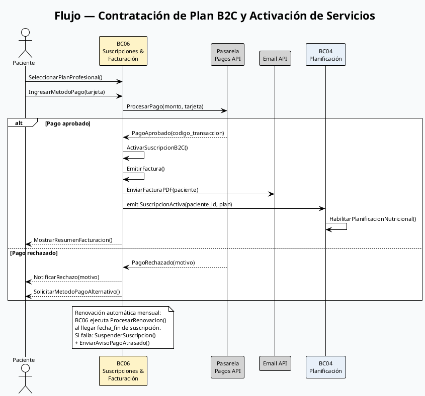
```plantuml
@startuml Flujo_SuscripcionB2C
!theme plain
skinparam backgroundColor #F8FAFB
skinparam defaultFontName Poppins
skinparam defaultFontSize 11

title Flujo — Contratación de Plan B2C y Activación de Servicios

actor "Paciente" as PAC
participant "BC06\nSuscripciones &\nFacturación" as BC06 #FEF3C7
participant "Pasarela\nPagos API" as PAGO #lightgrey
participant "Email API" as EMAIL #lightgrey
participant "BC04\nPlanificación" as BC04 #E8F0F9

PAC -> BC06 : SeleccionarPlanProfesional()
PAC -> BC06 : IngresarMetodoPago(tarjeta)
BC06 -> PAGO : ProcesarPago(monto, tarjeta)

alt Pago aprobado
  PAGO --> BC06 : PagoAprobado(codigo_transaccion)
  BC06 -> BC06 : ActivarSuscripcionB2C()
  BC06 -> BC06 : EmitirFactura()
  BC06 -> EMAIL : EnviarFacturaPDF(paciente)
  BC06 -> BC04  : emit SuscripcionActiva(paciente_id, plan)
  BC04 -> BC04  : HabilitarPlanificacionNutricional()
  BC06 --> PAC  : MostrarResumenFacturacion()
else Pago rechazado
  PAGO --> BC06 : PagoRechazado(motivo)
  BC06 --> PAC  : NotificarRechazo(motivo)
  BC06 --> PAC  : SolicitarMetodoPagoAlternativo()
end

note over BC06
  Renovación automática mensual:
  BC06 ejecuta ProcesarRenovacion()
  al llegar fecha_fin de suscripción.
  Si falla: SuspenderSuscripcion()
  + EnviarAvisoPagoAtrasado()
end note

@enduml
```
- Imagen del flujo 3 :
<p align="center">
  <!-- INSERTAR AQUÍ: captura del mockup del footer con fondo #1F2937, logo BioTrack en versión negativa, descripción en rgba(255,255,255,.75), social icons circulares con hover verde, columnas de links con hover verde y footer-bottom en rgba(255,255,255,.45) -->
  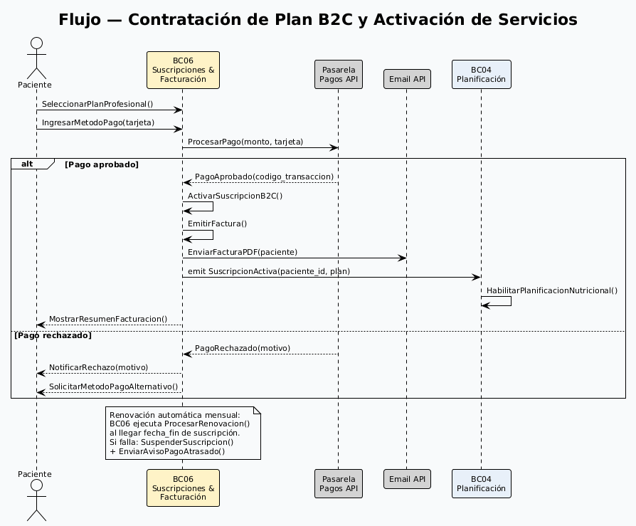
</p>

---

### Flujo: Dashboard Corporativo Anónimo (BC05 → BC03)

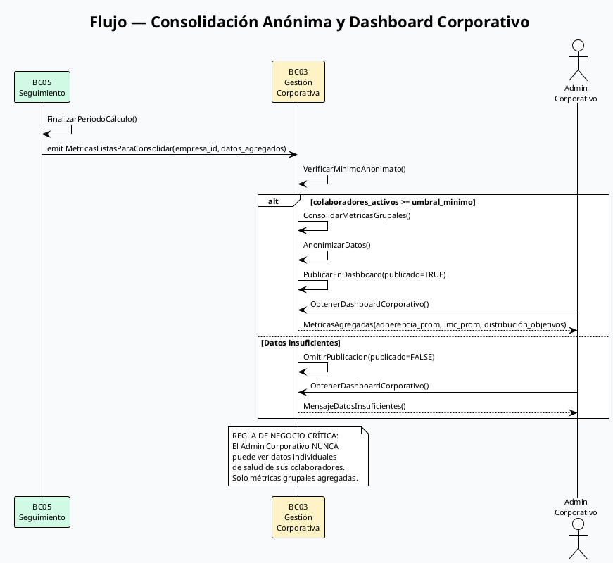
```plantuml
@startuml Flujo_DashboardCorporativo
!theme plain
skinparam backgroundColor #F8FAFB
skinparam defaultFontName Poppins
skinparam defaultFontSize 11

title Flujo — Consolidación Anónima y Dashboard Corporativo

participant "BC05\nSeguimiento" as BC05 #D1FAE5
participant "BC03\nGestión\nCorporativa" as BC03 #FEF3C7
actor "Admin\nCorporativo" as ADM

BC05 -> BC05 : FinalizarPeriodoCálculo()
BC05 -> BC03 : emit MetricasListasParaConsolidar(empresa_id, datos_agregados)

BC03 -> BC03 : VerificarMinimoAnonimato()
alt colaboradores_activos >= umbral_minimo
  BC03 -> BC03 : ConsolidarMetricasGrupales()
  BC03 -> BC03 : AnonimizarDatos()
  BC03 -> BC03 : PublicarEnDashboard(publicado=TRUE)
  ADM -> BC03 : ObtenerDashboardCorporativo()
  BC03 --> ADM : MetricasAgregadas(adherencia_prom, imc_prom, distribución_objetivos)
else Datos insuficientes
  BC03 -> BC03 : OmitirPublicacion(publicado=FALSE)
  ADM -> BC03  : ObtenerDashboardCorporativo()
  BC03 --> ADM : MensajeDatosInsuficientes()
end

note over BC03
  REGLA DE NEGOCIO CRÍTICA:
  El Admin Corporativo NUNCA
  puede ver datos individuales
  de salud de sus colaboradores.
  Solo métricas grupales agregadas.
end note

@enduml
```
- Imagen del flujo 4 :
<p align="center">
  <!-- INSERTAR AQUÍ: captura del mockup del footer con fondo #1F2937, logo BioTrack en versión negativa, descripción en rgba(255,255,255,.75), social icons circulares con hover verde, columnas de links con hover verde y footer-bottom en rgba(255,255,255,.45) -->
  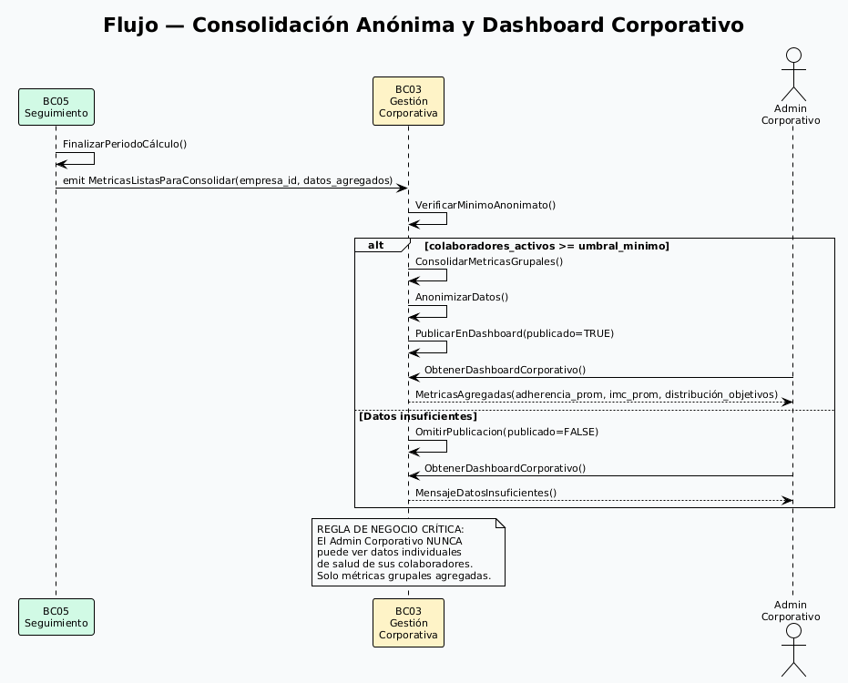
</p>

---

## 4.6.2. Software Architecture Context Diagram

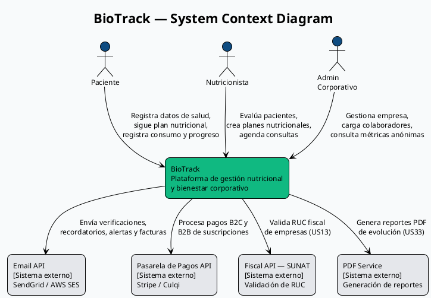
```plantuml
@startuml Structurizr_ContextDiagram
!theme plain
skinparam backgroundColor #F8FAFB
skinparam defaultFontName Poppins
skinparam defaultFontSize 12

skinparam rectangle {
  RoundCorner 16
}

title BioTrack — System Context Diagram

actor "Paciente" as PAC #0F4C81
actor "Nutricionista" as NUT #0F4C81
actor "Admin\nCorporativo" as ADM #0F4C81

rectangle "BioTrack\nPlataforma de gestión nutricional\ny bienestar corporativo" as SYS #10B981 {
}

rectangle "Email API\n[Sistema externo]\nSendGrid / AWS SES" as EMAIL #E5E7EB
rectangle "Pasarela de Pagos API\n[Sistema externo]\nStripe / Culqi" as PAGO #E5E7EB
rectangle "Fiscal API — SUNAT\n[Sistema externo]\nValidación de RUC" as SUNAT #E5E7EB
rectangle "PDF Service\n[Sistema externo]\nGeneración de reportes" as PDF #E5E7EB

PAC --> SYS : Registra datos de salud,\nsigue plan nutricional,\nregistra consumo y progreso
NUT --> SYS : Evalúa pacientes,\ncrea planes nutricionales,\nagenda consultas
ADM --> SYS : Gestiona empresa,\ncarga colaboradores,\nconsulta métricas anónimas

SYS --> EMAIL : Envía verificaciones,\nrecordatorios, alertas y facturas
SYS --> PAGO : Procesa pagos B2C y\nB2B de suscripciones
SYS --> SUNAT : Valida RUC fiscal\nde empresas (US13)
SYS --> PDF : Genera reportes PDF\nde evolución (US33)

@enduml
```
- Imagen del flujo 5 :
<p align="center">
  <!-- INSERTAR AQUÍ: captura del mockup del footer con fondo #1F2937, logo BioTrack en versión negativa, descripción en rgba(255,255,255,.75), social icons circulares con hover verde, columnas de links con hover verde y footer-bottom en rgba(255,255,255,.45) -->
  
</p>

---

## 4.6.3. Software Architecture Container Diagram

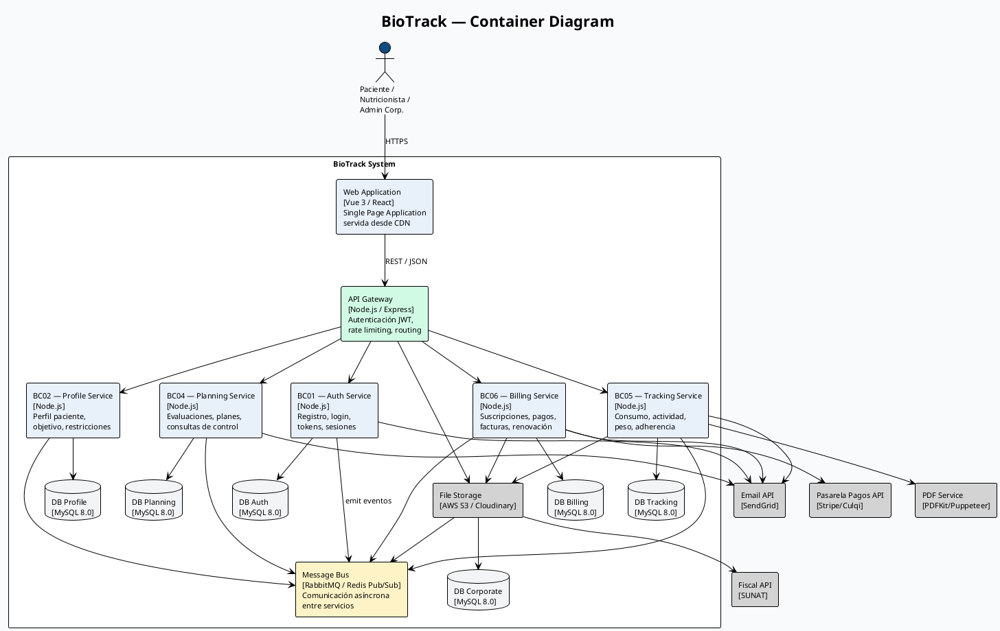
```plantuml
@startuml Structurizr_ContainerDiagram
!theme plain
skinparam backgroundColor #F8FAFB
skinparam defaultFontName Poppins
skinparam defaultFontSize 11

title BioTrack — Container Diagram

actor "Paciente /\nNutricionista /\nAdmin Corp." as USR #0F4C81

rectangle "BioTrack System" {

  rectangle "Web Application\n[Vue 3 / React]\nSingle Page Application\nservida desde CDN" as SPA #E8F0F9

  rectangle "API Gateway\n[Node.js / Express]\nAutenticación JWT,\nrate limiting, routing" as GW #D1FAE5

  rectangle "BC01 — Auth Service\n[Node.js]\nRegistro, login,\ntokens, sesiones" as S1 #E8F0F9
  rectangle "BC02 — Profile Service\n[Node.js]\nPerfil paciente,\nobjetivo, restricciones" as S2 #E8F0F9
  rectangle "BC03 — Corporate Service\n[Node.js]\nEmpresas, colaboradores,\nmétricas anónimas" as S3 #E8F0F9
  rectangle "BC04 — Planning Service\n[Node.js]\nEvaluaciones, planes,\nconsultas de control" as S4 #E8F0F9
  rectangle "BC05 — Tracking Service\n[Node.js]\nConsumo, actividad,\npeso, adherencia" as S5 #E8F0F9
  rectangle "BC06 — Billing Service\n[Node.js]\nSuscripciones, pagos,\nfacturas, renovación" as S6 #E8F0F9

  database "DB Auth\n[MySQL 8.0]" as DB1 #F3F4F6
  database "DB Profile\n[MySQL 8.0]" as DB2 #F3F4F6
  database "DB Corporate\n[MySQL 8.0]" as DB3 #F3F4F6
  database "DB Planning\n[MySQL 8.0]" as DB4 #F3F4F6
  database "DB Tracking\n[MySQL 8.0]" as DB5 #F3F4F6
  database "DB Billing\n[MySQL 8.0]" as DB6 #F3F4F6

  rectangle "Message Bus\n[RabbitMQ / Redis Pub/Sub]\nComunicación asíncrona\nentre servicios" as BUS #FEF3C7
}

rectangle "Email API\n[SendGrid]" as EMAIL #lightgrey
rectangle "Pasarela Pagos API\n[Stripe/Culqi]" as PAGO #lightgrey
rectangle "Fiscal API\n[SUNAT]" as SUNAT #lightgrey
rectangle "PDF Service\n[PDFKit/Puppeteer]" as PDF #lightgrey
rectangle "File Storage\n[AWS S3 / Cloudinary]" as S3 #lightgrey

USR --> SPA : HTTPS
SPA --> GW  : REST / JSON
GW --> S1
GW --> S2
GW --> S3
GW --> S4
GW --> S5
GW --> S6

S1 --> DB1
S2 --> DB2
S3 --> DB3
S4 --> DB4
S5 --> DB5
S6 --> DB6

S1 --> BUS : emit eventos
S2 --> BUS
S3 --> BUS
S4 --> BUS
S5 --> BUS
S6 --> BUS

S1 --> EMAIL
S4 --> EMAIL
S5 --> EMAIL
S6 --> EMAIL
S6 --> PAGO
S3 --> SUNAT
S5 --> PDF
S5 --> S3
S6 --> S3

@enduml
```
- Imagen del Container de Biotrack :
<p align="center">
  <!-- INSERTAR AQUÍ: captura del mockup del footer con fondo #1F2937, logo BioTrack en versión negativa, descripción en rgba(255,255,255,.75), social icons circulares con hover verde, columnas de links con hover verde y footer-bottom en rgba(255,255,255,.45) -->
  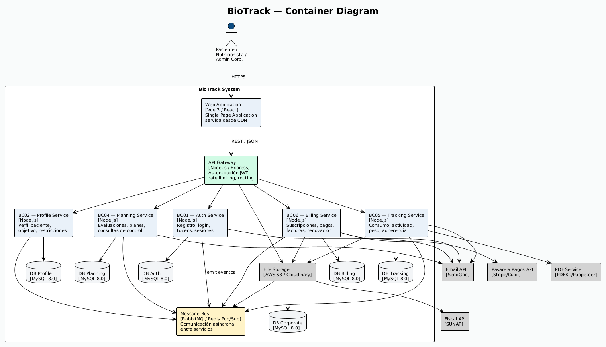
</p>

---

## 4.6.4. Software Architecture Components Diagrams

### BC01 — Auth Service: Components

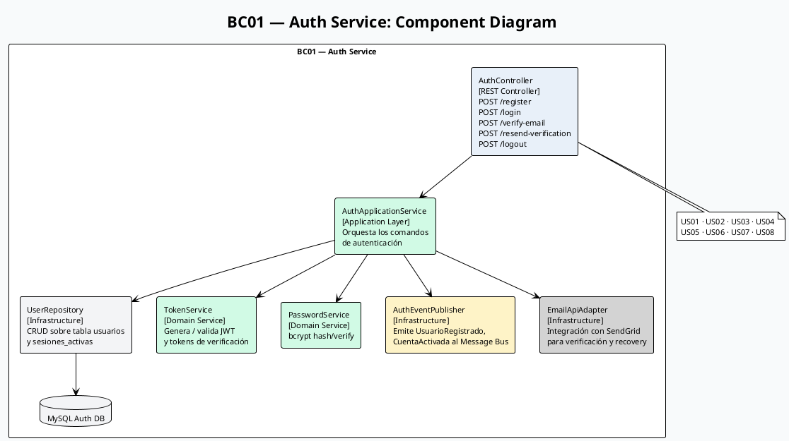
```plantuml
@startuml Component_BC01_Auth
!theme plain
skinparam backgroundColor #F8FAFB
skinparam defaultFontName Poppins
skinparam defaultFontSize 11

title BC01 — Auth Service: Component Diagram

rectangle "BC01 — Auth Service" {

  rectangle "AuthController\n[REST Controller]\nPOST /register\nPOST /login\nPOST /verify-email\nPOST /resend-verification\nPOST /logout" as CTRL #E8F0F9

  rectangle "AuthApplicationService\n[Application Layer]\nOrquesta los comandos\nde autenticación" as APP #D1FAE5

  rectangle "UserRepository\n[Infrastructure]\nCRUD sobre tabla usuarios\ny sesiones_activas" as REPO #F3F4F6

  rectangle "TokenService\n[Domain Service]\nGenera / valida JWT\ny tokens de verificación" as TOKEN #D1FAE5

  rectangle "PasswordService\n[Domain Service]\nbcrypt hash/verify" as PWD #D1FAE5

  rectangle "AuthEventPublisher\n[Infrastructure]\nEmite UsuarioRegistrado,\nCuentaActivada al Message Bus" as PUB #FEF3C7

  rectangle "EmailApiAdapter\n[Infrastructure]\nIntegración con SendGrid\npara verificación y recovery" as MAIL #lightgrey

  database "MySQL Auth DB" as DB #F3F4F6
}

CTRL --> APP
APP --> REPO
APP --> TOKEN
APP --> PWD
APP --> PUB
APP --> MAIL
REPO --> DB

note bottom of CTRL
  US01 · US02 · US03 · US04
  US05 · US06 · US07 · US08
end note

@enduml
```

---

### BC02 — Profile Service: Components

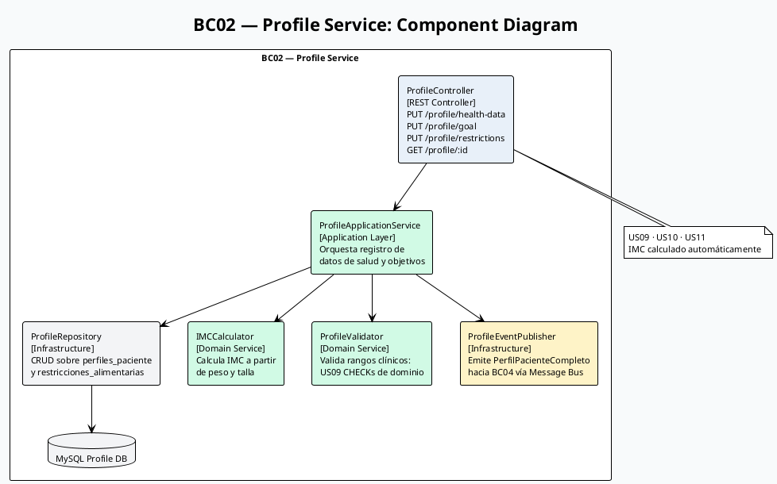
```plantuml
@startuml Component_BC02_Profile
!theme plain
skinparam backgroundColor #F8FAFB
skinparam defaultFontName Poppins
skinparam defaultFontSize 11

title BC02 — Profile Service: Component Diagram

rectangle "BC02 — Profile Service" {

  rectangle "ProfileController\n[REST Controller]\nPUT /profile/health-data\nPUT /profile/goal\nPUT /profile/restrictions\nGET /profile/:id" as CTRL #E8F0F9

  rectangle "ProfileApplicationService\n[Application Layer]\nOrquesta registro de\ndatos de salud y objetivos" as APP #D1FAE5

  rectangle "ProfileRepository\n[Infrastructure]\nCRUD sobre perfiles_paciente\ny restricciones_alimentarias" as REPO #F3F4F6

  rectangle "IMCCalculator\n[Domain Service]\nCalcula IMC a partir\nde peso y talla" as IMC #D1FAE5

  rectangle "ProfileValidator\n[Domain Service]\nValida rangos clínicos:\nUS09 CHECKs de dominio" as VAL #D1FAE5

  rectangle "ProfileEventPublisher\n[Infrastructure]\nEmite PerfilPacienteCompleto\nhacia BC04 vía Message Bus" as PUB #FEF3C7

  database "MySQL Profile DB" as DB #F3F4F6
}

CTRL --> APP
APP --> REPO
APP --> IMC
APP --> VAL
APP --> PUB
REPO --> DB

note bottom of CTRL
  US09 · US10 · US11
  IMC calculado automáticamente
end note

@enduml
```

---

### BC03 — Corporate Service: Components

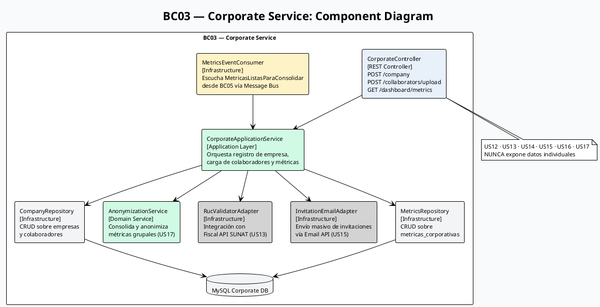
```plantuml
@startuml Component_BC03_Corporate
!theme plain
skinparam backgroundColor #F8FAFB
skinparam defaultFontName Poppins
skinparam defaultFontSize 11

title BC03 — Corporate Service: Component Diagram

rectangle "BC03 — Corporate Service" {

  rectangle "CorporateController\n[REST Controller]\nPOST /company\nPOST /collaborators/upload\nGET /dashboard/metrics" as CTRL #E8F0F9

  rectangle "CorporateApplicationService\n[Application Layer]\nOrquesta registro de empresa,\ncarga de colaboradores y métricas" as APP #D1FAE5

  rectangle "CompanyRepository\n[Infrastructure]\nCRUD sobre empresas\ny colaboradores" as REPO #F3F4F6

  rectangle "AnonymizationService\n[Domain Service]\nConsolida y anonimiza\nmétricas grupales (US17)" as ANON #D1FAE5

  rectangle "RucValidatorAdapter\n[Infrastructure]\nIntegración con\nFiscal API SUNAT (US13)" as RUC #lightgrey

  rectangle "InvitationEmailAdapter\n[Infrastructure]\nEnvío masivo de invitaciones\nvía Email API (US15)" as MAIL #lightgrey

  rectangle "MetricsRepository\n[Infrastructure]\nCRUD sobre\nmetricas_corporativas" as MREP #F3F4F6

  rectangle "MetricsEventConsumer\n[Infrastructure]\nEscucha MetricasListasParaConsolidar\ndesde BC05 vía Message Bus" as CONS #FEF3C7

  database "MySQL Corporate DB" as DB #F3F4F6
}

CTRL --> APP
APP --> REPO
APP --> ANON
APP --> RUC
APP --> MAIL
APP --> MREP
CONS --> APP
REPO --> DB
MREP --> DB

note bottom of CTRL
  US12 · US13 · US14 · US15 · US16 · US17
  NUNCA expone datos individuales
end note

@enduml
```

---

### BC04 — Planning Service: Components

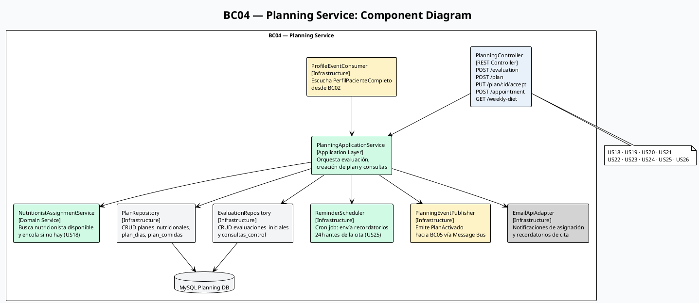
```plantuml
@startuml Component_BC04_Planning
!theme plain
skinparam backgroundColor #F8FAFB
skinparam defaultFontName Poppins
skinparam defaultFontSize 11

title BC04 — Planning Service: Component Diagram

rectangle "BC04 — Planning Service" {

  rectangle "PlanningController\n[REST Controller]\nPOST /evaluation\nPOST /plan\nPUT /plan/:id/accept\nPOST /appointment\nGET /weekly-diet" as CTRL #E8F0F9

  rectangle "PlanningApplicationService\n[Application Layer]\nOrquesta evaluación,\ncreación de plan y consultas" as APP #D1FAE5

  rectangle "NutritionistAssignmentService\n[Domain Service]\nBusca nutricionista disponible\ny encola si no hay (US18)" as ASSIGN #D1FAE5

  rectangle "PlanRepository\n[Infrastructure]\nCRUD planes_nutricionales,\nplan_dias, plan_comidas" as PREP #F3F4F6

  rectangle "EvaluationRepository\n[Infrastructure]\nCRUD evaluaciones_iniciales\ny consultas_control" as EREP #F3F4F6

  rectangle "ReminderScheduler\n[Infrastructure]\nCron job: envía recordatorios\n24h antes de la cita (US25)" as CRON #D1FAE5

  rectangle "PlanningEventPublisher\n[Infrastructure]\nEmite PlanActivado\nhacia BC05 vía Message Bus" as PUB #FEF3C7

  rectangle "ProfileEventConsumer\n[Infrastructure]\nEscucha PerfilPacienteCompleto\ndesde BC02" as CONS #FEF3C7

  rectangle "EmailApiAdapter\n[Infrastructure]\nNotificaciones de asignación\ny recordatorios de cita" as MAIL #lightgrey

  database "MySQL Planning DB" as DB #F3F4F6
}

CTRL --> APP
APP --> ASSIGN
APP --> PREP
APP --> EREP
APP --> CRON
APP --> PUB
APP --> MAIL
CONS --> APP
PREP --> DB
EREP --> DB

note bottom of CTRL
  US18 · US19 · US20 · US21
  US22 · US23 · US24 · US25 · US26
end note

@enduml
```

---

### BC05 — Tracking Service: Components

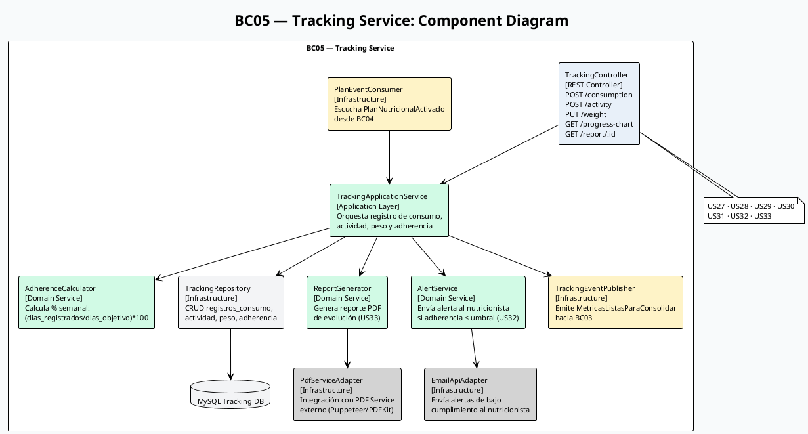
```plantuml
@startuml Component_BC05_Tracking
!theme plain
skinparam backgroundColor #F8FAFB
skinparam defaultFontName Poppins
skinparam defaultFontSize 11

title BC05 — Tracking Service: Component Diagram

rectangle "BC05 — Tracking Service" {

  rectangle "TrackingController\n[REST Controller]\nPOST /consumption\nPOST /activity\nPUT /weight\nGET /progress-chart\nGET /report/:id" as CTRL #E8F0F9

  rectangle "TrackingApplicationService\n[Application Layer]\nOrquesta registro de consumo,\nactividad, peso y adherencia" as APP #D1FAE5

  rectangle "AdherenceCalculator\n[Domain Service]\nCalcula % semanal:\n(dias_registrados/dias_objetivo)*100" as ADH #D1FAE5

  rectangle "TrackingRepository\n[Infrastructure]\nCRUD registros_consumo,\nactividad, peso, adherencia" as REPO #F3F4F6

  rectangle "ReportGenerator\n[Domain Service]\nGenera reporte PDF\nde evolución (US33)" as RPT #D1FAE5

  rectangle "AlertService\n[Domain Service]\nEnvía alerta al nutricionista\nsi adherencia < umbral (US32)" as ALERT #D1FAE5

  rectangle "TrackingEventPublisher\n[Infrastructure]\nEmite MetricasListasParaConsolidar\nhacia BC03" as PUB #FEF3C7

  rectangle "PlanEventConsumer\n[Infrastructure]\nEscucha PlanNutricionalActivado\ndesde BC04" as CONS #FEF3C7

  rectangle "PdfServiceAdapter\n[Infrastructure]\nIntegración con PDF Service\nexterno (Puppeteer/PDFKit)" as PDF #lightgrey

  rectangle "EmailApiAdapter\n[Infrastructure]\nEnvía alertas de bajo\ncumplimiento al nutricionista" as MAIL #lightgrey

  database "MySQL Tracking DB" as DB #F3F4F6
}

CTRL --> APP
APP --> ADH
APP --> REPO
APP --> RPT
APP --> ALERT
APP --> PUB
CONS --> APP
RPT --> PDF
ALERT --> MAIL
REPO --> DB

note bottom of CTRL
  US27 · US28 · US29 · US30
  US31 · US32 · US33
end note

@enduml
```

---

### BC06 — Billing Service: Components

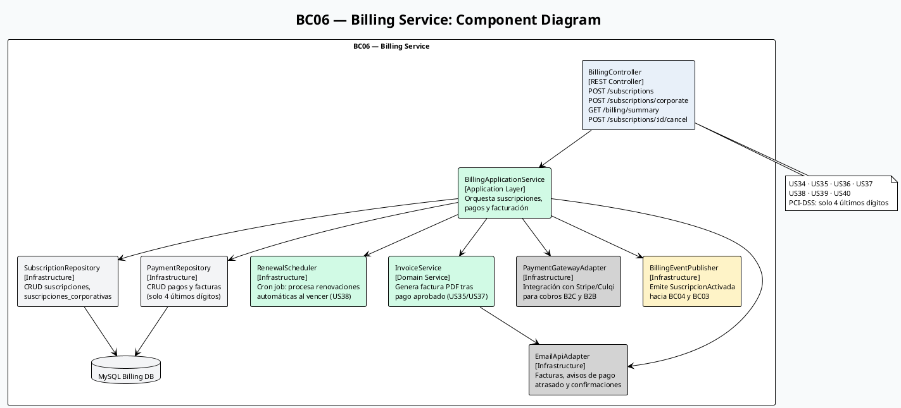
```plantuml
@startuml Component_BC06_Billing
!theme plain
skinparam backgroundColor #F8FAFB
skinparam defaultFontName Poppins
skinparam defaultFontSize 11

title BC06 — Billing Service: Component Diagram

rectangle "BC06 — Billing Service" {

  rectangle "BillingController\n[REST Controller]\nPOST /subscriptions\nPOST /subscriptions/corporate\nGET /billing/summary\nPOST /subscriptions/:id/cancel" as CTRL #E8F0F9

  rectangle "BillingApplicationService\n[Application Layer]\nOrquesta suscripciones,\npagos y facturación" as APP #D1FAE5

  rectangle "SubscriptionRepository\n[Infrastructure]\nCRUD suscripciones,\nsuscripciones_corporativas" as SREP #F3F4F6

  rectangle "PaymentRepository\n[Infrastructure]\nCRUD pagos y facturas\n(solo 4 últimos dígitos)" as PREP #F3F4F6

  rectangle "RenewalScheduler\n[Infrastructure]\nCron job: procesa renovaciones\nautomáticas al vencer (US38)" as CRON #D1FAE5

  rectangle "InvoiceService\n[Domain Service]\nGenera factura PDF tras\npago aprobado (US35/US37)" as INV #D1FAE5

  rectangle "PaymentGatewayAdapter\n[Infrastructure]\nIntegración con Stripe/Culqi\npara cobros B2C y B2B" as PAY #lightgrey

  rectangle "BillingEventPublisher\n[Infrastructure]\nEmite SuscripcionActivada\nhacia BC04 y BC03" as PUB #FEF3C7

  rectangle "EmailApiAdapter\n[Infrastructure]\nFacturas, avisos de pago\natrasado y confirmaciones" as MAIL #lightgrey

  database "MySQL Billing DB" as DB #F3F4F6
}

CTRL --> APP
APP --> SREP
APP --> PREP
APP --> INV
APP --> CRON
APP --> PAY
APP --> PUB
APP --> MAIL
INV --> MAIL
SREP --> DB
PREP --> DB

note bottom of CTRL
  US34 · US35 · US36 · US37
  US38 · US39 · US40
  PCI-DSS: solo 4 últimos dígitos
end note

@enduml
```

---

## Conclusiones

El desarrollo del presente informe permitió construir, de manera integral y trazable, la propuesta de solución tecnológica BioTrack: una plataforma HealthTech que conecta pacientes individuales, nutricionistas y empresas corporativas en un ecosistema unificado de gestión nutricional y bienestar organizacional. Desde el análisis del entorno competitivo hasta el diseño de la arquitectura de software, cada etapa del trabajo estuvo fundamentada en evidencia empírica recogida directamente de los segmentos objetivo, lo que garantizó que las decisiones tomadas respondan a necesidades reales y no a supuestos.

El proceso de needfinding confirmó que los tres segmentos identificados —pacientes que buscan acompañamiento nutricional personalizado, empresas que necesitan gestionar el bienestar de sus colaboradores con datos anonimizados, y nutricionistas que requieren digitalizar su práctica profesional— enfrentan una problemática común: la inexistencia de una herramienta que integre seguimiento clínico, planificación nutricional y métricas organizacionales en un solo punto de acceso. Las entrevistas realizadas, los User Personas construidos y los Journey Maps elaborados evidenciaron fricciones concretas en los flujos actuales, como la dependencia de hojas de cálculo para el seguimiento, la imposibilidad de medir el impacto de programas de bienestar a nivel grupal sin comprometer la privacidad individual, y la falta de herramientas que automaticen la asignación de nutricionistas y el cálculo de adherencia.

El diseño de la solución abordó estas fricciones con decisiones técnicas justificadas. La adopción de una arquitectura orientada a dominios con seis Bounded Contexts diferenciados —Identidad, Perfil, Gestión Corporativa, Planificación Nutricional, Seguimiento y Facturación— permitió aislar responsabilidades, reducir el acoplamiento entre módulos y garantizar que reglas de negocio críticas, como la privacidad absoluta de los datos individuales en el Dashboard Corporativo y la validación de rangos clínicos en el perfil del paciente, queden protegidas dentro de sus propios límites de dominio. El diseño de la base de datos en MySQL 8.0, normalizado hasta la Tercera Forma Normal con veinticinco tablas, cuarenta y un claves foráneas y columnas calculadas automáticamente mediante `GENERATED ALWAYS AS` para el IMC y la adherencia, asegura consistencia de datos sin intervención manual y elimina redundancias que en sistemas de salud pueden traducirse en errores clínicos.

El Product Design articuló un sistema de diseño coherente basado en las tipografías DM Serif Display y Poppins, una paleta cromática de azul institucional y verde de acción, y un conjunto de componentes reutilizables con especificaciones WCAG 2.1 AA que garantizan accesibilidad para todos los perfiles de usuario. Los wireframes, mockups y prototipos de la Landing Page y la aplicación web —organizados en seis epics y más de cuarenta user stories con criterios de aceptación en formato Gherkin— evidencian que la experiencia de usuario fue diseñada desde la arquitectura de información y no como una capa superficial añadida al final del proceso.

Finalmente, el ejercicio de modelado con Event Storming, los diagramas de componentes en PlantUML, los class diagrams en C# y el Structurizr DSL para los diagramas de contexto y contenedores conforman una documentación arquitectónica que no solo describe el sistema como fue concebido, sino que actúa como contrato técnico entre el equipo de diseño y el de desarrollo, reduciendo la ambigüedad en la implementación futura. BioTrack parte, así, de una base sólida: un problema validado, una arquitectura justificada, una interfaz accesible y una base de datos íntegra, aspectos que en conjunto hacen de esta plataforma una propuesta técnicamente viable, escalable y alineada con los estándares del desarrollo de software profesional.

### 4.7. Software Object-Oriented Design
#### 4.7.1. Class Diagrams
<p align="center">Shared BC</p>
<p align="center">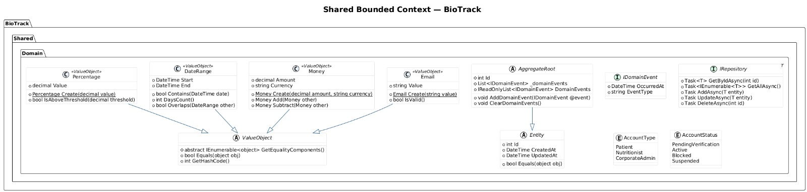</p>

<p align="center">Identity & Authentication BC</p>
<p align="center">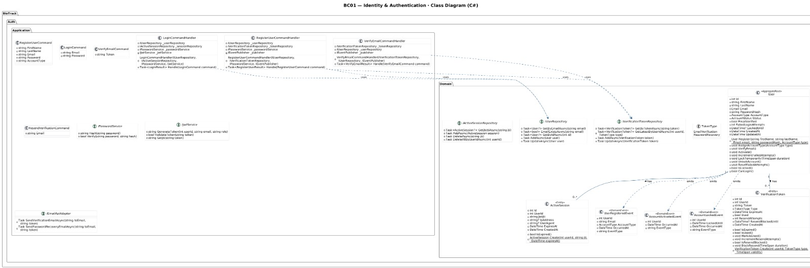</p>

<p align="center">Patient Profile BC</p>
<p align="center">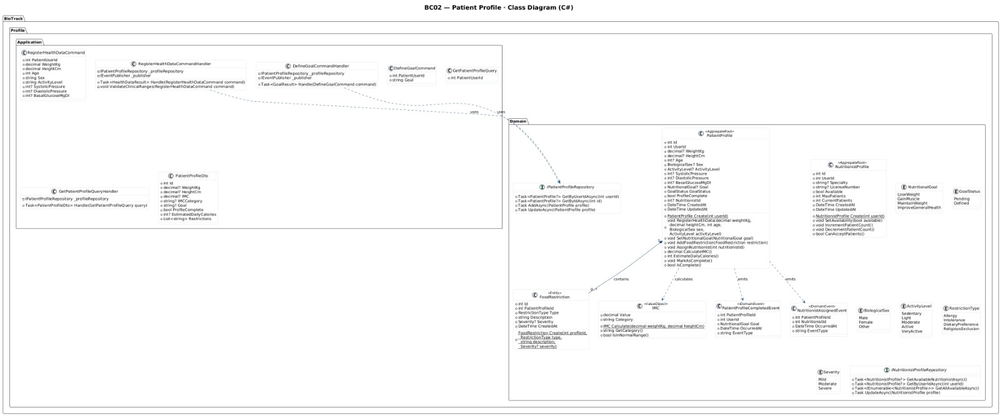</p>

<p align="center">Corporate Management BC</p>
<p align="center">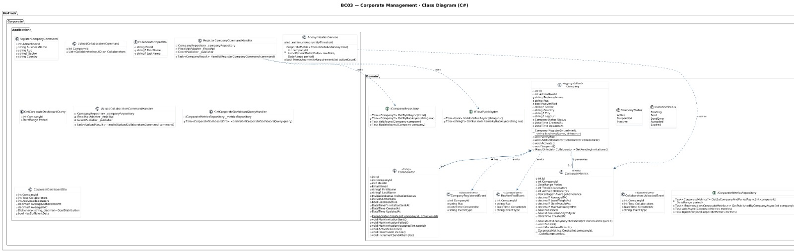</p>

<p align="center">Nutritional Planning BC</p>
<p align="center">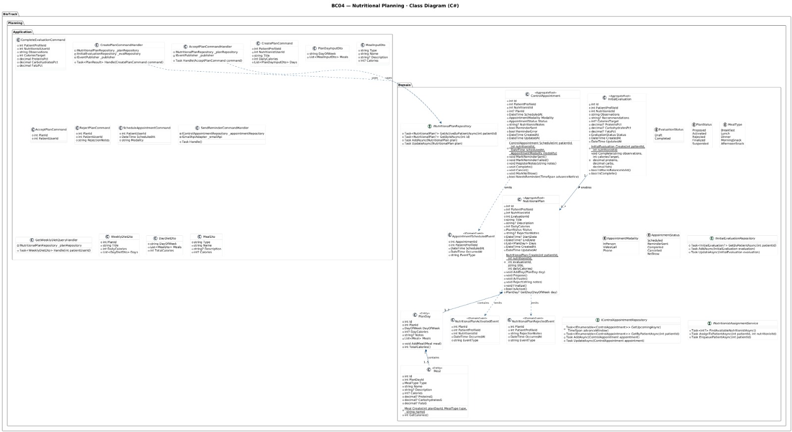</p>

<p align="center">Progress Tracking BC</p>
<p align="center">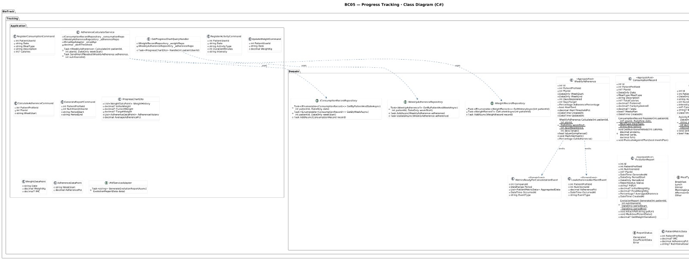</p>

<p align="center">Subscription & billing BC</p>
<p align="center">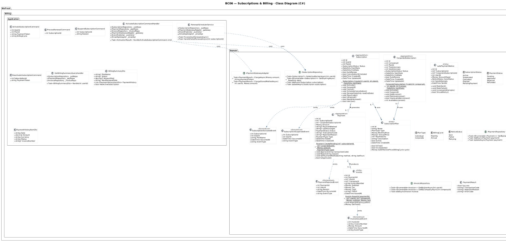</p>

## 4.8. Database Design

El diseño de base de datos de BioTrack está implementado en *MySQL 8.0* y organizado en cinco categorías funcionales alineadas con los Epics del sistema. El esquema aplica normalización hasta la *Tercera Forma Normal (3FN)*, eliminando redundancias y garantizando la integridad referencial en toda la operación de la plataforma de bienestar corporativo.

El sistema distingue tres actores con responsabilidades claramente separadas: los *Pacientes, quienes registran su consumo alimenticio, actividad física y progreso de salud; los **Nutricionistas, quienes gestionan evaluaciones, planes nutricionales y consultas de control; y los **Administradores Corporativos*, quienes administran el perfil de su empresa, los colaboradores y acceden exclusivamente a métricas grupales anonimizadas — nunca a datos individuales de salud.

Las métricas de bienestar corporativo se gestionan en la tabla metricas_corporativas, cuyo campo publicado solo toma valor TRUE cuando el número de colaboradores con datos registrados supera el umbral mínimo requerido para garantizar el anonimato, protegiendo la privacidad individual en todo momento.

El cálculo del *IMC* se implementa mediante una columna GENERATED ALWAYS AS en perfiles_paciente, derivándose automáticamente de peso_kg y talla_cm registrados por el paciente para evitar inconsistencias entre el valor calculado y los datos fuente. De igual manera, el campo porcentaje_adherencia en adherencia_plan se calcula automáticamente a partir de los días registrados sobre los días objetivo del período.

Las *suscripciones* operan bajo un modelo dual: B2C individual (suscripciones) para pacientes y nutricionistas, y B2B corporativo (suscripciones_corporativas) para empresas con licencias por colaborador. Los pagos se registran en la tabla pagos, que almacena únicamente los últimos 4 dígitos de la tarjeta por cumplimiento PCI-DSS, el código devuelto por la Pasarela de Pagos API y el motivo de rechazo cuando aplica.

Los *tokens de verificación* tienen una vida útil de 24 horas y llevan contador de reenvíos con campo bloqueado_reenvio_hasta para implementar el cooldown por exceso de solicitudes descrito en US05. La seguridad de sesiones se gestiona en sesiones_activas mediante el campo jwt_jti, que permite la revocación individual de tokens JWT sin invalidar toda la sesión.

### 4.8.1. Database Diagrams

<div align="center">

<!-- INSERTAR AQUÍ: el diagrama entidad-relación completo de BioTrack generado desde MySQL Workbench, dbdiagram.io o equivalente. Debe mostrar las 25 tablas con sus columnas principales, tipos de datos y las relaciones (líneas de FK) entre ellas. Exportar como SVG o PNG de alta resolución. -->

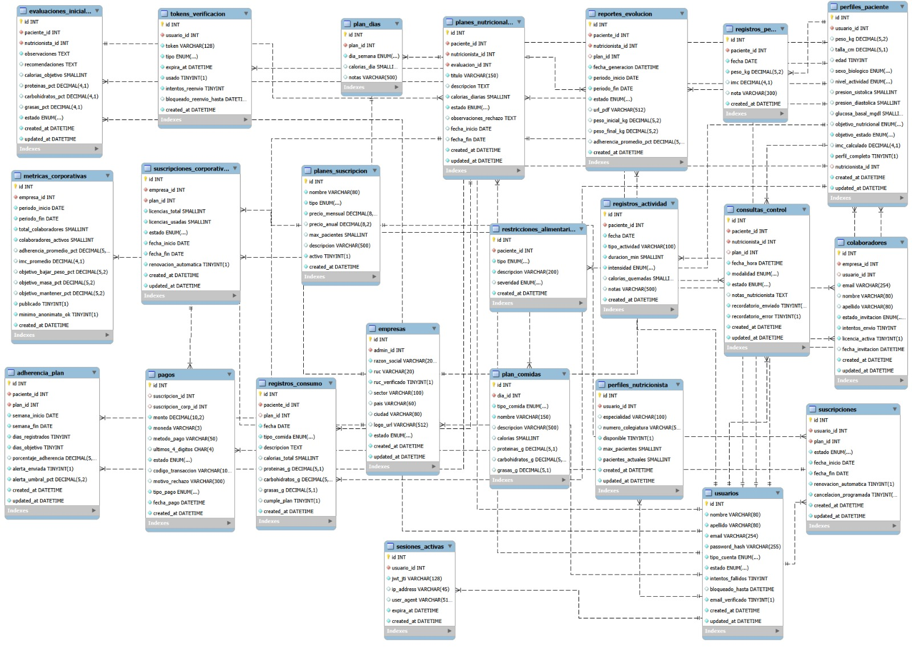

</div>

El esquema se organiza en las siguientes tablas por categoría:

---

*Identidad y Acceso:*

- usuarios — tabla central del sistema. Almacena nombre, apellido, email, hash de contraseña (bcrypt), tipo de cuenta asignado automáticamente al registro (paciente, nutricionista, admin_corporativo), estado de la cuenta (pendiente_verificacion, activa, bloqueada, suspendida), contador de intentos fallidos de inicio de sesión, timestamp de bloqueo temporal y flag de verificación de email. El campo tipo_cuenta no puede ser modificado por el usuario una vez asignado, según la regla de negocio de US02.

- tokens_verificacion — tokens de un solo uso para verificación de correo electrónico y recuperación de contraseña. Cada token tiene una expiración de 24 horas (expira_at), un flag usado que se activa al primer uso válido, un contador intentos_reenvio y el campo bloqueado_reenvio_hasta que implementa el bloqueo temporal por exceso de solicitudes de reenvío descrito en US05 Scenario 2.

- sesiones_activas — gestiona las sesiones JWT activas almacenando el jwt_jti (JWT ID claim) para permitir la revocación individual de tokens sin necesidad de invalidar toda la sesión. Incluye IP de origen y User-Agent para auditoría de acceso.

- perfiles_paciente — extiende la tabla usuarios con datos de salud: peso (10–300 kg), talla (50–250 cm), edad (1–120 años), sexo biológico, nivel de actividad, presión arterial sistólica y diastólica, glucosa basal y objetivo nutricional. El campo imc_calculado es una columna GENERATED ALWAYS AS STORED derivada automáticamente de peso y talla. El campo nutricionista_id registra la asignación automática descrita en US18. Todos los rangos numéricos están protegidos por CHECK constraints.

- restricciones_alimentarias — tabla hija de perfiles_paciente que almacena las restricciones alimentarias del paciente (alergias, intolerancias, preferencias dietéticas, exclusiones religiosas) con nivel de severidad para alergias. Implementa US11.

- perfiles_nutricionista — extiende usuarios con especialidad, número de colegiatura, flag de disponibilidad y contador de pacientes actuales vs. máximo permitido. El campo disponible controla si el nutricionista aparece en la cola de asignación automática de US18.

---

*Corporate Management:*

- empresas — almacena el perfil corporativo: razón social, RUC, flag ruc_verificado que se activa tras la validación fiscal exitosa de US13, sector, ciudad y estado de la empresa. La relación con usuarios a través de admin_id garantiza que solo usuarios con tipo_cuenta = 'admin_corporativo' pueden ser administradores de una empresa.

- colaboradores — tabla de gestión de la lista de empleados de cada empresa. Almacena el email pre-cargado desde el archivo CSV (US14), el estado del flujo de invitación (pendiente, enviada, error_envio, aceptada, expirada), el contador de reintentos de envío para el fallback de US15 Scenario 2, y la relación opcional con usuario_id que se establece cuando el colaborador activa su cuenta.

- metricas_corporativas — almacena exclusivamente métricas grupales anonimizadas por período: total de colaboradores activos, porcentaje de adherencia promedio, IMC promedio grupal y distribución de objetivos nutricionales. El campo publicado solo es TRUE cuando minimo_anonimato_ok está activo, implementando la regla de negocio de US17 Scenario 2 que protege la privacidad cuando hay pocos colaboradores. Nunca almacena datos individuales identificables.

---

*Nutritional Planning :*

- evaluaciones_iniciales — registra la evaluación clínica del nutricionista sobre cada paciente: observaciones, recomendaciones, calorías objetivo y distribución de macronutrientes. Incluye un CHECK constraint que valida que proteinas_pct + carbohidratos_pct + grasas_pct = 100.0 cuando los tres campos están completos. El campo estado (borrador, completada) controla que solo se pueda crear un plan nutricional cuando la evaluación esté completada, según US20 Scenario 2.

- planes_nutricionales — ciclo de vida completo de un plan: propuesto por el nutricionista (US21), activado o rechazado por el paciente (US22), con campo observaciones_rechazo obligatorio cuando el paciente rechaza. Puede pasar a finalizado o suspendido por cambio de condiciones. Cada plan está vinculado a una evaluación inicial y tiene fechas de inicio y fin definidas.

- plan_dias — estructura semanal del plan nutricional. Cada registro representa un día de la semana (lunes a domingo) dentro de un plan, con calorías objetivo para ese día. Implementa la Vista de Dieta Semanal de US23.

- plan_comidas — tabla hija de plan_dias que detalla cada comida del día (desayuno, almuerzo, cena, snack mañana, snack tarde) con nombre, descripción, calorías y macronutrientes. Permite al nutricionista diseñar el menú completo del paciente.

- consultas_control — gestiona el agendamiento (US24), el envío automático de recordatorios por Email API (US25) y el registro de notas post-consulta (US26). El campo recordatorio_enviado y recordatorio_error rastrean el estado del envío del aviso. Las notas del nutricionista son validadas como obligatorias al registrar la consulta como realizada.

---

*Progress Tracking & Monitoring:*

- registros_consumo — log diario de alimentación del paciente. Almacena cada comida del día con descripción, calorías y macronutrientes. La restricción UNIQUE (paciente_id, fecha, tipo_comida) garantiza un solo registro por tipo de comida por día. El campo cumple_plan compara el registro contra la plan_comida correspondiente y alimenta el cálculo de adherencia. Implementa US27.

- registros_actividad — log de actividad física con tipo de actividad, duración en minutos (protegida por CHECK duracion_min > 0), intensidad y estimación de calorías quemadas. Implementa US28.

- registros_peso — historial semanal de peso del paciente con restricción UNIQUE (paciente_id, fecha) para un registro por día. El campo imc se calcula al momento del registro utilizando la talla del perfil. Es la fuente de datos para el gráfico de evolución de peso de US30.

- adherencia_plan — calcula y almacena la adherencia semanal al plan nutricional. El campo porcentaje_adherencia es una columna GENERATED ALWAYS AS STORED calculada como (dias_registrados / dias_objetivo) * 100. El campo alerta_enviada controla que la notificación al nutricionista (US32) se envíe una sola vez por período cuando la adherencia cae por debajo de alerta_umbral_pct (valor por defecto: 60%).

- reportes_evolucion — registra los reportes PDF de evolución generados por el nutricionista (US33). Almacena la URL del PDF en el sistema de almacenamiento, el período cubierto, el peso inicial y final del período, y la adherencia promedio. El campo estado maneja el escenario de datos insuficientes de US33 Scenario 2.

---

*Subscriptions & Billing:*

- planes_suscripcion — catálogo de planes disponibles con precio mensual y anual. Contiene el seed inicial con tres planes: *Starter* (gratuito, individual), *Profesional* (S/ 59/mes, individual, con nutricionista y seguimiento completo) y *Empresarial* (S/ 299/mes, corporativo, con dashboard anónimo y hasta 50 licencias).

- suscripciones — gestiona el ciclo de vida de las suscripciones B2C individuales: pendiente_pago → activa → suspendida (cobro fallido, US39) → cancelada o vencida. El campo renovacion_automatica está activado por defecto (US38). El campo cancelacion_programada permite que la suscripción permanezca activa hasta fecha_fin tras solicitar la cancelación.

- suscripciones_corporativas — variante B2B para empresas con licencias_total y licencias_usadas. Un CHECK constraint garantiza que licencias_usadas <= licencias_total. Implementa US36 y US37.

- pagos — registro centralizado de todas las transacciones. Almacena únicamente ultimos_4_digitos de la tarjeta (nunca el número completo, por cumplimiento PCI-DSS), el codigo_transaccion devuelto por la Pasarela de Pagos API, el motivo_rechazo cuando el estado es rechazado (ej: "CARD_EXPIRED" de US34 Scenario 2) y el tipo_pago para distinguir activación, renovación y reactivación.

- facturas — generada automáticamente tras cada pago aprobado. Soporta tanto facturación B2C (vinculada a usuario_id) como B2B (vinculada a empresa_id). El campo numero_factura tiene restricción UNIQUE. Implementa US35 y US37.

- avisos_pago_atrasado — historial de correos de aviso enviados por Email API cuando una suscripción está en estado suspendida por cobro fallido. Registra los intentos de envío y el estado de cada intento para el reintento automático descrito en US40.

---

*Normalización aplicada:* 

La normalización aplicada al esquema de BioTrack se resume en tres puntos fundamentales. La *Primera Forma Normal (1FN)* se cumple con valores atómicos en todas las columnas: los tipos de dato ENUM garantizan dominios controlados en campos como tipo_cuenta, estado, tipo_comida y objetivo_nutricional, y las restricciones alimentarias múltiples se normalizan en la tabla hija restricciones_alimentarias en lugar de una columna de lista. La *Segunda Forma Normal (2FN)* se cumple con claves primarias simples (INT UNSIGNED AUTO_INCREMENT) en todas las tablas, eliminando dependencias parciales. La *Tercera Forma Normal (3FN)* se evidencia en seis decisiones clave de diseño: la separación de perfiles_paciente, perfiles_nutricionista y perfiles_corporativo de la tabla base usuarios elimina dependencias transitivas del tipo de cuenta; la tabla planes_suscripcion centraliza el catálogo de precios evitando que el precio se repita en cada suscripción; la separación de plan_dias y plan_comidas normaliza la estructura jerárquica del plan nutricional; los campos calculados imc_calculado y porcentaje_adherencia usan GENERATED ALWAYS AS en lugar de ser almacenados manualmente para evitar inconsistencias; la tabla metricas_corporativas almacena únicamente datos derivados y anonimizados, separados completamente de los datos individuales; y la separación de pagos y facturas distingue el evento transaccional del documento fiscal generado, siguiendo el principio de responsabilidad única.


## 🛠️ Capítulo V: Product Implementation, Validation & Deployment

### 5.1. Software Configuration Management
En el trancurso del desarollo se gestionó una configuración de software básico funcional, con herramientas estandars para el control de versiones, documentación y colaboración en equipo dentro de una organización y proyecto. Esto aseguró que el código fuente se mantuviera homologado, accesible y organizado, facilitando la integración continua del gitflow

#### 5.1.1. Software Development Environment Configuration
En el entorno de desarolló se configuró localmente las siguientes herramientas:

Editor de código: Visual Studio Code

Control de versiones: Git

Repositorio remoto: GitHub

Estilos: CSS

Gestor de paquetes: npm

Despliegue: GitHub Pages para la landing page

Se definieron las extensiones de VSCode para buenas prácticas: ESLint, Prettier, GitLens, JS-sniptes

#### 5.1.2. Source Code Management
Usuarios de github:
| Integrantes                         | Usuarios de GitHub |
|-------------------------------------|--------------------|
| Villón Amez, Enrique Manuel         | enriquevillon25    |

En el desarollo de cada repositorio usaremos Gitflow como estrategia de control de versiones, conssite en crear ramas por cada feat, fix o choore para tener un trabajo organizado y registrado. Las ramas principales serán Main, Release, Develop, Hotfix, A continuación describiremos las ramas:

Main: Rama principal donde se encunetra la versión estable y oficial del producto

Develop: Rama de desarollo donde se implementan las funcionalides, correciones, es la rama del Desarollador donde puede hacer todas sus pruebas y funcionalidades

Release: Rama de lanzamiento donde se preparan las versiones estables para pasarlas a producción (main)

Hotfix: Rama de correción de errores sirve como emergencia para resolver errores de producción urgentes

#### 5.1.3. Source Code Style Guide & Conventions

Para mantener la calidad del código, el equipo escogió una guía de estilo de codigo y convenciones

Lenguaje Principal: Javascript, Typescript
Framework: Vue
Lenguaje de etiquetas: HTML, CSS
Nombres de variables: camelCase para variables y funciones, PascalCase para componentes
Comentarios: Se formenta el uso de comentarios calros en bloques complejos de código
Commits: Convenctión tipo(feat/fix/hotfix/choore): descriptión

#### 5.1.4. Software Deployment Configuration

Para el despligues de la Landing Page y la aplicación se utilizará GitHubPages y con una integración continua aplicando el uso de GitFlow

Landing Page:

El despliegue de la landing page se realizará mediante GitHub Pages, usando las herramientas brindadas ya que tenemos el repositorio y la organización en GitHub

La Landing se ubicará en una carpeta /docs dentro del branch princial del repositorio. GitHub Pages detectará automaticmamente esta estructura para generar y servir el sitio

### 5.2. Landing Page, Services & Applications Implementation
#### 5.2.1. Sprint 1
##### 5.2.1.1. Sprint Planning 1
##### 5.2.1.2. Aspect Leaders and Collaborators
##### 5.2.1.3. Sprint Backlog 1
##### 5.2.1.4. Development Evidence for Sprint Review
##### 5.2.1.5. Execution Evidence for Sprint Review
##### 5.2.1.6. Services Documentation Evidence for Sprint Review
##### 5.2.1.7. Software Deployment Evidence for Sprint Review
##### 5.2.1.8. Team Collaboration Insights during Sprint

### 5.3. Validation Interviews
#### 5.3.1. Diseño de Entrevistas
#### 5.3.2. Registro de Entrevistas
#### 5.3.3. Evaluaciones según heurísticas

### 5.4. Video About-the-Product

---

## 💡 Conclusiones
## 📚 Bibliografía

- Bejarano Roncancio, J. J., & Díaz Beltrán, M. D. P. (2012). ALIMENTACIÓN LABORAL UNA ESTRATEGIA PARA LA PROMOCIÓN DE LA SALUD DEL TRABAJADOR: a strategy for promoting workers' health. Revista de la Facultad de Medicina, 60, 87-97. Recuperado de [http://scielo.org.co/scielo.php?script=sci_arttext&pid=S0120-00112012000500009](http://scielo.org.co/scielo.php?script=sci_arttext&pid=S0120-00112012000500009)

- Ortega Cerda, J. J., Sánchez Herrera, D., Rodríguez Miranda, Ó. A., & Ortega Legaspi, J. M. (2018). Adherencia terapéutica: un problema de atención médica. Acta médica grupo Ángeles, 16(3), 226-232. Recuperado de [https://www.scielo.org.mx/scielo.php?pid=S1870-72032018000300226&script=sci_arttext](https://www.scielo.org.mx/scielo.php?pid=S1870-72032018000300226&script=sci_arttext)

- Patel, M. L., Hopkins, C. M., Brooks, T. L., & Bennett, G. G. (2019). Comparing self-monitoring strategies for weight loss in a smartphone app: randomized controlled trial. JMIR mHealth and uHealth, 7(2), e12209. Recuperado de [https://mhealth.jmir.org/2019/2/e12209](https://mhealth.jmir.org/2019/2/e12209)

## 📎 Anexos
